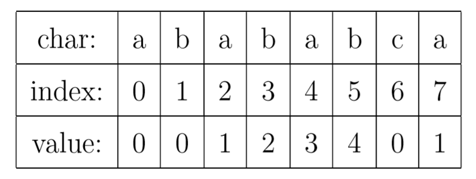
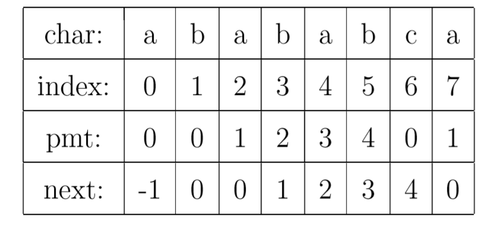
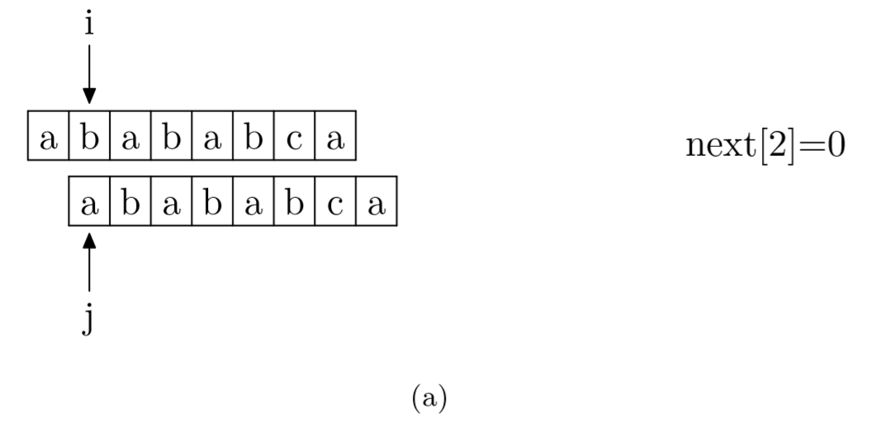
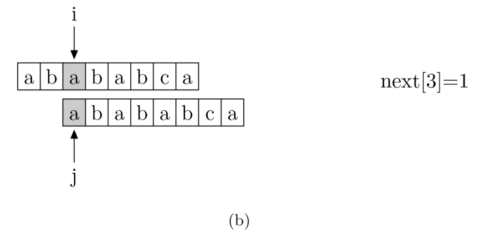
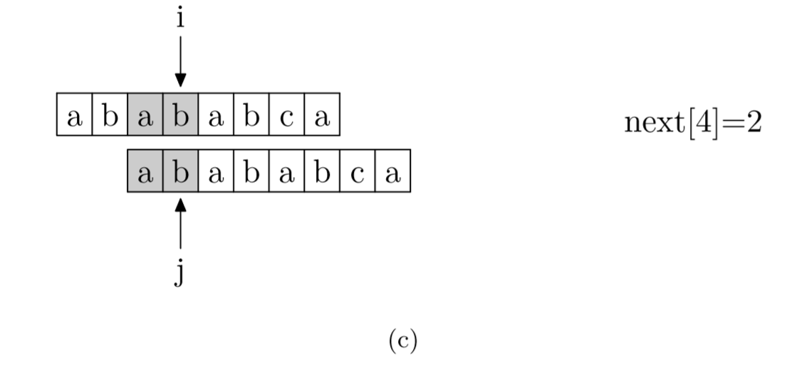
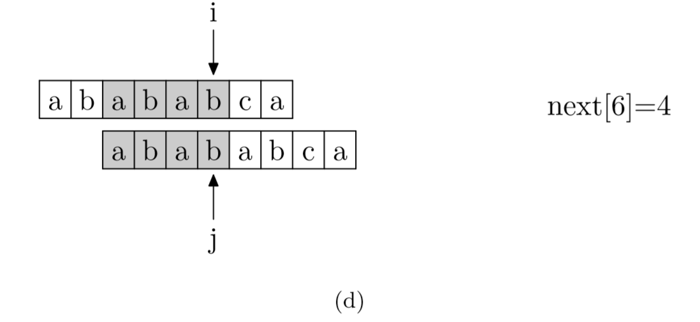
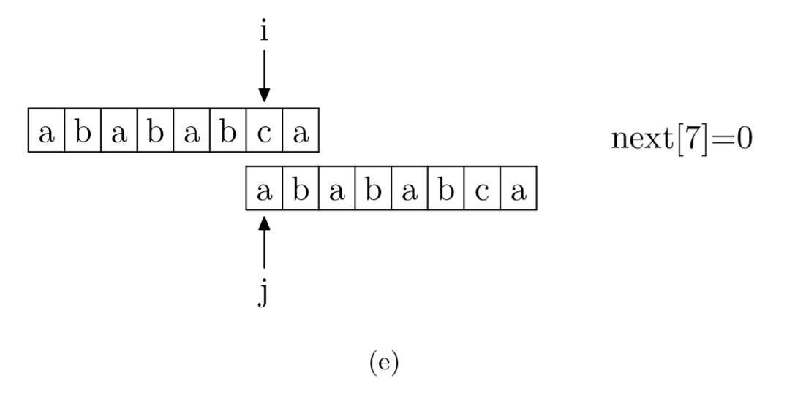

# KMP 字符匹配

```typescript
/*
leecode:
28.实现 strStr(简单)
*/
```

## 暴力算法

```typescript
function search(pat: string, txt: string) {
  let M = pat.length;
  let N = txt.length;
  for (let i = 0; i <= N - M; i++) {
    let j;
    for (j == 0; j < M; j++) {
      if (pat[j] != txt[i + j]) {
        break;
      }
    }
    if (j == M) return i;
  }

  return -1;
}
```

可以看到，暴力查找的最坏时间复杂度为 O(N\*M)，实际应用中往往文本字符串很长（成万上亿个字符），而模式字符串很短，这样暴力算法的时间复杂度是无法接受的。

为了改进查找时间，人们发明了很多字符串查找算法，而今天的主角 KMP 算法（D.E.Knuth，J.H.Morris 和 V.R.Pratt 发明，简称 KMP 算法）就是其中的一种。

## KMP 算法

KMP 算法的核心，是一个被称为部分匹配表(Partial Match Table)的数组。

对于字符串“abababca”，它的 PMT 如下表所示：如果待匹配的模式字符串有 8 个字符，那么 PMT 就会有 8 个值。



先解释一下字符串的前缀和后缀。

如果字符串 A 和 B，存在 A=BS，其中 S 是任意的非空字符串，那就称 B 为 A 的前缀。例如，”Harry”的前缀包括{”H”, ”Ha”, ”Har”, ”Harr”}，我们把所有前缀组成的集合，称为字符串的前缀集合。  
同样可以定义后缀 A=SB， 其中 S 是任意的非空字符串，那就称 B 为 A 的后缀，例如，”Potter”的后缀包括{”otter”, ”tter”, ”ter”, ”er”, ”r”}，然后把所有后缀组成的集合，称为字符串的后缀集合。要注意的是，字符串本身并不是自己的后缀。

有了这个定义，就可以说明 PMT 中的值的意义了。**PMT 中的值是字符串的前缀集合与后缀集合的交集中最长元素的长度**。

例如，对于字符串”ababa”，它的前缀集合为{”a”, ”ab”, ”aba”, ”abab”}，它的后缀集合为{”baba”, ”aba”, ”ba”, ”a”}， 两个集合的交集为{”a”, ”aba”}，其中最长的元素为”aba”，长度为 3。

再来看如何使用这个表来加速字符串的查找，以及这样用的道理是什么。如图 1.12 所示，要在主字符串"ababababca"中查找模式字符串"abababca"。如果在 j 处字符不匹配，那么由于前边所说的模式字符串 PMT 的性质，**主字符串中 i 指针之前的 PMT[j −1] 位就一定与模式字符串的第 0 位至第 PMT[j−1] -1 位是相同的**。

这是因为主字符串在 i 位失配，也就意味着主字符串**从 i−j 到 i-1 这一段**是与模式字符串的 **0 到 j-1 这一段**是完全相同的。而我们上面也解释了，模式字符串从 0 到 j−1 ，在这个例子中就是”ababab”，其前缀集合与后缀集合的交集的最长元素为”abab”， 长度为 4。所以就可以断言，**主字符串中 i 指针之前的 4 位一定与模式字符串的第 0 位至第 3 位是相同的**，即长度为 4 的后缀与前缀相同。这样一来，我们就可以将这些字符段的比较省略掉。具体的做法是，

**保持 i 指针不动，然后将 j 指针指向模式字符串的 PMT[j −1]位即可(模式字符串的 PMT[j-1]就是从 0 到 PMT[j-1]的这部分重复的字符串跳过比较)**。

简言之，以图中的例子来说，在 i 处失配，那么主字符串和模式字符串的前边 6 位就是相同的。又因为模式字符串的前 6 位，**它的前 4 位前缀和后 4 位后缀是相同的**，所以我们推知主字符串 i 之前的 4 位和模式字符串开头的 4 位是相同的。就是图中的灰色部分。那这部分就不用再比较了


有了上面的思路，我们就可以使用 PMT 加速字符串的查找了。**我们看到如果是在 j 位 失配，那么影响 j 指针回溯的位置的其实是第 j −1 位的 PMT 值，所以为了编程的方便， 我们不直接使用 PMT 数组，而是将 PMT 数组向后偏移一位**。我们把新得到的这个数组称为 next 数组。下面给出根据 next 数组进行字符串匹配加速的字符串匹配程序。其中要注意的一个技巧是，在把 PMT 进行向右偏移时，第 0 位的值，我们将其设成了-1，这只是为了编程的方便，并没有其他的意义。



```typescript
function KMP(text: string, pattern: string) {
  let i = 0;
  let j = 0;

  while (i < text.length && j < pattern.length) {
    // 如果j = -1，或者当前字符匹配成功（即S[i] == P[j]），都令i++，j++
    if (j == -1 || text[i] == pattern[j]) {
      i++;
      j++;
    } else {
      //如果j != -1，且当前字符匹配失败（即S[i] != P[j]），则令 i 不变，j = next[j]
      //next[j]即为j所对应的next值
      j = next[j];
    }
  }

  if (j == pattern.length) return i - j;
  return -1;
}
```

### 如何求 next 数组

求 next 数组的过程完全可以看成字符串匹配的过程，即**以模式字符串为主字符串，以模式字符串的前缀为目标字符串**，一旦字符串匹配成功，那么当前的 next 值就是匹配成功的字符串的长度。

具体来说，就是从模式字符串的第一位(注意，不包括第 0 位)开始对自身进行匹配运算。 在任一位置，能匹配的最长长度就是当前位置的 next 值。如下图所示。







```typescript
// getNext 匹配模式可以看做KMP的匹配模式相同,只是变成了两个相同的pattern自己匹配自己
function getNext(pattern: string): number[] {
  let n = pattern.length;
  const next = Array.from({ length: n });
  let i = 0,
    k = -1;

  while (i < n - 1) {
    //p[k]表示前缀，p[i]表示后缀
    if (k == -1 || pattern[i] == pattern[k]) {
      i++;
      k++;
      next[i] = k;
    } else {
      //例如 k = next[k] == 4 数组的含义，表示在 k 位置的字符和主串不匹配的话。k 需要回溯到 位置为 4 的地方。
      // next[k]中的前缀最大字符串和pattern[i]前面的后缀最大字符串相同，
      // 将k重置到相同字符串(前缀最大字符串)的位置，继续后续匹配
      k = next[k];
    }
  }
  return next;
}
```
