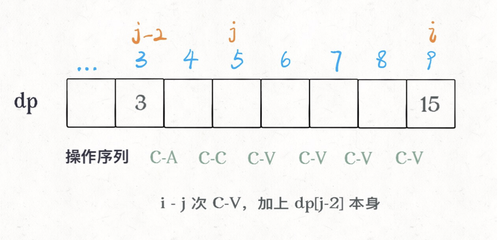

# 四键键盘

```typescript
/*
leecode:
651.四键键盘（中等）
*/
```


## 思路

这种思路会很容易理解，但是效率并不高，我们直接走流程：**对于动态规划问题，首先要明白有哪些「状态」，有哪些「选择」**。  
具体到这个问题，对于每次敲击按键，有哪些「选择」是很明显的：4 种，就是题目中提到的四个按键，分别是 A、C-A、C-C、C-V（Ctrl 简写为 C）。

接下来，思考一下对于这个问题有哪些「状态」？**或者换句话说，我们需要知道什么信息，才能将原问题分解为规模更小的子问题？**

「选择」还是那 4 个，但是这次我们只定义一个「状态」，也就是剩余的敲击次数 n。

这个算法基于这样一个事实，**最优按键序列一定只有两种情况**：  
要么一直按 A：A,A,...A（当 N 比较小时）。  
要么是这么一个形式：A,A..C-A,C-C,C-V,C-V..C-A,C-C,C-V..（当 N 比较大时）。

因为字符数量少（N 比较小）时，C-A C-C C-V 这一套操作的代价相对比较高，可能不如一个个按 A；而当 N 比较大时，后期 C-V 的收获肯定很大。这种情况下整个操作序列大致是：**开头连按几个 A，然后 C-A C-C 组合再接若干 C-V，然后再 C-A C-C 接着若干 C-V，循环下去**。

最后一次按键要么是 A，要么是 C-V，可以通过这两种情况来设计算法：

```typescript
const dp = Array.from({ length: N + 1 });
// 定义dp[i]表示i次操作后最多能显示多少个A
for (let i = 0; i <= N; i++) {
    dp[i] = Math.max(
        按A键，
        按C-V键
    )
}
```

对于【按 A 键】的情况，就是状态 i-1 的屏幕新增了一个 A 而已，很容易得到结果

```typescript
// 按 A 键，就比上次多一个 A 而已
dp[i] = dp[i - 1] + 1;
```

如果是按 C-V，**最优的操作序列一定是 C-A C-C 接着若干(一个或多个) C-V 后续在 C-A C-C C-V 和 C-V 中选择，所以我们用一个变量 j 作为若干 C-V 的起点**，那么 j 之前的 2 个操作就应该是 C-A C-C 了

```typescript
function maxA(N: number) {
  const dp = Array.from({ length: N + 1 });
  dp[0] = 0;
  for (let i = 1; i <= N; i++) {
    // 按A键
    dp[i] = dp[i - 1] + 1;
    for (let j = 2; j < i; j++) {
      // 全选&赋值，连续粘贴i-j次
      // 屏幕上共dp[j-2]*(i-j+1)个A
      dp[i] = Math.max(dp[i], dp[j - 2] * (i - j + 1));
    }
  }
  // N次按键之后最多有几个A
  return dp[N];
}
```

其中 j 变量减 2 是给 C-A C-C 留下操作数，看个图就明白了：



时间复杂度 O(N^2)，空间复杂度 O(N)
