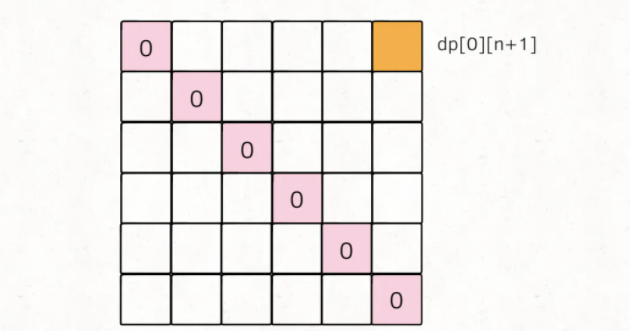
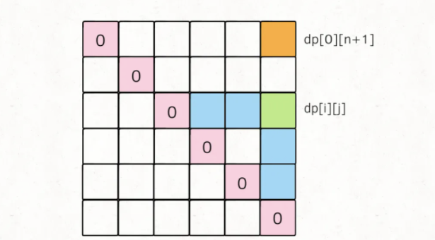
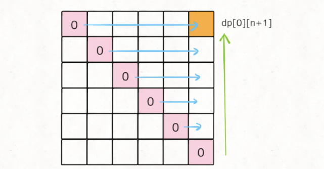

# 戳气球

```typescript
/*
leecode:
312.戳气球（困难）
*/
```


## 回溯思路

套路：**只要涉及求最值，没有任何奇技淫巧，一定是穷举所有可能的结果，然后对比得出最值**。

穷举主要有两种算法，就是回溯算法和动态规划，前者就是暴力穷举，后者是根据状态方程推导【状态】。

回溯算法根据不同的戳气球顺序可能得到不同的分数，全排列后找出最高的那个，时间复杂度是阶乘级别的。

## 动态规划思路

这一题和其他动态规划的题的特别之处和难点在于：**这个问题中我们没戳破一个气球 nums[i],得到的分数和该气球相邻的气球 nums[i]和 nums[i+1]是由相关性的**。

前文说过运用动态规划算法的一个重要条件：**子问题必须独立**，所以对于这个戳气球问题，如果想用动态规划，必须巧妙地定义 dp 数组的含义，避免子问题产生相关性，才能推出合理的状态转移方程。

如何定义 dp 数组？这里需要对问题进行一个简单的转化，题目说可以认为 nums[-1]=nums[n]=1,那么我们先直接把这两个边界加进去，形成一个新的数组 points；

```typescript
function maxCoins(nums: number[]) {
  let n = nums.length;
  let points = Array.from({ length: n + 2 }).map((i) => {
    return i == 0 || i == n + 1 ? 1 : nums[n - 1];
  });
}
```

现在气球的索引变成了从 1 到 n，points[0]和 points[n+1]可以认为是两个虚拟气球。

那么我们现在可以改变题目：**在一排气球 points 中，请你戳破气球 0 和气球 n+1 之间的所有气球（不包括 0 和 n+1）,使得最终只剩下气球 0 和气球 n+1 两个气球，最多能得到多少分**？

定义 dp 数组：**dp[i][j]=x 表示，戳破气球 i 和气球 j 之间(开区间，不包括 i 和 j)的所有气球，可以获得的最高分数为 x**。

根据这个定义，题目要求的结果就是 dp[0][n+1]的值，而 base case 就是 dp[i][j]=0,其中 0<=i<=n+1,j<=i+1

```typescript
let dp = Array.from({ length: n + 2 }).map((i) => {
  return Array.from({ length: n + 2 }).map((j) => 0);
});
```

状态转移方程就是思考怎么【做选择】：

想求戳破气球 i 和气球 j 之间的最高分数，如果【正向思考】，那就只能写出前文的回溯算法；**我们需要反向思考，想一想气球 i 和气球 j 之间最后一个被戳破的气球可能是哪一个？**

i 和 j 就是两个【状态】，最后戳破的那个气球 k 就是【选择】。

**根据刚才对 dp 数组的定义，如果最后一个戳破气球 k，dp[i][j]的值应该为**:

```typescript
dp[i][j] = dp[i][k] + dp[k][j] + points[i] * points[k] * points[j];
```

为了最后戳破气球 k，就得先把卡区间(i,k)的气球都戳破，再把开区间(k,j)的气球都戳破，最后剩下的气球 k，相邻的就是气球 i 和气球 j，这时候戳破 k 的话得到的分数就是 points[i] x points[k] x points[j]

戳破开区间(i,k)和开区间(k,j)的气球最多能得到的分数是多少？就是 dp[i][k]和 dp[k][j]，这恰好是 dp 数组的定义

**对于一组给定的 i 和 j，我们只要穷举 i < k < j 的所有气球 k，选择得分最高的作为 dp[i][j]的值即可**：

```typescript
for (let k = i + 1; k < j; k++) {
  dp[i][j] = Math.max(
    dp[i][j],
    dp[i][k] + dp[k][j] + points[i] * points[k] * points[j],
  );
}
```

还有一个问题，对于 k 的穷举仅仅是在做【选择】，那应该如何穷举【状态】i 和 j 呢？

```typescript
for (let i = 0; ... ; ... ) {
  for (let j = 0; ... ; ... ) {
    for (let k = i + 1; k < j; k++) {
      dp[i][j] = Math.max(
        dp[i][j],
        dp[i][k] + dp[k][j] + points[i] * points[k] * points[j],
      );
    }
  }
}
```

## 最终代码

**关于【状态】的穷举，最重要的一点就是：状态转移所依赖的状态必须被提前计算出来**。

拿这题举例，dp[i][j]所依赖的状态是 dp[i][k]和 dp[k][j],那么我们必须保证：在计算 dp[i][j]时，dp[i][k]和 dp[k][j]已经被计算出来了。

那么应该如何安排 i 和 j 的遍历顺序呢，来提供上述的保证？**根据 base case 和最终状态进行推导**

最终状态就是指题目要求的结果，对于这道题目也就是 dp[0][n+1].

先把 base case 和最终的状态在 DP table 上画出来：



对于任一 dp[i][j]，我们希望所有 dp[i][k]和 dp[k][j]已经被计算，在图上就是这种情况：



为了达到最终状态，可以由两种遍历方法，要么斜着遍历，要么从下到上从左到右遍历：




一般从下往上遍历：

```typescript
function maxCoins(nums: number[]) {
  let n = nums.length;
  // 添加两侧的虚拟气球
  let points = Array.from({ length: n + 2 }).map((i) => {
    return i == 0 || i == n + 1 ? 1 : nums[i - 1];
  });
  // base case 初始化为0
  const dp = Array.from({ length: n + 2 }).map((i) => {
    return Array.from({ length: n + 2 }).map((j) => 0);
  });

  // 状态转移，i应该从下往上
  for (let i = n; i >= 0; i--) {
    // j应该从左往右
    for (let j = i + 1; j < n + 2; j++) {
      // 最后戳破气球的是哪个？
      for (let k = i + 1; k < j; k++) {
        dp[i][j] = Math.max(
          dp[i][j],
          dp[i][k] + dp[k][j] + points[i] * points[j] * points[k],
        );
      }
    }
  }
}
```
