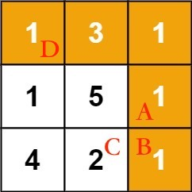

# 最小路径和

```typescript
/*
leecode:
64.最小路径和（中等）
*/
```

现在给你输入一个二维数组 grid，其中的元素都是**非负整数**，现在你站在左上角，**只能向右或者向下移动**，需要到达右下角。现在请你计算，经过的路径和最小是多少？


算法应该返回 7，最小路径和为 7，即上图黄色的路径

**一般来说，让你在二维矩阵中求最优化问题(最大值或者最小值)，肯定需要递归+备忘录，也就是 动态规划**。



我们想从起点 D 到达 B 的最小路径和，如何才能到达 B 呢？题目说了只能向右或者向下走，所以只有从 A 或者 C 到达 B。

是因为位置 A 的元素大小是 1，位置 C 的元素是 2，1 小于 2，所以一定要从 A 走到 B 才能使路径和最小？

并不是，**真正的原因是，从 D 走到 A 的最小路径和是 6，而从 D 走到 C 的最小路径和是 8，6 小于 8，所以一定要从 A 走到 B 才能使路径和最小**。

换句话说，我们把【从 D 走到 B 的最小路径和】这个问题转化成了【从 D 走到 A 的最小路径和】和【从 D 走到 C 的最小路径和】这两个问题。

```typescript
function dp(grid: number[], i: number, j: number);
```

dp 函数定义：**从左上角位置(0,0)走到位置(i,j)的最小路径和为 dp(grid,i,j)**

最小路径和可以通过调用 dp 函数计算出来：

```typescript
function minPathSum(grid: number[][]) {
  let m = grid.length;
  let n = grid[0].length;
  // 计算从左上角到右下角的最小路径和
  return dp(grid, m - 1, n - 1);
}
```

根据刚才的分析，dp(grid,i,j)的值取决于 dp(grid,i-1,j)和 dp(grid,i,j-1)的值

```typescript
function dp(grid: number[][], i: number, j: number) {
  if (i == 0 && j == 0) {
    return grid[0][0];
  }

  if (i < 0 || j < 0) return Infinity;

  return Math.min(dp(grid, i - 1, j), dp(grid, i, j - 1)) + grid[i][j];
}
```

使用备忘录优化重叠子问题

```typescript
let memo: number[][];

function minPathSum(grid: number) {
  let m = grid.length;
  let n = grid[0].length;
  // 构造备忘录，初始值全部为-1
  memo = Array.from({ length: m }).map((i) => {
    return Array.from({ length: n }).map((j) => -1);
  });

  return dp(grid, m - 1, n - 1);
}

function dp(grid: number[][], i: number, j: number) {
  // base case
  if (i == 0 && j == 0) return grid[0][0];
  if (i < 0 || j < 0) return Infinity;
  // 避免重复计算
  if (memo[i][j] != -1) return memo[i][j];
  // 将计算结果记入备忘录
  memo[i][j] = Math.min(dp(grid, i - 1, j), dp(grid, i, j - 1)) + grid[i][j];
  return memo[i][j];
}
```
