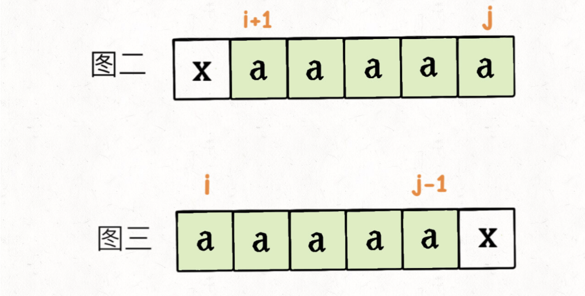
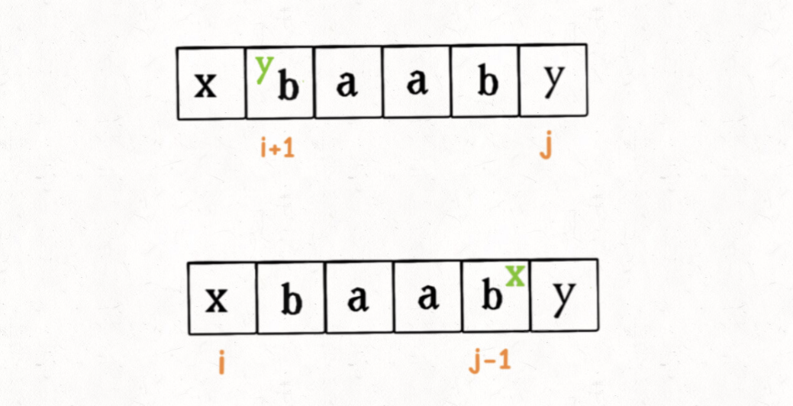
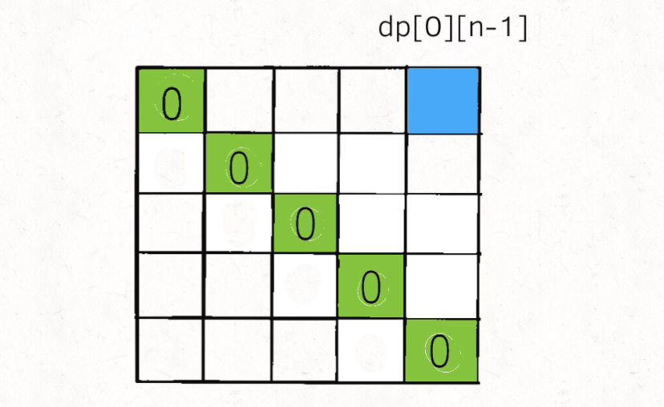
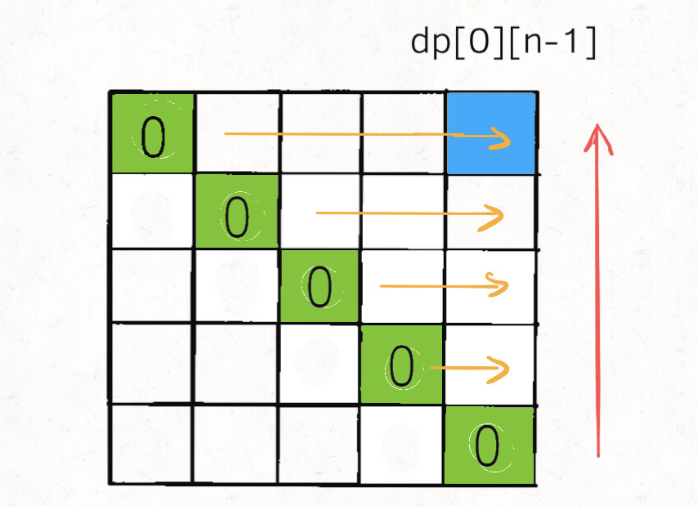

# 构造回文的最小插入次数

```typescript
/*
leecode:
1312.让字符串成为回文串的最少插入次数（困难）
*/
```

输入一个字符串 s，你可以在字符串的任意位置插入任意字符。如果要把 s 变成回文串，请你计算最少要进行多少次插入？

比如说输入 s = "abcea"，算法返回 2，因为可以给 s 插入 2 个字符变成回文串 "abeceba" 或者 "aebcbea"。如果输入 s = "aba"，则算法返回 0，因为 s 已经是回文串，不用插入任何字符。

## 思路解析

首先，要找最少的插入次数，肯定要穷举，暴力算法肯定是指数级别的。所以肯定要用动态规划，回文问题一般都是从字符串的中间向两端扩散，构造回文串也是类似的。

**定义二维 dp 数组：dp[i][j],对字符串 s[i..j],最少需要进行 dp[i][j]次插入才能变成回文串。**。

我们想求整个 s 的最少插入次数，根据这个定义，也就是想求 dp[0][n-1]的大小(n 为 s 的长度)。同时，base case 也很容易想到，当 i==j 时，dp[i][j]=0,因为当 i==j 时 s[i..j]就是一个字符，本身即是回文串，所以不需要进行插入操作。

## 状态转移方程

状态转移就是从小规模问题的答案推导出大规模问题的答案，从 base case 向其他状态推导。**如果我们现在想计算 dp[i][j]的值，而且假设我们已经计算出了子问题 dp[i+1][j-1]的值了，如何推出 dp[i][j]的值呢？**。

**那么也就可以认为 s[i+1..j-1] 已经是一个回文串了，所以通过 dp[i+1][j-1] 推导 dp[i][j] 的关键就在于 s[i] 和 s[j] 这两个字符**。

- 如果 s[i] == s[j]的话，不需要进行任何插入，即：

```typescript
if (s[i] == s[j]) {
  dp[i][j] = dp[i + 1][j - 1];
}
```

- 如果 s[i]!=s[j]，最无脑的办法肯定是插入两次，变成回文串，但不一定是插入次数最少的，最优的插入方案应该被拆解成如下流程：

**步骤一，做选择，先将 s[i..j-1] 或者 s[i+1..j]变为回文串。选择变成回文串的插入次数少的**。

如图二的情况，将 s[i+1..j]变成回文串的代价小，因为它本身就是回文串，根本不需要插入，图三同理。  


然而，如果 s[i+1..j] 和 s[i..j-1] 都不是回文串，都至少需要插入一个字符才能变成回文，所以选择哪一个都一样：



**步骤二，根据步骤一的选择，将 s[i..j]变成回文**。

如果你在步骤一中选择把 s[i+1..j] 变成回文串，那么在 s[i+1..j] 右边插入一个字符 s[i] 一定可以将 s[i..j] 变成回文；同理，如果在步骤一中选择把 s[i..j-1] 变成回文串，在 s[i..j-1] 左边插入一个字符 s[j] 一定可以将 s[i..j] 变成回文

```typescript
if (s[i] != s[j]) {
  // 步骤一选择代价较小的
  // 步骤二必然要进行一次插入
  dp[i][j] = min(dp[i + 1][j], dp[i][j - 1]) + 1;
}
```

## 代码实现

base case 是什么，当 i==j 时，dp[i][j] = 0,因为这时候 s[i..j]就是单个字符，本身就是回文串，不需要任何插入：最终的答案是 dp[0][n-1](n 是字符串 s 的长度)。那么 dp table 如下：



因为状态转移方程中 dp[i][j]和 dp[i+1][j],dp[i][j-1],dp[i+1][j-1]三个状态有关，为了保证每次计算 dp[i][j]时，这三个状态都已经被计算，我们一般选择从下向上，从左到右遍历 dp 数组



```typescript
function minInsertions(s: string) {
  let n = s.length;
  // 定义：对 s[i..j]，最少需要插入 dp[i][j] 次才能变成回文

  // base case：i == j 时 dp[i][j] = 0，单个字符本身就是回文
  // dp 数组已经全部初始化为 0，base case 已初始化
  const dp = Array.from({ length: n }).map((i) => {
    return Array.from({ length: n }).map((j) => 0);
  });
  // 从下向上遍历
  for (let i = n - 2; i >= 0; i--) {
    // 从左向右遍历
    for (let j = i + 1; j < n; j++) {
      // 根据 s[i] 和 s[j] 进行状态转移
      if (s[i] == s[j]) {
        dp[i][j] = dp[i + 1][j - 1];
      } else {
        dp[i][j] = Math.min(dp[i + 1][j], dp[i][j - 1]) + 1;
      }
    }
  }
  return dp[0][n - 1];
}
```

现在这道题就解决了，时间和空间复杂度都是 O(N^2)。还有一个小优化，注意到 dp 数组的状态之和它相邻的状态有关，所以 dp 数组是可以压缩成一维的

```typescript
function minInsertions(s: string) {
  let n = s.length;
  const dp = Array.from({ length: n }).map((i) => 0);

  let temp = 0;
  for (let i = n - 2; i >= 0; i--) {
    // 记录dp[i+1][j-1]
    let pre = 0;
    for (let j = i + 1; j < n; j++) {
      temp = dp[j];

      if (s[i] == s[j]) {
        // dp[i][j] = dp[i+1][j-1]
        dp[j] = pre;
      } else {
        // dp[i][j] = Math.min(dp[i + 1][j], dp[i][j - 1]) + 1;
        dp[j] = Math.min(dp[j], dp[j - 1]) + 1;
      }
      pre = temp;
    }
  }
  return dp[n - 1];
}
```
