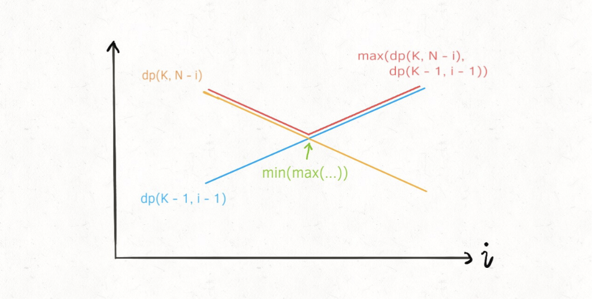
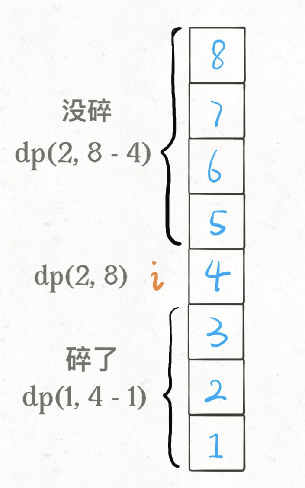

# 高楼扔鸡蛋

```typescript
/*
leecode:
887.鸡蛋掉落（困难）
*/
```

你面前有一栋从 1 到 N 共 N 层的楼，然后给你 K 个鸡蛋（K 至少为 1）。现在确定这栋楼存在楼层 0 <= F <= N，在这层楼将鸡蛋扔下去，鸡蛋恰好没摔碎（高于 F 的楼层都会碎，低于 F 的楼层都不会碎）。现在问你，最坏情况下，你至少要扔几次鸡蛋，才能确定这个楼层 F 呢？

如果不限制鸡蛋个数的话，很明显最好的策略是二分查找思路，但问题是**现在给了你鸡蛋个数的限制 K，直接使用二分思路就不行了**。

比如，100 层两个鸡蛋，如果不要【二分】，变成【五分】【十分】都会大幅减少最坏情况下的尝试次数，比如第一个鸡蛋每隔十层楼扔，在哪里碎了，第二个鸡蛋一个个线性扫描，最优解能达到 14 次

## 思路分析

框架：这个问题有什么【状态】，有什么【选择】，然后穷举。

**[状态]很明显，就是当前拥有的鸡蛋数 K 和需要测试的楼层数 N**。随着测试的进行，鸡蛋个数可能减少，楼层的搜索范围会减小，这就是状态的变化。

**【选择】就是去选择那层楼扔鸡蛋**。

```typescript
function dp(K,N){
    let res;
    for(1<=i<=N){
        res=Math.min(res,这次在第i层楼扔鸡蛋)
    }
    return res
}
```

我们在第 i 层楼扔鸡蛋后，可能出现两种情况：

**鸡蛋碎了**：那么鸡蛋的个数 K 应该减一，搜索的楼层区间应该从[1..N]变为[1..i-1]共 i-1 层楼

**鸡蛋没碎**：鸡蛋的个数 K 不变，搜索的楼层区间从[1..N]变为[i+1..N]共 N-i 层楼

因为我们要求的是**最坏情况**下扔鸡蛋的次数，所以鸡蛋在第 i 层楼碎没碎，取决于哪种情况的结果更大：

```typescript
function dp(K, N) {
  for (let i = 1; i <= N; i++) {
    res = Math.min(
      res,
      Math.max(
        dp(K - 1, i - 1), // 碎
        dp(K, N - i), // 没碎
      ) + 1, // 在第i楼扔了一次
    );
  }
  return res;
}
```

递归的 base case 很容易理解：当楼层数 N 等于 0 时，显然不需要扔鸡蛋，当鸡蛋数 K 为 1 时，显然只能线性扫描扫描所有楼层：

```typescript
function dp(K, N) {
  if (K == 1) return N;
  if (K == 0) return 0;
}
```

消除重叠子问题

```typescript
function superEggDrop(K: number, N: number) {
  const memo = new Map();
  function dp(K, N) {
    // base case
    if (K == 1) return N;
    if (K == 0) return 0;
    // 避免重复计算
    const key = `${K}-${N}`;
    if (memo[key]) return memo[key];

    let res;
    // 穷举所有可能的选择
    for (let i = 0; i < N + 1; i++) {
      res = Math.min(res, Math.max(dp(K, N - i), dp(K - 1, i - 1)) + 1);
    }

    memo[key] = res;
    return res;
  }
  return dp(K, N);
}
```

算法的总时间复杂度是 O(K\*N^2), 空间复杂度为子问题个数，即 O(KN)

## 二分搜索优化

原始动态规划的思路：

- 1.暴力穷举尝试在所有楼层 1 <= i <= N 扔鸡蛋，每次选择尝试次数最少的那一层；

- 2.每次扔鸡蛋有两种可能，要么碎，要么没碎；

- 3.㘝鸡蛋碎了，F 应该在第 i 层下面，否则，F 应该在第 i 层上面；

- 4.鸡蛋碎了或者没碎，取决于那种情况下尝试次数更多，因为我们想求的是最坏情况下的结果。

核心状态转移代码：

```typescript
// 当前状态为K个鸡蛋，面对N层楼
// 返回这歌状态下的最优结果

function dp(K, N) {
  for (i = 1; i <= N; i++) {
    res = Math.min(res, Math.max(dp(K - 1, i - 1), dp(K, N - i)) + 1);
  }
  return res;
}
```

根据 dp(K,N)数组的定义(有 K 个鸡蛋面对 N 层楼，至少需要扔几次)，**很容易知道 K 固定时，这个函数随着 N 的增加一定是单调递增的**

注意 dp(K-1,i-1)和 dp(K,N-i)这两个函数，其中 i 是从 1 到 N 单增的，如果固定 K 和 N，**把这两个函数看做关于 i 的函数，前者随着 i 的增加应该也是单调递增的，而后者随着 i 的增加应该是单调递减的**：



这时候求两者的较大值，再求这些最大值中的最小值，就是求这两条直线交点，即红色折线的最低点。

运用二分查找来优化线性搜索的复杂度，回顾这两个 dp 函数的取线，我们要找的最低点就是这种情况：

```typescript
for (let i = 0; i <= N; i++) {
  if (dp(K - 1, i - 1) == dp(K, N - i)) {
    return dp(K, N - i);
  }
}
```

这就相当于求 Valley(山谷)值，可以用二分查找来快速寻找这个点。

```typescript
function superEggDrop(K: number, N: number) {
  const memo = new Map();
  function dp(K, N) {
    // base case
    if (K == 1) return N;
    if (K == 0) return 0;
    // 避免重复计算
    const key = `${K}-${N}`;
    if (memo[key]) return memo[key];

    let res;
    // 穷举所有可能的选择
    // for (let i = 0; i < N + 1; i++) {
    //   res = Math.min(res, Math.max(dp(K, N - i), dp(K - 1, i - 1)) + 1);
    // }

    // 二分搜索代替线性搜索
    let lo = 1,
      hi = N;

    while (lo <= hi) {
      let mid = Math.floor((lo + hi) / 2);
      let broken = dp(K - 1, mid - 1); // 碎
      let notBroken = dp(K, N - mid); // 没碎

      if (broken > notBroken) {
        hi = mid - 1;
        res = Math.min(res, broken + 1);
      } else {
        lo = mid + 1;
        res = Math.min(res, notBroken + 1);
      }
    }
    memo[key] = res;
    return res;
  }
  return dp(K, N);
}
```

这个算法的时间复杂度是多少呢？动态规划算法的时间复杂度就是子问题个数 × 函数本身的复杂度。

函数本身的复杂度就是忽略递归部分的复杂度，这里 dp 函数中用了一个二分搜索，所以函数本身的复杂度是 O(logN)。  
子问题个数也就是不同状态组合的总数，显然是两个状态的乘积，也就是 O(KN)。  
所以算法的总时间复杂度是 O(K*N*logN), 空间复杂度 O(KN)。效率上比之前的算法 O(KN^2) 要高效一些。

### 重新定义状态转移

对 dp 数组的定义稍作修改，**确定当前的鸡蛋个数和最多允许的扔鸡蛋次数，就知道能够确定 F 的最高楼层数**：

```typescript
dp[k][m] = n;
/*
当前有k个鸡蛋，可以尝试扔m次鸡蛋
这个状态下，最坏情况下最多能确切测试一栋n层的楼

比如说dp[1][7] = 7表示：
现在又1个鸡蛋，允许你扔7次；
这个状态下最多给你7层楼，
使得你可以确定楼层F 使得鸡蛋恰好摔不碎。
(一层层线性探查)
*/
```

这种定一下的最终想求的答案是什么？其实是扔鸡蛋次数 m，但是这时候 m 在状态之中而不是 dp 数组的结果，可以这样处理：

```typescript
function superEggDrop(K: number, N: number) {
  let m = 0;
  while (dp[K][m] < N) {
    m++;
    // 状态转移
  }
  return m;
}
```

题目**给你 K 鸡蛋，N 层楼，让你求最坏情况下最少的测试次数**，while 循环结束的条件是 dp[K][m] == N，也就是**给你 K 个鸡蛋，测试 m 次，最坏情况下最多能测试 N 层楼**。



这个图描述的仅仅是某一个楼层 i，原始解法还得线性或者二分扫描所有楼层，要求最大值，最小值，但是现在这种 dp 定义根本不需要这些了，基于下面两个事实：

- **1.无论你再那层扔鸡蛋，鸡蛋只可能摔碎或者没摔碎，碎了就测楼下，没碎就测楼上**。

- **2.无论上楼还是下楼，总的楼层数=楼上的楼层数+楼下的楼层数+1（当前这层楼）**。

dp 状态转移方程：dp[k][m]=dp[k][m-1] + dp[k-1][m-1]+1

**dp[k][m-1]就是楼上的楼层数**，因为鸡蛋个数 k 不变，即鸡蛋没碎，扔鸡蛋次数 m-1；

**dp[k-1][m-1]就是楼下的楼层数**，因为鸡蛋个数 k-1，也就是鸡蛋碎了，同时扔鸡蛋次数 m-1；


```typescript
function superEggDrop(K: number, N: number) {
  const dp = Array.from({ length: K + 1 }).map((i) => {
    return Array.from({ length: N + 1 }).map((j) => 0);
  });

  // base case:
  // dp[0][..]=0;
  // dp[..][0]=0;

  let m = 0;
  while (dp[K][m] < N) {
    m++;
    for (let k = 1; k < K; k++) {
      dp[k][m] = dp[k][m - 1] + dp[k - 1][m - 1] + 1;
    }
  }
  return m;
}
```

这段代码就相当于：

```typescript
for (let m = 1; dp[K][m] < N; m++) {
  for (let k = 1; k < K; k++) {
    dp[k][m] = dp[k][m - 1] + dp[k - 1][m - 1] + 1;
  }
}
```

这个算法的时间复杂度是多少？很明显就是两个嵌套循环的复杂度 O(KN)。

另外注意到 dp[m][k] 转移只和左边和左上的两个状态有关，所以很容易优化成一维 dp 数组，这里就不写了。
