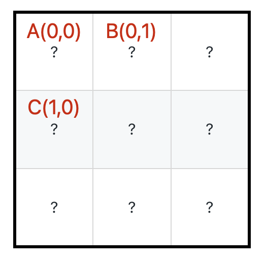

# 魔塔

```typescript
/*
leecode:
174.地下城游戏（困难）
*/
```

输入一个存储着整数的二维数组 grid，如果 grid[i][j] > 0，说明这个格子装着血瓶，经过它可以增加对应的生命值；如果 grid[i][j] == 0，则这是一个空格子，经过它不会发生任何事情；如果 grid[i][j] < 0，说明这个格子有怪物，经过它会损失对应的生命值。

换句话说，就是问你至少需要多少初始生命值，能够让骑士从最左上角移动到最右下角，且**任何时候生命值都要大于 0**。

dp 函数的定义：

**从 grid[i][j]到达终点(右下角)所需的最少生命值是 dp(grid,i,j)**。

```typescript
function dp(grid: number[][], i: number, j: number) {
  let m = grid.length;
  let n = grid[0].length;
  // base case
  if (i == m - 1 && j == n - 1) {
    return grid[i][j] >= 0 ? 1 : -grid[i][j] + 1;
  }
}
```

根据新的 dp 函数定义和 base case ，我们想求 dp(0,0),那就应该试图通过 dp(i,j+1)和 dp(i+1,j)推导出 dp(i,j),这样才能不断逼近 base case，正确进行状态转移

具体来说,[从 A 到达右下角的最少生命值] 应该由[从 B 到达右下角的最少生命值]和[从 C 到达右下角的最少生命值]推导出来:



假设 A 的值为 1，既然知道下一步要往 C 走，且 dp(1,0) =4 意味着走到 grid[1][0]的时候至少要有 4 点生命值，那么就可以确定骑士出现在 A 点时需要 4-1=3 点初始生命值，

如果 A 的值为 10，超出后续需求，4-10=-6 意味着骑士的初始生命为负数，很明显不行，所以这种情况下骑士的初始生命应该是 1

状态转移方程：

```typescript
let res = Math.min(dp(i + 1, j), dp(i, j + 1)) - grid[i][j];
dp(i, j) = res <= 0 ? 1 : res;
```

自顶向下的动态规划

```typescript
let memo: number[][];

function calcMinHP(grid: number) {
  let m = grid.length;
  let n = grid[0].length;
  // 构造备忘录，初始值全部为-1
  memo = Array.from({ length: m }).map((i) => {
    return Array.from({ length: n }).map((j) => -1);
  });

  //自顶向下
  return dp(grid, 0, 0);
}

// 从 (i, j) 到达右下角，需要的初始血量至少是多少
function dp(grid: number[][], i: number, j: number) {
  let m = grid.length;
  let n = grid[0].length;
  // base case
  if (i == m - 1 && j == n - 1) {
    // 如果血量<0 说明至少需要-grid[i][j]+1
    return grid[i][j] >= 0 ? 1 : -grid[i][j] + 1;
  }
  if (i == m || j == n) return Infinity;

  // 避免重复计算
  if (memo[i][j] != -1) return memo[i][j];

  // 将计算结果记入备忘录
  // 每个格子的血量最小为1
  res = Math.max(
    // 如果下一步可以加血，减去上一步格子里的数值，就是上一步格子需要的最少值
    Math.min(dp(grid, i + 1, j), dp(grid, i, j + 1)) - grid[i][j],
    1,
  );
  return memo[i][j];
}
```
