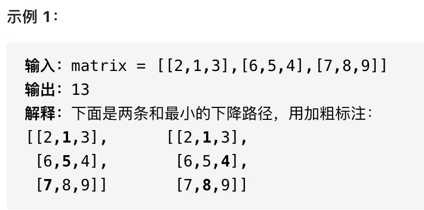
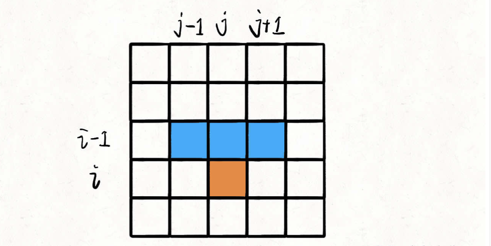

# base case 和备忘录的初始值

```typescript
/*
leecode:
931.下降路径最小和（中等）
*/
```

输入为一个 n\*n 的二维数组 matrix,计算从第一行落到最后一行，经过的路径和最小为多少。



**base case 返回值、备忘录的初始值、索引越界情况返回值如何确定**？

定义 dp 函数：**从第一行(matrix[0][...])向下落，落到位置 matrix[i][j]的最小路径和为 dp(matrix,i,j)**

```typescript
function minFallingPathSum(matrix: number[][]) {
  let n = matrix.length;
  let res = Infinity;

  for (let j = 0; j < n; j++) {
    res = Math.min(res, dp(matrix, n - 1, j));
  }

  return res;
}
```

因为我们可能落到最后一行的任意一列，所以要穷举一下，看看落到哪一列才能得到最小的路径和。

dp 函数的实现：

对于 matrix[i][j],只有可能从 matrix[i-1][j],matrinx[i-1][j-1],matrix[i-1][j+1],这三个位置转移过来。



**那么，只要知道到达(i-1,j),(i-1,j-1),(i-1,j+1)这三个位置的最小路径和，加上 matrix[i][j]的值，就能计算出到达位置(i,j)的最小路径和**.

```typescript
// 暴力穷举法

function dp(matrix: number[][], i: number, j: number) {
  // 非法索引检查
  if (i < 0 || j < 0 || j >= matrix.length || j >= matrix[0].length) {
    // 返回一个特殊值
    return 9999;
  }

  // base case
  if (i == 0) return matrix[i][j];

  // 状态转移
  return (
    matrix[i][j] +
    min(
      dp(matrix, i - 1, j),
      dp(matrix, i - 1, j - 1),
      dp(matrix, i - 1, j + 1),
    )
  );
}

function min(a, b, c) {
  return Math.min(a, Math.min(b, c));
}
```

上述代码为暴力穷举法，可以用备忘录的方法消除重叠子问题，完整代码如下：

```typescript
function minFallingPathSum(matrix: number[][]) {
  let n = matrix.length;
  let res = Infinity;
  // 备忘录的值初始化为6666
  memo = Array.from({ length: n }).map((i) => {
    return Array.from({ length: n }).map((i) => 11111);
  });
  // 终点可能在matrix[n-1]的任意一列
  for (let j = 0; j < n; j++) {
    res = Math.min(res, dp(matrix, n - 1, j));
  }
  return res;
}

let memo: number[][];

function dp(matrix: number[][], i: number, j: number) {
  // 非法索引检查
  if (i < 0 || j < 0 || j >= matrix.length || j >= matrix[0].length) {
    // 返回一个特殊值
    return 23333;
  }

  // base case
  if (i == 0) return matrix[0][j];

  if (memo[i][j] !== 11111) {
    return memo[i][j];
  }

  // 状态转移

  memo[i][j] =
    matrix[i][j] +
    Math.min(
      dp(matrix, i - 1, j),
      dp(matrix, i - 1, j - 1),
      dp(matrix, i - 1, j + 1),
    );
  return memo[i][j];
}
```

对于 dp 函数主要探讨三个问题：

- 1.对于索引的合法性检测，返回值为什么是 23333，其他值行不行？

- 2.base case 为什么是 i==0？

**返回值为什么是 matrix[0][j],这是根据 dp 函数的定义所决定的**，从 matrix[0][j]开始下落，如果想落到的目的地是 i==0,所需的路径和当然就是 matrix[0][j]

- 3.备忘录 memo 的初始值为什么是 11111？其他值行不行。

对于 1，3 问题，因为题目给出的范围是 100\*100，所以最大为 10000，超过 10000 设置为特殊值即可

**对于不合法的索引，返回值应该如何确定，这需要根据我们的状态转移方程的逻辑确定**。

```typescript
return (
  matrix[i][j] +
  Math.min(
    dp(matrix, i - 1, j),
    dp(matrix, i - 1, j - 1),
    dp(matrix, i - 1, j + 1),
  )
);
```

显然 i-1,j-1,j+1 这几个运算可能会造成索引越界，对于索引越界的 dp 函数，应该返回一个不可能被取到的值。

因为我们调用的是 min 函数，最终返回的值是最小值，所以对于不合法的索引，只要 sp 函数返回一个永远不会被取到的最大值即可。
