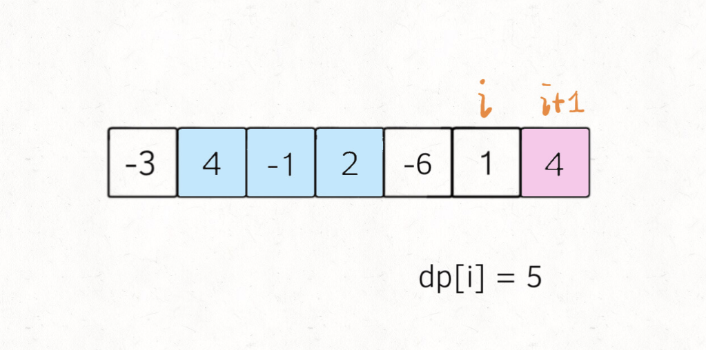

# 最大子数组

```typescript
/*
leecode:
53.最大子序和（简单）
*/
```


## 思路分析

看到子串/子数组问题，就应该想到滑动窗口算法。但是**这道题还不能用滑动窗口算法，因为数组中的数字可以是负数**。

滑动窗口算法无非就是双指针形成的窗口扫描整个数组/子串,但关键是，你得清楚地知道什么时候应该移动右侧指针来扩大窗口，什么时候移动左侧指针来减小窗口。

而这道题，窗口扩大时可能是负数，窗口中的值也就可能增加也可能减少，这种情况下不知道什么时机去搜索左侧窗口，也就无法求出【最大子数组和】。

按照通常动态规划定义 dp 数组：**nums[0..i]中的[最大的子数组和]为 dp[i]**.

如果这样定义的话，整个 nums 数组的【最大子数组和】就是 dp[n-1].那么如何根据 dp[n-1]，推导出 dp[i]呢？

如下图，按照 dp 数组的定义，dp[i]=5,即等于 nums[0..i]中的最大子数组和：



按照属性归纳法，**实际上是无法用 dp[i]推出 dp[i+1]的，因为子数组一定是连续的，按照我们当前 dp 数组定义，并不能保证 nums[0..1]中的最大子数组与 nums[i+1]是相邻的，也就没办法从 dp[i]推导出 dp[i+1]**

需要重新定义 dp 数组的含义：

**以 nums[i]为结尾的[最大子数组和]为 dp[i]**.

这种定义下，想得到整个 nums 数组的【最大子数组和】，不能直接返回 dp[n-1],而需要遍历整个 dp 数组：

```typescript
let res = Math.max(...dp);
return res;
```

假设我们已经算出 dp[i-1],如何推导出 dp[i]?

**dp[i]有两种[选择],要么与前面的相邻子数组链接，形成一个和为更大的子数组，要么不与前面的子数组链接，自成一派，自己作为一个子数组**。最后取这两种情况中的最大值

```typescript
function maxSubArray(nums: number[]) {
  let n = nums.length;
  if (n == 0) return 0;
  const dp = Array.from({ length: n });
  // base case 第一个元素前面没有子数组
  dp[0] = nums[0];
  // 状态转移方程
  for (let i = 1; i < n; i++) {
    // 遍历得到每个下标对应的以 nums[i]为结尾的[最大子数组和]
    dp[i] = Math.max(nums[i], nums[i] + dp[i - 1]);
  }

  // 得到nums的最大子数组
  return Math.max(...dp);
}
```

上述解法时间复杂度 O(N),空间复杂度 O(N),不过**注意到 dp[i]仅仅和 dp[i-1]状态有关**，那么我们可以进行【状态压缩】，将空间复杂度降低。

```typescript
function maxSubArray(nums: number[]) {
  let n = nums.lnegth;
  if (n == 0) return 0;

  // base case
  let dp_0 = nums[0];
  let dp_1 = 0,
    res = dp_0;

  for (let i = 1; i < n; i++) {
    // dp[i] = Math.max(nums[i], nums[i] + dp[i - 1]);
    dp_1 = Math.max(nums[i], nums[i] + dp_0);
    dp_0 = dp_1;
    // 顺便计算最大结果
    res = Math.max(res, dp_1);
  }
  return res;
}
```

## 总结

【最大子数组和】和【最长递增子序列】非常类似，dp 数组的定义是【以 nums[i]为结尾的最大子数组和/最长递增子序列为 dp[i]】.因为只有这样定义才能将 dp[i+1]和 dp[i]建立起联系，利用数学归纳法写出状态转移方程。
