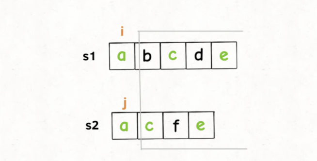
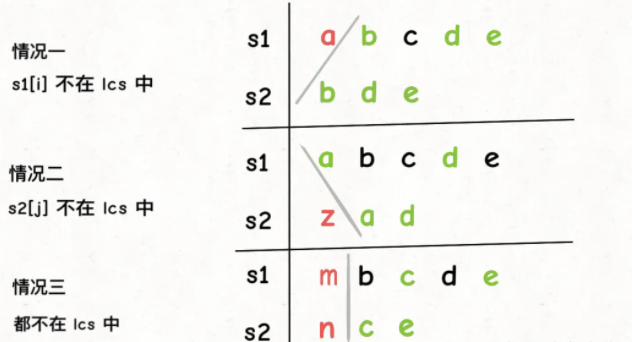
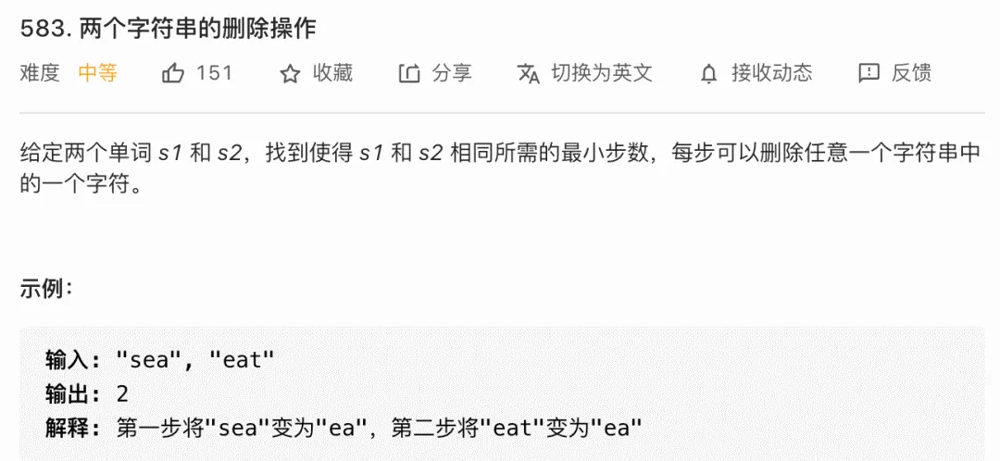
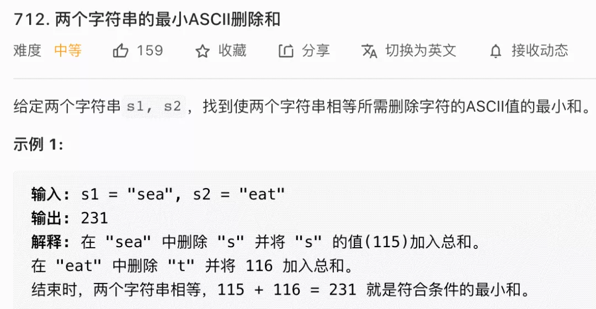

# 最长公共子序列

```typescript
/*
leecode:
1143.最长公共子序列（中等）
583. 两个字符串的删除操作（中等）
712.两个字符串的最小ASCII删除和（中等）
*/
```

计算最长公共子序列（Longest Common Subsequence，简称 LCS)

给你输入两个字符串 s1 和 s2，请你找出他们俩的最长公共子序列，返回这个子序列的长度。

比如说输入 s1 = "zabcde", s2 = "acez"，它俩的最长公共子序列是 lcs = "ace"，长度为 3，所以算法返回 3。

暴力算法，把 s1 和 s2 的所有子序列都穷举出来，然后看看有没有公共的，然后在所有公共子序列里面再寻找一个长度最大的。复杂度是指数级别的。

**对于两个字符串求子序列的问题，都是用两个指针 i 和 j 分别在两个字符串上移动，大概率是动态规划思路**。

先写 dp 函数：**dp(s1, i, s2, j)计算 s1[i..]和 s2[j..]的最长公共子序列长度**。

```typescript
// 计算s1[i..]和s2[j..]的最长公共子序列长度
function dp(s1: string, i: number, s2: string, j: number) {}
```

根据这个定义，我们想要的答案就是 dp[s1,0,s2,0],且 base case 就是 i == len(s1)或 j == len(s2)时，因为这时候 s1[i...]或 s2[j..]就相当于空串了，最长公共子序列的长度显然为 0.

```typescript
function longestCommonSubsequence(s1: string, s2: string) {
  return dp(s1, 0, s2, 0);
}

function dp(s1: string, i: number, s2: string, j: string) {
  if (i == s1.length || j == s2.length) {
    return 0;
  }
}
```

我们只看 s1[i]和 s2[j],如果 s1[i] == s2[j],说明这个字符一定在 lcs 中



这样，就找到了一个 lcs 中的字符，根据 dp 函数的定义，我们可以完善一下代码：

```typescript
function dp(s1: string, i: number, s2: string, j: string) {
  if (i == s1.length || j == s2.length) {
    return 0;
  }

  if (s1[i] === s2[j]) {
    // s1[i]和s2[j]必然在lcs中
    // 加上s1[i+1..]和s2[j+1..]中的lcs长度，就是答案
    return 1 + dp(s1, i + 1, s2, j + 1);
  } else {
    // ...
  }
}
```

如果 s[i] != s2[j]时，意味着**s1[i]和 s2[j]中至少有一个字符不再 lcs 中**：



总共有三种情况

```typescript
function dp(s1: string, i: number, s2: string, j: string) {
  if (i == s1.length || j == s2.length) {
    return 0;
  }

  if (s1[i] === s2[j]) {
    // s1[i]和s2[j]必然在lcs中
    // 加上s1[i+1..]和s2[j+1..]中的lcs长度，就是答案
    return 1 + dp(s1, i + 1, s2, j + 1);
  } else {
    return Math.max(
      // s1[i]在lcs中
      dp(s1, i + 1, s2, j),
      // s2[j]不在lcs中
      dp(s1, i, s2, j + 1),
      // 都不在lcs中
      dp(s1, i + 1, s2, j + 1),
    );
  }
}
```

最后一个优化：**情况三「s1[i]和 s2[j]都不在 lcs 中」其实可以直接忽略。**。

因为我们在求最大值嘛，情况三在计算 s1[i+1..]和 s2[j+1..]的 lcs 长度，这个长度肯定是小于等于情况二 s1[i..]和 s2[j+1..]中的 lcs 长度的，因为 s1[i+1..]比 s1[i..]短嘛，那从这里面算出的 lcs 当然也不可能更长嘛。

同理，情况三的结果肯定也小于等于情况一。说白了，情况三被情况一和情况二包含了，所以我们可以直接忽略掉情况三

```typescript
const memo: number[][];

function longestCommonSubsequence(s1: string, s2: string) {
  let m = s1.length,
    n = s2.length;
  // 备忘录值为-1，代表未曾计算
  memo = Array.from({ length: m }).map((i) => {
    return Array.from({ length: n }).map((j) => -1);
  });
  // 计算s1[0..]和s2[0..]的lcs长度
  return dp(s1, 0, s2, 0);
}

function dp(s1: string, i: number, s2: string, j: number) {
  // base case
  if (i == s1.length || j == s2.length) {
    return 0;
  }

  // 如果之前计算过，直接返回备忘录中的答案
  if (memo[i][j] != -1) {
    return memo[i][j];
  }

  if (s1[i] === s2[j]) {
    // s1[i]和s2[j]必然在lcs中
    // 加上s1[i+1..]和s2[j+1..]中的lcs长度，就是答案
    memo[i][j] = 1 + dp(s1, i + 1, s2, j + 1);
  } else {
    memo[i][j] = Math.max(
      // s1[i] 和 s2[j] 至少有一个不在 lcs 中
      dp(s1, i + 1, s2, j),
      dp(s1, i, s2, j + 1),
    );
  }

  return memo[i][j];
}
```

## 字符串的删除操作



最后这两个字符串删除的记过就是他们的最长公共子序列，那么要计算删除的次数，就可以通过最长公共子序列的长度推导出来：

```typescript
function minDistance(s1: string, s2: string) {
  let m = s1.length;
  let n = s2.length;
  let lcs = longestCommonSubsequence(s1, s2);
  return m - lcs + n - lcs;
}
```

## 最小 ASCII 删除和



和上一题非常相似，不过问的是删除的字符的 ASCII 码加起来的值，那就不能直接复用计算最长公共子序列的函数了，但是可以依照之前的思路，**稍微修改 base case 和状态转移部分即可**

```typescript
const memo: number[][];

function minimumDeleteSum(s1: string, s2: string) {
  let m = s1.length,
    n = s2.length;
  // 备忘录值为-1，代表未曾计算
  memo = Array.from({ length: m }).map((i) => {
    return Array.from({ length: n }).map((j) => -1);
  });
  // 计算s1[0..]和s2[0..]的lcs长度
  return dp(s1, 0, s2, 0);
}

function dp(s1: string, i: number, s2: string, j: number) {
  let res = 0;
  // base case
  if (i == s1.length) {
    // 如果s1到头了，那么s2剩下的都删除
    for (; j < s2.length; j++) {
      res += s2[j].charCodeAt();
    }
  }
  if (j == s2.length) {
    // 如果s2到头了，那么s1剩下的都删除
    for (; i < s1.length; i++) {
      res += s1[i].charCodeAt();
    }
  }
  // 如果之前计算过，直接返回备忘录中的答案
  if (memo[i][j] != -1) {
    return memo[i][j];
  }

  if (s1[i] === s2[j]) {
    // s1[i]和s2[j]必然在lcs中
    memo[i][j] = dp(s1, i + 1, s2, j + 1);
  } else {
    memo[i][j] = Math.min(
      // s1[i] 和 s2[j] 至少有一个不在 lcs 中
      s1[i].charCodeAt() + dp(s1, i + 1, s2, j),
      s2[j].charCodeAt() + dp(s1, i, s2, j + 1),
    );
  }

  return memo[i][j];
}
```
