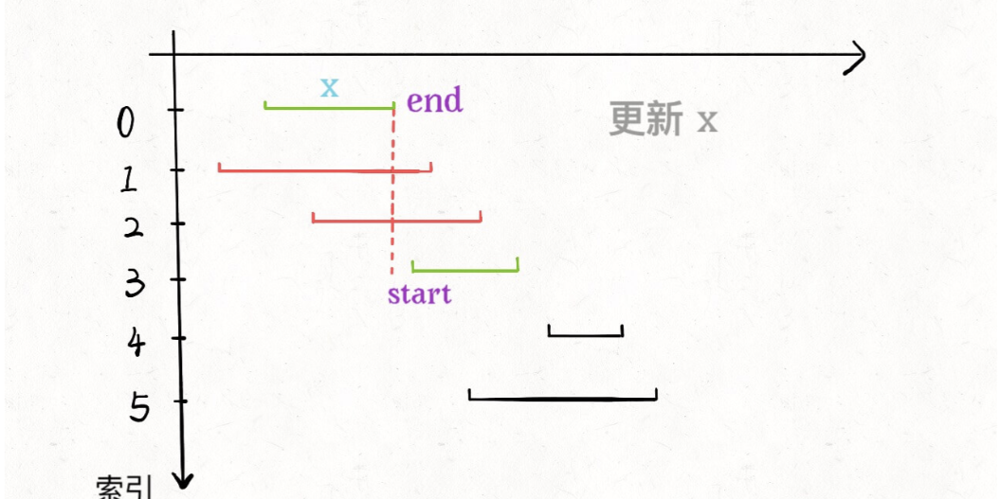

# 区间调度问题

```typescript
/*
leecode:
435. 无重叠区间（中等）
452.用最少数量的箭引爆气球（中等）
*/
```

贪心算法可以认为是动态规划算法的一个特例，相比动态规划，使用贪心算法需要满足更多的条件(贪心选择性质)，但是效率比动态规划要高。

比如一个算法问题使用暴力解法需要指数级时间，如果能使用动态规划消除重叠子问题，就可以降到多项式级别的时间，如果满足贪心选择性质，那么可以进一步降低时间复杂度，达到线性级别。

什么是贪心选择性质呢？简单来说就是：**每一步都做出一个局部最优的选择，最终的结果就是全局最优**。注意，这是一种特殊性质，只有一部分问题拥有这个性质。

比如你面前放着 100 张人民币，你只能拿十张，如何才能拿到最多的面额，显然每次选择剩下钞票中面值最大的那张，最后的结果一定是最优的。

然而，大部分问题明显不具有贪心选择性质

## 问题描述

给你很多形如[start,end]的闭区间，设计一个算法，**算出这些区间中最多有几个互不相交的区间**。

举个例子，intvs=[[1,3],[2,4],[3,6]],这些区间最多有 2 个区间互不相交，即[[1,3],[3,6]],返回 2. 注意边界相同并不算相交。

## 贪心解法

错误的贪心思路：

也许我们可以每次选择可选区间中开始最早的那个，但是可能存在某些区间开始很早，但是很长，使得我们错误地错过了一些短的区间。或者我们每次选择可选区间中最短的那个？或者选择出现冲突最少的按个区间？这些方案都能举出反例，不是正确的方案。

正确思路分三步：

- 1. 从区间集合 invts 中选择一个区间 x,这个 x 是在当前所有区间中**结束最早的(end 最小)**。

- 2.把所有与 x 区间相交的区间从区间集合 intvs 中删除

- 3.重复步骤 1 和 2，知道 intvs 为空为止，之前选出的那些 x 就是最大不相交子集。

关键在于如何去除与 x 相交的区间，选择下一轮循环的 x 呢？

**由于我们事先排了序**，不难发现所有与 x 相交的区间必然会与 x 的 end 相交，如果一个区间不想与 x 的 end 相交，它的 start 必须要大于或等于 x 的 end：



```typescript
function intervalSchedule(intvs: number[][]) {
  if (intvs.length == 0) return 0;

  // 按end升序排序
  intvs.sort((a, b) => {
    return a[1] - b[1];
  });
  // 至少有一个区间不相交
  let count = 1;
  // 排序后，第一个区间就是x
  let x_end = intvs[0][1];
  for (const interval of intvs) {
    let start = interval[0];
    if (start >= x_end) {
      // 找到下一个选择的区间
      count++;
      x_end = interval[1];
    }
  }
  return count;
}
```

## 应用举例


我们已经会求最多有几个区间不会重叠了，那么剩下的不就是至少需要去除的区间吗？

```typescript
function eraseOverlapIntervals(intervals: number[][]) {
  let n = intervals.length;
  return n - intervalSchedule(intervalss);
}
```


这个题和区间调度算法一模一样，只有一点不一样，在 intervalSchedule 算法中，如果两个区间的边界触碰，不算重叠，而按照这道题目的描述，箭头如果碰到边界气球也会爆炸，所以说相当于区间的边界触碰也算重叠。

```typescript
function findMinArrowShots(intvs: number[][]) {
  if (intvs.length == 0) return 0;
  intvs.sort((a, b) => {
    return a[1] - b[1];
  });
  let count = 1;
  let x_end = intvs[0][1];
  for (const interval of intvs) {
    let start = interval[0];
    // 把>= 改成>即可
    if (start > x_end) {
      count++;
      x_end = interval[1];
    }
  }
  return count;
}
```
