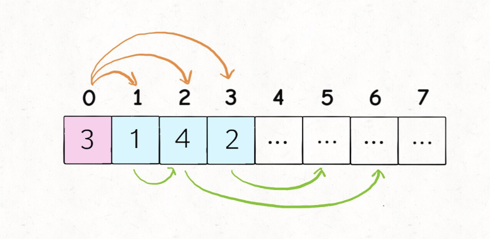
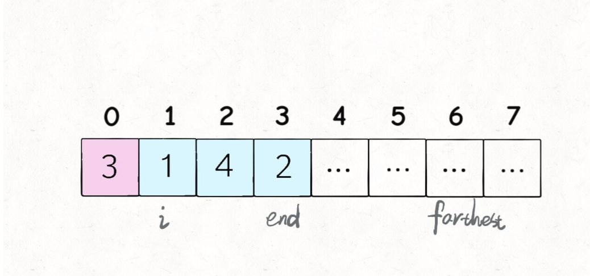

# 贪心思想玩跳跃游戏

```typescript
/*
leecode:
55.跳跃游戏（中等）
45.跳跃游戏 II（困难）
*/
```

## 跳跃游戏 1


**关于动态规划的问题，大多是让你求最值**，比如最长子序列，最小编辑距离，最长公共子串等。因为动态规划本身就是运筹学里的一种求最值的算法。

这道题表面不是求最值，但是可以改一改：

**请问通过题目的跳跃规则，最多能跳多远**？如果能够越过最后一格，返回 true，否则返回 false。

```typescript
// 实际该题主要需要考虑的是0的情况能否跨过去
function canJump(nums: number[]) {
  let n = nums.length;
  let ferthest = 0;
  for (let i = 0; i < n - 1; i++) {
    // 元素为非负正整数，只要不是0，都可以跳到下一步
    // 不断计算能跳到的最远距离
    farthest = Math.max(farthest, i + nums[i]);
    // 碰到0，卡主跳不过去
    if (farthest <= i) return false;
  }
  return farthest >= n - 1;
}
```

## 跳跃游戏 2


**现在的问题是，保证你一定可以跳到最后一格，请问你最少要跳多少次，才能跳过去**。

动态规划的思路，采用自顶向下的递归动态规划，定义 dp 函数

```typescript
// 定义：从索引p跳到最后一格，至少需要dp(nums,p)步
function dp(nums: number[], p: number) {}
```

我们要求的结果就是 dp(nums,0),base case 就是当 p 超过最后一格时，不需要跳跃：

```typescript
if (p >= nums.size() - 1) {
  return 0;
}
```

套用动态规划框架，暴力穷举所有可能的跳法，通过备忘录 memo 消除重叠子问题，取最小值

```typescript
let memo: number[];

function jump(nums: number[]) {
  let n = nums.length;
  // 因为从0调到n-1最多n-1步
  memo == Array.from({ length: n }).map((i) => n);
  return dp(nums, 0);
}

function dp(nums: number[], p: number) {
  let n = nums.length;
  // base case
  if (p >= n - 1) return 0;
  // 子问题已经计算过
  if (memo[p] != n) return memo[p];

  let steps = nums[p];
  // 可以选择跳1步，2步...
  for (let i = 1; i <= steps; i++) {
    // 穷举每一个选择
    // 计算每一个子问题的结果
    let subProblem = dp(nums, p + i);
    // 取其中最小的最为结果
    memo[p] = min(memo[p], subProblem + 1);
  }

  return memo[p];
}
```

时间复杂度是递归深度\*每次递归的时间复杂度为 O(N^2),过高。

**贪心算法比动态规划多一个性质：贪心选择性质**.

上述代码中 for 循环会陷入递归计算子问题，这是复杂度高的根本原因。但是**似乎不需要递归，只需要判断哪一个选择最具有【潜力】即可**：



上图情况下，站在索引 0 的位置，可以向前跳 1，2，或 3 步，**显然应该跳 2 步跳到索引 2，因为 nums[2]的可调月区域涵盖了索引区间[3..6],比其他都大**，如果想求最少的跳跃次数，那么索引 2 跳必然是最优的选择。

**这就是贪心选择性质，我们不需要【递归地】计算出所有选择的具体结果然后求最值，只需要找出那个最【有潜力】的选择即可**.

```typescript
function jump(nums: number[]) {
  let n = nums.length;
  let end = 0,
    farthest = 0;
  let jumps = 0;
  for (let i = 0; i < n - 1; i++) {
    farthest = Math.max(nums[i] + i, farthest);
    if (end == i) {
      jumps++;
      end = farthest;
    }
  }
  return jumps;
}
```



i 和 end 标记了可以选择的跳跃步数，farthest 标记了所有选择[i..end]中能够跳到的最远距离，jumps 记录了跳跃次数。

时间复杂度 O(N)，空间复杂度 O(1)
