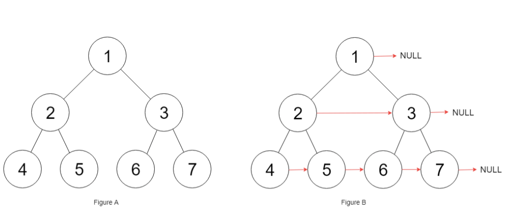
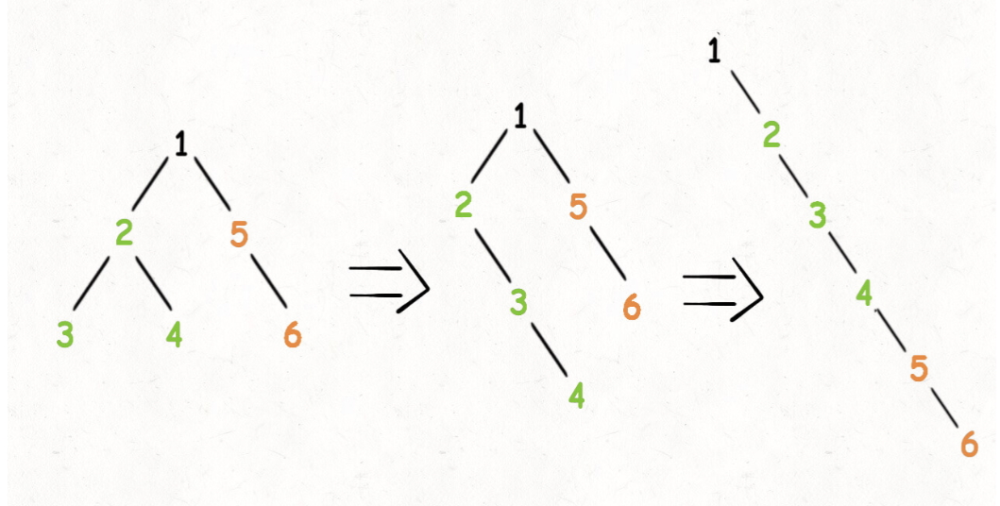
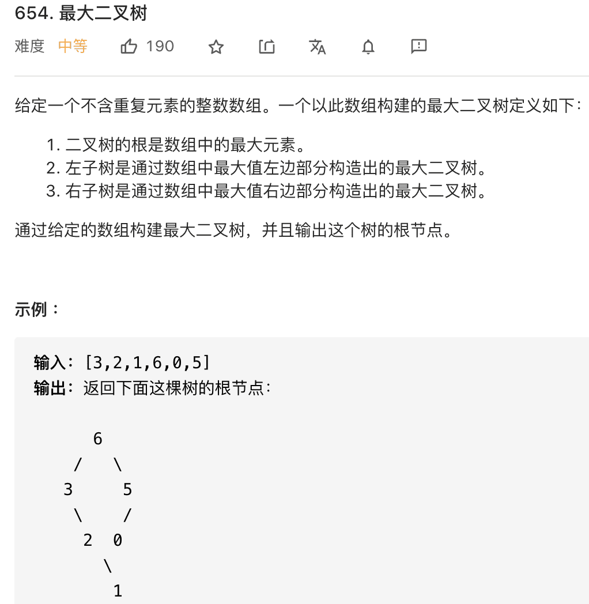
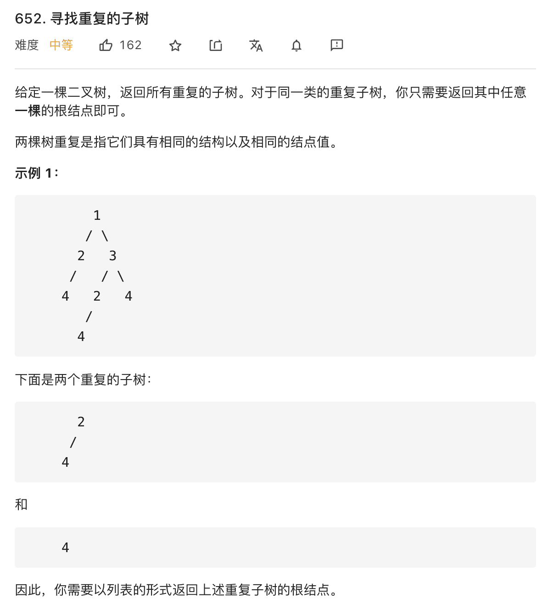

# 二叉树

```typescript
/*
leecode:
226.翻转二叉树（简单）
114.二叉树展开为链表（中等）
116.填充每个节点的下一个右侧节点指针（中等）
654.最大二叉树（中等）
105.从前序与中序遍历序列构造二叉树（中等）
106.从中序与后序遍历序列构造二叉树（中等）
652.寻找重复的子树（中等）

*/
```

树的问题即树的递归遍历框架：

```typescript
// 二叉树遍历框架
function traverse(root: TreeNode) {
  // 前序遍历
  traverse(root.left);
  // 中序遍历
  traverse(root.right);
  // 后序遍历
}
```

## 二叉树的重要性

**快速排序就是二叉树的前序遍历，归并排序就是二叉树的后序遍历**。

快速排序的逻辑是：若要对 nums[lo..hi]进行排序，我们先找一个分界点 p,通过交换元素使得 nums[lo..p-1]都小于等于 nums[p],且 nums[p+1..hi]都大于 nums[p],然后递归地去 nums[lo..p-1]和 nums[p+1..hi]中寻找新的分界点，最后整个数组就被排序了。

快排的框架如下：

```typescript
function sort(nums: number[], lo: number, hi: number) {
  // 前序遍历位置
  // 通过交换元素构建分界点p
  let p = partition(nums, lo, hi);
  //...

  sort(nums, lo, p - 1);
  sort(nums, p + 1, hi);
}
```

先构造分界点，然后去左右子数组构造分界点，与二叉树的前序遍历思路一致。

归并排序逻辑：若要对 nums[lo..hi]进行排序，先对 nums[lo...mid]排序，再对 nums[mid+1..hi]排序，最后把这两个有序的子数组合并，整个数组就排好序了。框架如下：

```typescript
function sort(nums: number[], lo: number, hi: number) {
  let mid = (lo + hi) / 2;
  sort(nums, lo, mid);
  sort(nums, mid + 1, hi);

  //后序遍历位置
  // 合并两个排好序的子数组
  merge(nums, lo, mid, hi);
}
```

先对左右子数组排序，然后合并（类似合并有序链表的逻辑），即二叉树后序遍历的框架,分治算法

## 递归算法的秘诀

**写递归算法的关键是要明确函数的【定义】是什么，然后相信这个定义，利用这个定义推导最终结果，绝不要跳入递归的细节**。

例子：计算一棵二叉树共有几个节点：

```typescript
// 定义：count(root)返回root为根的树有多少节点
function count(root: TreeNode) {
  // base case
  if (root == null) return 0;
  // 自己加上子树的节点数就是整棵树的节点数
  return 1 + count(root.left) + count(root.right);
}
```

**写树相关的算法，简单说就是，先搞清楚当前 root 节点该做什么，然后根据函数定义递归调用子节点**，递归调用会让子节点做相同的事情

## 算法实践

### 1.反转二叉树

输入一个二叉树根节点，把整棵树镜像翻转。  
**只要把二次树上的每一个节点的左右子节点进行交换，最后的结果就是完全翻转之后的二叉树**

```typescript
function invertTree(root: TreeNode) {
  // base case
  if (root == null) return null;

  // root 节点需要交换它的左右子节点
  let tmp = root.left;
  root.left = root.right;
  root.right = tmp;

  // 让左右子节点继续翻转他们的子节点
  invertTree(root.left);
  invertTree(root.right);
  return root;
}
```

如果把交换左右子节点的代码放在后序遍历的位置也是可以的，但是放在中序遍历的位置是不行的，因为先交换左节点 left 的子节点，在交换 left 和 right，再交换 right 的子节点（这时的 right 已经变成了 left 了）。中序遍历会导致左节点交换两次，右节点交换 0 次

### 2.填充二叉树节点的右侧指针

完美二叉树，每个父节点两个子节点，填充它的 next 指针，指向其下一个右侧节点，找不到则为 null。



二叉树的问题难点在于，如何把题目的要求细化成每个节点需要做的事情。如果只依赖一个节点的话，是没办法链接【跨父节点】的两个相邻节点的。

可以增加函数参数，一个节点做不到，就用两个节点，【将每一层二叉树节点连接起来 】可以细化成【将每两个相邻节点都连接起来】

```typescript
type Node = {
  val: number;
  left: Node;
  right: Node;
  next: Node;
};

function connect(root: Node) {
  if (root == null) return null;
  connextTwoNode(root.left, root.right);
  return root;
}

function connectTwoNode(node1: Node, node2: Node) {
  if (node1 == null || node2 == null) return;

  // 前序遍历位置
  // 将传入的两个节点链接
  node1.next = node2;

  // 链接相同父节点的两个子节点
  connectTwoNode(node1.left, node1.right);
  connectTwoNode(node2.left, node2.right);
  // 链接跨越父节点的两个子节点
  connectTwoNode(node1.right, node2.left);
}
```

### 3.将二叉树展开为链表

**给 flatten 函数输入一个节点 root，以 root 为根的二叉树会被拉平为一条链条**。

流程：

1.将 root 的左子树和右子树拉平。

2.将 root 的右子树接到左子树下方，然后将整个左子树作为右子树。



第一步中，如何把 root 的左右子树拉平？按照 flatten 函数的定义，对 root 的左右子树递归调用 flatten 函数即可：

```typescript
function flatten(root: TreeNode) {
  // base case
  if (root == null) return;

  flatten(root.left);
  flatten(root.right);

  // 后续遍历位置
  // 1.左右子树已经被拉平成一条链表
  let left = root.left;
  let right = root.right;

  // 2.将左子树作为右子树
  root.left = null;
  root.right = left;

  // 3.将原先的右子树接到当前右子树的末端
  let p = root;
  while (p.right != null) {
    p = p.right;
  }
  p.right = right;
}
```

注意递归框架是后序遍历，因为我们要先拉平左右子树才能进行后续操作

### 4.构造最大二叉树



先明确根节点做什么？**对于构造二叉树的问题，根节点要做的就是想办法把自己构造出来**。

需要遍历数组找到最大值 maxVal，把根节点 root 做出来，然后对 maxVal 左边的数组和右边的数组进行递归调用，作为 root 的左右子树。

对于例子[3,2,1,6,0,5],对于整棵树的根节点来说：

```typescript
function construcMaximumBinaryTree([3,2,1,6,0,5]){
    // 找到数组中的最大值
    let root=new TreeNode(6);
    root.left=constructMaximumBinaryTree([3,2,1])
    root.right=constructMaximumBinaryTree([0,5])
    return root;
}
```

再详细一点的伪码：

```typescript
function constructMaximumBinaryTree(nums: number[]) {
  if (nums.length === 0) return null;

  let maxVal = Infinity;
  let index = 0;
  for (let i = 0; i < nums.length; i++) {
    const ele = nums[i];
    if (ele > maxVal) {
      maxVal = ele;
      index = i;
    }
  }

  let root = new TreeNode(maxVal);
  root.left=constructMaximumBinaryTree(nums[0...index-1])
  root.right=constructMaximumBinaryTree(nums[index+1...nums.length-1])
  return root;
}
```

**对于每个根节点，只需要找到当前 nums 中最大值和对应的索引，然后递归调用左右数组构造左右子树即可**。

明确思路后，重写一个辅助函数 build，来控制 nums 的索引：

```typescript
function constructMaxmunBinaryTree(nums: number[]) {
  return build(nums, 0, nums.length - 1);
}

function build(nums: number[], lo: number, hi: number) {
  if (lo > hi) {
    return null;
  }

  let maxVal = Infinity;
  let index = -1;
  // 找到数组中最大值和对应的索引
  for (let i = lo; i <= hi; i++) {
    const ele = nums[i];
    if (ele > maxVal) {
      maxVal = ele;
      index = i;
    }
  }

  let root = newTreeNode(maxVal);
  // 递归调用构造左右子树
  root.left = build(nums, lo, index - 1);
  root.right = build(nums, index + 1, hi);
  return root;
}
```

### 5.寻找重复子树



函数签名如下：

```typescript
function findDuplicateSubtrees(root: TreeNode): TreeNode[] {}
```

**先思考，对于某一个节点，它应该做什么**。

如果想知道以自己为根的子树是不是重复的，是否应该被加入结果列表中，需要知道什么信息呢？

**1.以我为根的这颗二叉树(子树)是什么样的**。

**2.以其他节点为根的子树是什么样**。

需要知道以自己为根的二叉树什么样，用【后序遍历】，即先知道左右子树，再加上自己，即构成整颗子树。

所以，我们可以通过拼接字符串的方式把二叉树序列化：

```typescript
function traverse(root: TreeNode) {
  // 空节点，可以用一个特殊字符表示
  if (root == null) {
    return "#";
  }

  // 将左右子树序列化成字符串
  let left = traverse(root.left);
  let right = traverse(root.right);

  // 后序遍历代码位置
  // 左右子树加上自己，就是以自己为根的二叉树序列化结果
  let subTree = left + "," + right + "," + root.val;
  return subTree;
}
```

**至此，第一个问题解决了，对于每个节点，递归函数中 subTree 变量就可以描述以该节点为根的二叉树**。

**现在解决第二个问题，其他节点找什么样**。

初步思路可以用 Set 记录子树:  
但是题目要求的是最终结果不要重复结果，所以可以用 map

```typescript
let momo = new Map();
let res: TreeNode[] = [];

function traverse(root: TreeNode): string {
  if (root == null) return "#";
  // 将左右子树序列化成字符串
  let left = traverse(root.left);
  let right = traverse(root.right);

  // 后序遍历代码位置
  // 左右子树加上自己，就是以自己为根的二叉树序列化结果
  let subTree = left + "," + right + "," + root.val;

  if (memo.has(subTree) && memo[subTree] == 1) {
    res.push(root);
    momo[subTree]++;
  } else {
    momo[subTree] = memo.has(subTree) ? momo[subTree] + 1 : 1;
  }

  return subTree;
}
```

## 总结

递归算法的关键要明确函数的定义，相信这个定义，而不要跳进递归细节。

二叉树的算法题，都是基于递归框架的，我们要先搞清楚 root 节点它自己要做什么，在根据题目要求选择使用前序，中序，后序的递归框架

二叉树题目的难点在于要思考出每一个节点需要做什么
