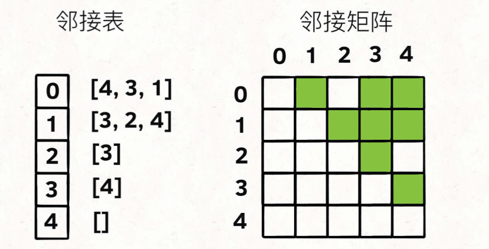
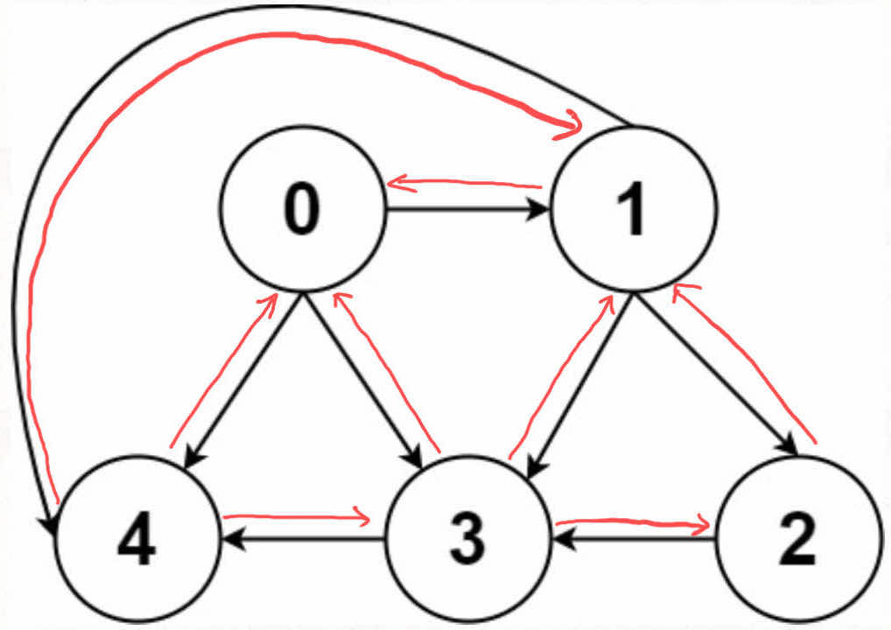

# 图的算法

```typescript
/*
leecode:
797.所有可能的路径（中等）
*/
```

图的算法题很少，就算有，也是简单的遍历问题，基本上可以照搬多叉树的遍历。所以一下只考虑【最实用】的部分

## 图的逻辑结构和具体实现

图是由**节点**和**边**构成


**什么叫[逻辑结构]？就是为了方便研究，把图抽象成这个样子**。

根据这个逻辑结构，可以认为每个节点的实现如下：

```typescript
// 图节点的逻辑结构
class Vertex {
  id: number;
  neighbors: Vertex[];
}
```

和多叉树节点几乎完全一样

```typescript
class TreeNode {
  val: number;
  children: TreeNode[];
}
```

实际上我们很少用 Vertex 类实现图，而是用常说的**相邻表**和**邻接矩阵**来实现。



邻接表很直观，把每个节点 x 的邻居都存到一个列表里，然后把 x 和这个列表关联起来，这样就可以通过一个节点 x 找到它的所有相邻节点。

邻接矩阵是一个二维布尔数组，权且称为 matrix，如果节点 x 和 y 是相连的，那么 matrix[x][y]设为 true。如果想找节点 x 的邻居，去扫一圈 matrix[x][...]即可

**这两种存储方式各有优劣**.

对于邻接表，好处是占用空间少。邻接矩阵空着那么多位置，肯定需要更多的存储空间。

但是邻接表无法快速判断两个节点是否相邻。

有向加权图的实现：

如果是邻接表，不仅存储某个节点 x 所有邻居节点，还存储 x 到每个邻居的权重，即实现加权有向图。

如果是邻接矩阵，matrix[x][y]不再是布尔值，而是一个 number 值，0 表示没有连接，其他值表示权重，不就变成加权有向图了吗？

无向图，所谓的‘无向’即等于‘双向’



连接无向图中的节点 x 和 y，把 matrix[x][y]和 matrix[y][x]都变成 true 即可，邻接表同样的操作

## 图的遍历

多叉树的遍历框架如下：

```typescript
function traverse(root: TreeNode) {
  if (root == null) return;

  for (const child of root.children) {
    traverse(child);
  }
}
```

图和多叉树最大的区别是，图可能包含环，你从图的某一个节点开始遍历，有可能走了一圈又回到这个节点。

如果图包含环，遍历框架就要一个 visited 数组进行辅助：

```typescript
let visited: boolean[];

function traverse(graph: Graph, s: number) {
  if (visited[s]) return;

  // 经过节点s
  visited[s] = true;

  for (const neighbor of graph.neighbors(s)) {
    traverse(neighbor);
  }

  // 离开节点s
  visited[s] = false;
}
```

这个 visited 数组的操作很想回溯算法做[做选择]和[撤销选择]，区别在于位置，回溯算法的[做选择]和[撤销选择]在 for 循环里，而对 visited 数组的操作在 for 循环外。

## 题目实践

输入一幅有向无环图，这个图包含 n 个节点，0,1,2,...,n-1,计算所有从节点 0 到节点 n-1 的路径。

输入的这个 graph 其实就是[邻接表]表示的一幅图，graph[i]存储这节点 i 的所有**邻居节点的下角标**.


算法应该返回[[0,1,3],[0,2,3]],即 0 到 3 的所有路径。

**解法很简单，以 0 为起点遍历图，同时记录遍历过的路径，当遍历到终点时将路径记录下来即可**。无环的图，不需要 visited 数组辅助，直接套用图的遍历框架

```typescript
let res = [];

function allPathsSourceTarget(graph: number[][]) {
  let path = [];
  traverse(graph, 0, path);
  return res;
}

// 图的遍历框架
function traverse(graph:number[][],s:number,path:number[]){
    // 添加节点s到路径
    path.push(s);
    int n = graph.length;

    if(s == n -1){
        // 到达终点
        res.add([path])
        path.pop()
        return
    }

    // 递归每个相邻节点
    for (const v of graph[s]) {
        traverse(graph,v,path)
    }
    // 从路径移除节点s
    path.pop()
}
```
