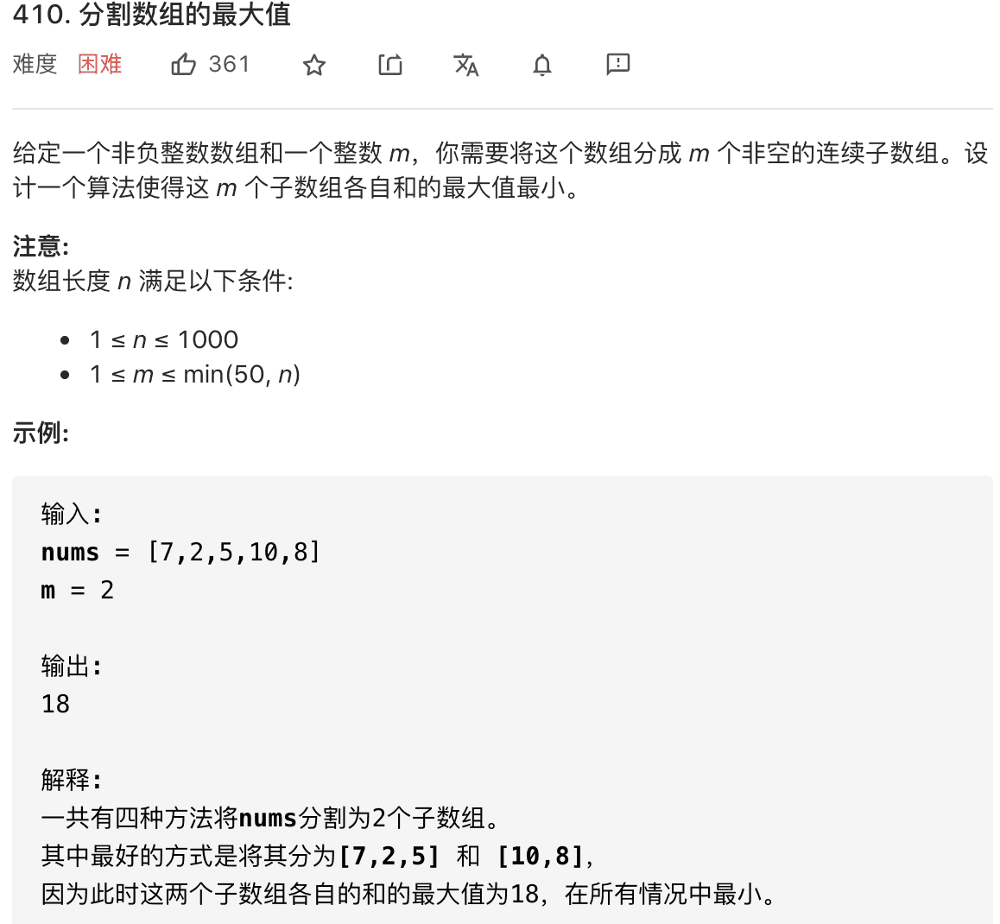

# 二分查找优化算法效率

```typescript
/*
leecode:
410.分割数组的最大值（困难）
*/
```

想用二分查找优化算法，首先要把 for 循环形式的暴力算法写出来，如果算法中存在如下形式的 for 循环：

```typescript
// func是i的单调函数（递增递减都可）
function func(i: number): number {}
// 形如这种for循环可以用二分查找技巧优化效率
for (let i = 0; i < n; i++) {
  if (func(i) === target) {
    return i;
  }
}
```

为什么满足上述条件就可以使用二分查找？**因为这个逻辑和【在有序数组中查找一个元素】是完全一样的**。

注意 不一定是 func(i) == target 作为终止条件，可能是<= 或者>= 的关系。



肯定不止一种分割方法，每种分割方法都会把 nums 分成 m 个子数组，这 m 个子数组中肯定有一个和最大的子数组。我们想要找一个分割方法， 该方法分割出的最大子数组和是所有方法中最大子数组和最小的。

**算法题，一般都会要求算法的时间复杂度，如果你发现 O(NlogN)这样存在对数的复杂度，一般都要往二分查找的方向上靠，这也算是个小套路**。

最暴力的回溯算法穷举，把 nums 分割成 m 个子数组，相当于在 len(nums)个元素的序列中切 m-1 刀，对每两个元素之间的间隙，我们有两种选择，切一刀，或者不切。但是时间爱你复杂的非常高。

用二分查找技巧，反向思考这道题：

**题目固定了 m 的值，让我们确定一个最大子数组和；所谓反向思考就是说，我们可以反过来，限制一个最大子数组和 max，来反推最大子数组和为 max 时，至少可以将 nums 分割成几个子数组**。

比如这样一个 split 函数：

```typescript
// 在每个子数组和不超过max的条件下，计算nums至少可以分割成几个子数组
function split(nums: number[], max: number) {}
```

比如 nums=[7,2,5,10],若限制 max=10，则 split 函数返回 3，即 nums 数组最少能分割成三个子数组，分别是[7,2],[5],[10].

如果我们找到一个最小 max 值，满足 split(nums,max)和 m 相等，那么这个 max 值不就是符合题意的【最小的最大子数组和】吗？

现在只需要对 max 进行穷举就行，那么最大子数组和 max 的取值范围是什么？显然，子数组至少包含一个元素，至多包含这个数组，所以【最大】子数组和的取值范围就是闭区间【max(nums),sum(nums)】,也就是最大元素值到整个数组和之间。

```typescript
// 主函数，计算最大子数组和
function splitArray(nums: number[], m: number) {
  let lo = Math.max(...nums),
    hi = nums.reduce((s, cur) => s + cur);
  for (let max = lo; max <= hi; max++) {
    // 如果最大子数组和是max，
    // 至少可以把nums分割成n个子数组
    let n = split(nums, max);
    // 为什么是<= 不是==？
    if (n <= m) {
      return max;
    }
  }
  return -1;
}
// 若限制最大子数组和为max，计算nums至少可以被分割成几个子数组
function split(nums: number[], max: number) {
  // 至少可以分割的子数组数量
  let count = 1;
  // 记录每个子数组的元素和
  let sum = 0;
  for (let i = 0; i < nums.length; i++) {
    if (sum + nums[i] > max) {
      // 如果当前子数组和大于max限制，则这个子数组不能再添加元素了
      count++;
      sum = nums[i];
    } else {
      // 当前子数组和还没达到max限制，可继续添加元素
      sum += nums[i];
    }
  }
  return count;
}
```

代码关键问题：

- **1.对 max 变量的穷举是从 lo 到 hi 即从小到大的**。

这是因为我们求的是【最大子数组和】的【最小值】，且 split 函数的返回值有单调性，所以从小到大遍历，第一个满足条件的值就是【最小值】。

- **2.函数返回的条件是 n<=m,而不是 n==m**。

split 函数采取了贪心的粗略，计算的是 max 限制下至少能将 nums 分割成几个子数组。

举个例子，输入 nums=[2,1,1],m=3,显然分割方法只有一种，即每个元素都认为是一个子数组，最大子数组和尾 2.但我们的算法区间会在[2,4]穷举 max，当 max=2 时，split 会算出 nums 至少可以被分割成 n=2 个子数组[2] [1,1].当 max=3 时算出 n=2,当 max=4 时，算出 n=1,显然都是小于 m=3 的。

所以我们不能用 n==m 而必须用 n<=m 来找到答案，**因为如果你能把 nums 分割成 2 个子数组[2],[1,1],那么肯定也可以分割成 3 个子数组[2],[1],[1]**

由于 split 是单调函数，且符合二分查找技巧进行优化的标志，所以可以改成二分查找。**因为我们的算法会返回最小的那个 max，所以应该使用搜索左侧边界的二分查找算法**。

现在问题变为：在闭区间[lo,hi]中搜索一个最小 max，是的 aplit(nums,max)恰好等于 m。

```typescript
function splitArray(nums: number[], m: number) {
  // 一般搜索区间是左开右闭的，所以hi要额外加一
  let lo = Math.max(...nums);
  let hi = nums.reduce((s, c) => s + c) + 1;
  while (lo < hi) {
    let mid = lo + Maht.floor((lo + hi) / 2);
    // 根据分割子数组的个数收缩搜索区间
    let n = split(nums, mid);
    if (n == m) {
      // 收缩右边界，达到搜索左边界的目的
      hi = mid;
    } else if (n < m) {
      // 最大子数组和上限高了，减小一些
      hi = mid;
    } else if (n > m) {
      // 最大子数组和上限低了，增加一些
      lo = mid + 1;
    }
  }
  return lo;
}
```

split 函数复杂度为 O(N),二分查找的复杂度为 O(logS),算法总复杂的为 O(N\*logS)
