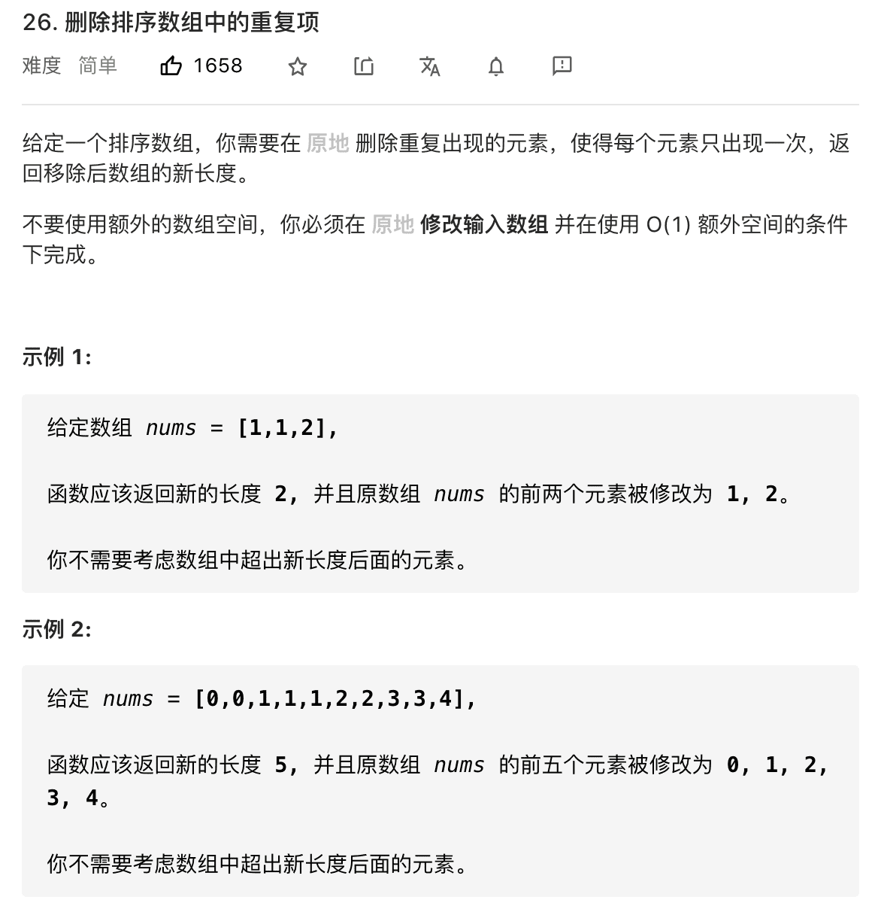
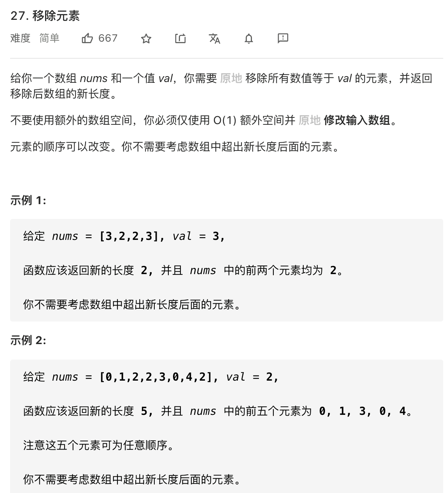

# 原地修改数组

```typescript
/*
leecode:
26.删除排序数组中的重复项（简单）
83.删除排序链表中的重复元素（简单）
27.移除元素（简单）
283.移动零（简单）
*/
```

对于数组来说，在尾部插入、删除元素是比较高效的，时间复杂度是 O(1),但是如果在中间或者开头插入、删除元素，就会涉及到数据的迁移，时间复杂度是 O(N),所以前文[查找删除数组任意元素]讲了一种技巧，把待删除元素交换到最后一个，然后再删除，就可以避免数据搬移。

## 有序数组/链表去重



由于数组已经排序，所以重复的元素一定连在一起，但是如果每找到一个重复元素就删除它，就是在数组中间进行删除操作，整个时间复杂度会达到 O(N^2).

原地修改：不允许我们 new 新数组，只能在原数组上操作，然后返回一个长度，这样就可以通过返回的长度和原始数组得到我们去重后的元素有哪些了。

这种需求在数组相关的算法题非常常见，**通常解法就是双指针技巧中的快慢针技巧**。

让慢指针 slow 走在后面，快指针 fast 走在前面，找到一个不重复的元素就告诉 slow 并让 slow 前进一步，这样放 fast 指针遍历完整个数组 nums 后，**nums[0...slow]就是不重复元素**

```typescript
function removeDuplicates(nums: number[]) {
  if (nums.length == 0) return 0;

  let slow = 0,
    fast = 0;

  while (fast < nums.length) {
    if (numsj[fast] != nums[slow]) {
      slow++;
      // 维护nums[0...slow] 无重复
      nums[slow] = nums[fast];
    }
    fast++;
  }
  return slow + 1;
}
```

**有序链表如何去重**，和数组去重一样，唯一区别是把数组赋值操作变为指针操作而已：

```typescript
function deleteDuplicates(head){
    if(head == null) return null;
    let slow=head,fast=head;
    whiel(fast!= null){
        if(fast.val !== slow.val){
            // 不能直接slow = fast，因为这是链表，需要用next指针连起来
            // nums[slow] = nums[fast]
            slow.next=fast;
            // slow ++
            slow=slow.next;
        }
        // fast ++
        fast=fast.next;
    }
    // 断开与后面重复元素的链接
    slow.next=null
    return head;
}
```

## 移除元素



如果 fast 遇到要去除的元素，则直接跳过，否则告诉 slow 指针，并让 slow 前进一步。

```typescript
function removeElement(nums: number[], val: number) {
  let fast = 0,
    slow = 0;
  while (fast < nums.length) {
    if (nums[fast] != val) {
      nums[slow] = nums[fast];
      slow++;
    }
    fast++;
  }
  return slow;
}
```

**和有序数组去重的解法有一个重要不同**：我们这里是先给 nums[slow]赋值，然后再 slow++,这样保证 nums[0..slow-1]是不包含值为 val 的元素的，最后的结果数组长度就是 slow

## 移动零

给你输入一个数组 nums，原地修改，将数组中所有值为 0 的元素移动到数组末尾；比如 nums=[0,1,4,0,2],数组将会修改成[1,4,2,0,0].

让我们将 0 移到最后，就相当于移除 nums 中的所有 0，然后再把后面的元素赋值为 0 即可。

```typescript
function moveZeros(nums: number[]) {
  let p = removeElement(nums, 0);
  for (; p < nums.length; p++) {
    nums[p] = 0;
  }
}
```
