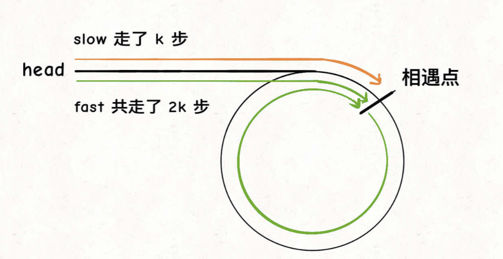
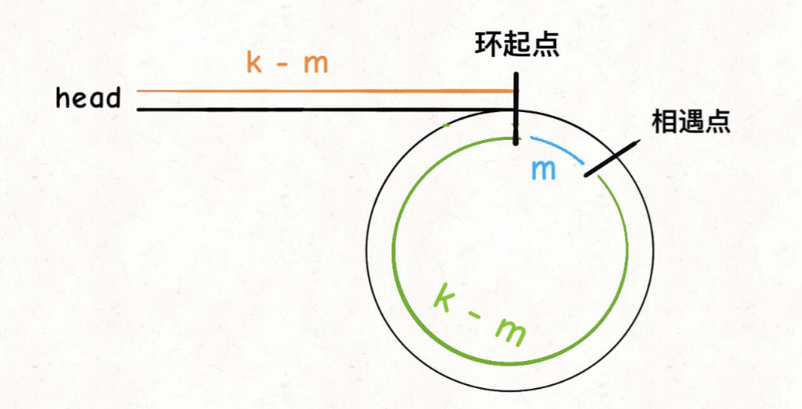
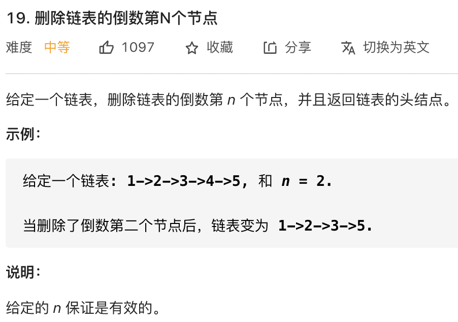

# 双指针

```typescript
/*
leecode:
141.环形链表（简单）
142.环形链表II（简单）
167.两数之和 II - 输入有序数组（中等）
344.反转字符串（简单）
19.删除链表倒数第 N 个元素（中等）
*/
```

双指针分为两类，一类是【快慢指针】，一类是【左右指针】，前者主要解决链表中的问题，比如典型的判断链表中是否包含环，后者主要解决数组(或字符串)中的问题，比如二分查找

## 一、快慢指针的常见算法

快慢指针一般都初始化指向链表的结点 head，前进的时快指针 fast 在前，慢指针 slow 在后

### 1.判断链表中是否含有环

单链表的特点是每个节点只知道下一个节点，所以一个指针的话无法判断链表中是否含有环。

如果链表中不含环，那么这个指针最终会遇到空指针 null 表示链表到头了，如果链表中含有环，那么这个指针就会陷入死循环，因为环形数组中没有 null 指针作为尾部节点。

典型解法就是用来两个指针，一个快，一个慢，如果不含有环，快的指针会最终会遇到 null，说明链表不含环；如果含有环，快指针最终会超慢指针一圈，和慢指针相遇，说明链表有环

```typescript
function hasCycle(head: ListNode) {
  let fast, slow;
  fast = slow = head;
  while (fast != null && fast.next != null) {
    fast = fast.next.next;
    slow = slow.next;
    if (fast == slow) return true;
  }

  return false;
}
```

### 2.已知链表中含有环，返回这个环的起始位置

```typescript
function detectCycle(head: ListNode) {
  let fast, slow;
  fast = slow = head;
  while (fast != null && fast.next != null) {
    fast = fast.next.next;
    slow = slow.next;
    if (fast == slow) break;
  }

  // 上面代码与hasCycle类似
  if (fast == null || fast.next == null) {
    // fast遇到空指针说明没有环
    return null;
  }

  slow = head;
  while (slow != fast) {
    fast = fast.next;
    slow = slow.next;
  }
  return slow;
}
```



第一次相遇时，慢指针走了 k 步，快指针走了 2k 步，**fast 一定比 slow 多走了 k 步，这多走的 k 步其实就是 fast 指针在环里转圈圈，所以 k 的值就是环长度的整数倍**

当快慢指针相遇时，让其中任一个指针指向头节点，然后让他两以相同速度前进，再次相遇所在的节点就是环开始的位置



设相遇点距环的起点距离为 m，那么环的起点距头结点 head 的距离为 k-m，也就是说如果从 head 前进 k-m 步就能达到环起点。

如果从相遇点继续前进 k-m 步，也恰好到达环起点，不管 fast 在环里转了几圈，再走 k-m 步，就一定走到环起点。

### 3.寻找链表的中点

类似上面的思路，快指针一次前进两部，慢指针一次前进一步，当快指针到达链表尽头时，慢指针就处于链表的中间位置

```typescript
function middleNode(head: ListNode) {
  let fast, slow;
  fast = slow = head;
  while (fast != null && fast.next != null) {
    fast = fast.next.next;
    slow = slow.next;
  }
  return slow;
}
```

### 4.寻找链表的倒数第 n 个元素



让快指针先走 n 步，快慢指针开始同速前进。这样当快指针走到链表末尾 null 时，慢指针所在的位置就是倒数第 n 个链表节点(n 不会超过链表长度)

```typescript
function removeNthFromEnd(head: ListNode, n: number) {
  let fast, slow;
  fast = slow = head;
  // 快指针先前进n步
  while (n-- > 0) {
    fast = fast.next;
  }

  if (fast == null) {
    // 如果此时快指针走到头了，说明倒数第n个节点就是第一个节点
    return head.next;
  }
  // 慢指针和快指针同步向前
  while (fast != null && fast.next != null) {
    fast = fast.next;
    slow = slow.next;
  }
  // slow.next 就是倒数第n个节点，删除它
  slow.next = slow.next.next;
  return head;
}
```

## 二、左右指针的常用算法

### 1.二分查找

```typescript
function binarySearch(nums: number[], target: number) {
  let left = 0;
  let right = nums.length - 1;
  while (left <= right) {
    let mid = Math.floor(left + right) / 2;
    if (nums[mid] == target) return mid;
    if (nums[mid] < target) {
      left = mid + 1;
    } else {
      right = mid - 1;
    }
  }
  return -1;
}
```

### 2.两数之和


```typescript
function twoSum(nums: number[], target: number) {
  let left = 0,
    right = nums.length - 1;
  while (left < right) {
    let sum = nums[left] + nums[right];
    if (sum == target) {
      // 题目要求索引是从1开始的
      return [nums[left + 1], nums[right + 1]];
    } else if (sum < target) {
      left++;
    } else if (sum > target) {
      right--;
    }
  }
  return [-1, -1];
}
```

### 3.反转数组

```typescript
// leecode 344
function reverseString(str) {
  let left = 0;
  let right = arr.length - 1;
  while (left < right) {
    // 交换arr[left] 和 arr[right]
    let temp = arr[left];
    arr[left] = arr[right];
    arr[right] = temp;
    left++;
    right--;
  }
}
```

### 4.滑动窗口算法

[滑动窗口算法](../../框架思维/滑动窗口算法解题框架.md)
