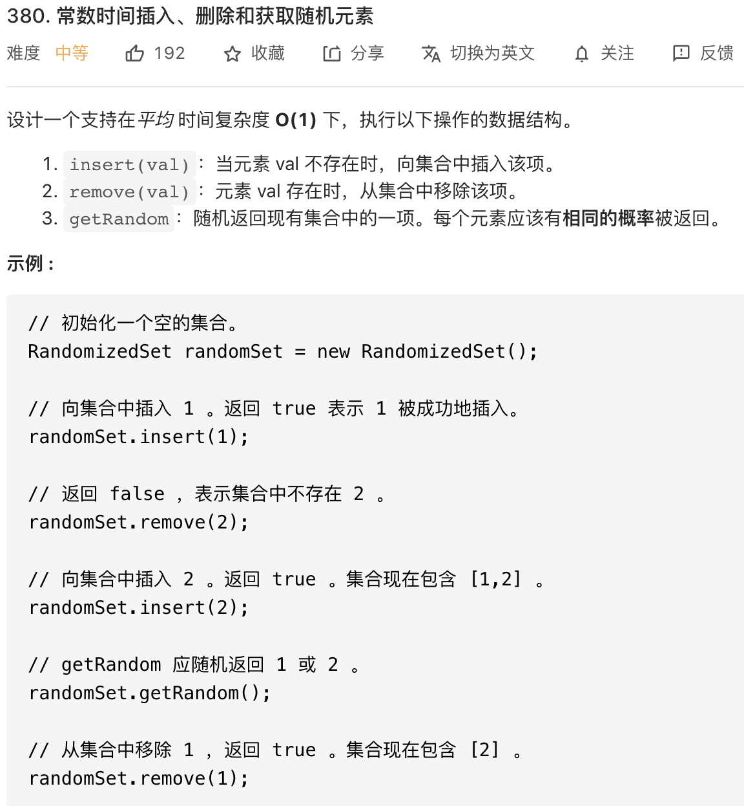

# 查找删除数组任意元素

```typescript
/*
leecode:
380.常数时间插入、删除和获取随机元素（中等）
710.黑名单中的随机数（困难）
*/
```

随机读取元素的技巧点在于，如何结合哈希表和数组，使得数组的删除操作时间复杂度变成 O(1)

## 实现随机集合



本题的难点在于两点：

- **1、插入，删除，获取随机元素这三个操作的时间复杂度必须都是 O(1)。**

- **2、getRandom 方法返回的元素必须等概率返回随机元素，也就是说，如果集合里面有 n 个元素，每个元素被返回的概率必须是 1/n。**

对于 getRandow 方法，因为底层用链表结构存储元素的话，是无法在 O(1)时间方位某一个元素的。要满足【等概率】且【在 O(1)的时间】取出元素，一定要满足：**底层用数组实现，且数组必须是紧凑的**。

**如果用数组存储元素的话，插入、删除的时间复杂度怎么做到 O(1)呢？**

对数组尾部进行插入和删除操作不会涉及数据搬移，时间复杂度是 O(1)。

**如果我们想在 O(1)时间删除数组中的某一个元素 val，可以先把这个元素交换到数组的尾部，然后再 pop 掉**。

交换两个元素必须通过索引进行交换，所以需要一个哈希表 valToIndex 来记录每个元素值对应的索引

```typescript
class RandowmizedSet {
  // 存储元素的值
  nums: number[];

  // js实现HashMap 【todo】

  // 记录每个元素对应在nums中的索引
  valToIndex: HashMap;

  insert(val: number) {
    // 若val已存在，不用再插入
    if (valToIndex[val]) {
      return false;
    }

    // 若val不存在，插入到nums尾部并记录val对应的索引值
    valToIndex[val] = nums.length;
    nums.push(val);
    return true;
  }

  remove(val: number) {
    // 若val不存在，不用再删除
    if (!valToIndex[val]) return false;

    // 先拿到val的索引
    let index = valToIndex[val];
    let lastIndex = nums.length - 1;
    // 将最后一个元素对应的索引修改为index
    valToIndex[nums[lastIndex]] = index;
    // 交换val和最后一个元素
    [nums[index], nums[lastIndex]] = [nums[lastIndex], nums[index]];
    // 在数组中删除元素val
    nums.pop();
    // 删除元素val对应的索引
    valToIndex.remove(val);
    return true;
  }

  getRandow() {
    return nums[Math.floor(Math.randow() * nums.length)];
  }
}
```

## 避开黑名单的随机数

给你输入一个正整数 N，代表左闭右开区间 [0,N)，再给你输入一个数组 blacklist，其中包含一些「黑名单数字」，且 blacklist 中的数字都是区间 [0,N) 中的数字。现在要求你设计如下数据结构：

```typescript
class Solution {
  constructor(N: number, blacklist: number[]) {}

  // 在区间[0,N)中等概率随机选取一个元素并返回，这个元素不能是blacklist中的元素
  pick() {}
}
```

**题目要求，在 pick 函数中应该尽可能少调用随机数生成函数 random()。**

拍脑袋的想法是：

```typescript
function pick() {
  let res = Math.random();
  while (blacklist.includes(res)) {
    res.Math.random();
    // ...
  }
}
```

**更好的解法类似上一道题，我们可以将区间[0,N)看做一个数组，然后将 blacklist 中的元素移到数组的最末尾，同时用一个哈希表映射**。

```typescript
class Solution {
  sz: number;
  mapping: Map;

  constructor(N: number, blacklist: number[]) {
    this.sz = N - blacklist.length;
    for (const item of blacklist) {
      mapping[item] = 666;
    }

    let last = N - 1;
    for (const item of blacklist) {
      // 如果b已经在区间[sz,N)，直接忽略
      if (item >= this.sz) continue;
      // 跳过所有黑名单中的数字
      while (mapping[last]) {
        last--;
      }
      // 将黑名单中的索引映射到合法数字
      mapping[item] = last;
      last--;
    }
  }

  picK() {
    let index = Math.floor(Math.randow() * this.sz);
    // 这个索引命中了黑名单，需要被映射到其他位置
    if (mapping[index]) {
      return mapping[index];
    }
    // 若没命中黑名单，则直接返回
    return index;
  }
}
```

核心思想：

- 1.如果想高效地，等概率地随机获取元素，就要使用数组作为底层容器。

- 2.如果要保持数组元素的紧凑性，可以把待删除元素换到最后，然后 pop 掉末尾的元素，这样时间复杂度就是 O(1)了，当然，我们需要额外的哈希表记录值到索引的映射。

- 3.对于第二题，数组中含有【黑名单】(空洞)，也可以利用哈希表巧妙处理映射关系
