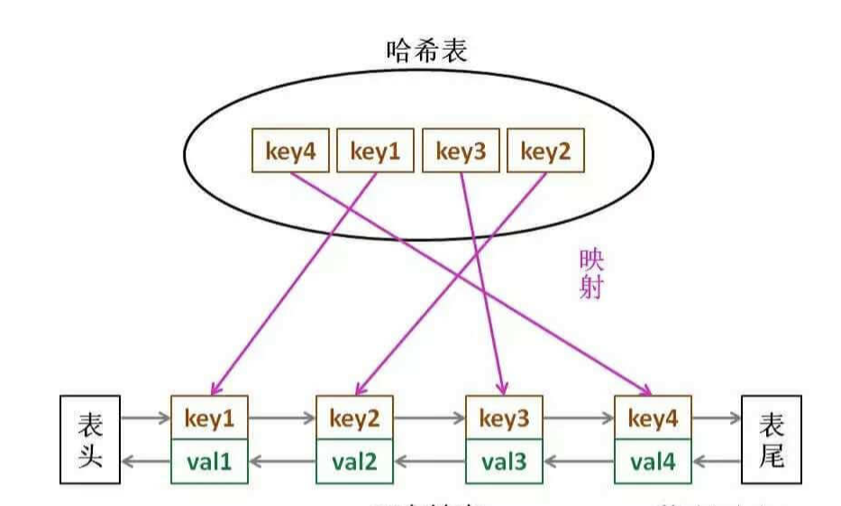

# LRU 和 LFU 算法

```typescript
/*
leecode:
146.LRU缓存机制（中等）
460.LFU缓存机制（困难）
*/
```

LRU 缓存淘汰算法是一种常用策略，即我们认为最近使用过的数据应该是有用的，很久没用过的数据应该是无用的，内存满了就优先删那些很久没用过的数据。

LFU 每次淘汰使用次数最少的数据，相当于把数据按照访问频次进行排序，需要在每个节点维护访问频次(刚开始加入时为 1，每次访问时+1)

## LRU 算法描述

首先要接收一个 capacity 参数作为缓存的最大容量，然后实现两个 API，一个是 put(key,val)方法存入键值对，另一个是 get(key)方法获取 key 对应的 val，如果 key 不存在则返回-1；

get 和 put 方法必须是 O(1)的时间复杂度

```typescript
// 缓存容量为2
let cache = new LRUCache(2);
// 你可以把cache理解成一个队列
// 假设左边是队头，右边是队尾
// 最近使用的排在队头，久未使用的排在队尾
// 圆括号表示键值对(key,val)

cacht.put(1, 1);
// cache = [(1,1)]

cacht.put(2, 2);
// cache=[(2,2),(1,1)]

cache.get(1); // 返回1
// cache=[(1,1),(2,2)]
// 因为最近访问了键1，所以提前至队头
// 返回键1 对应的值 1

cache.put(3, 3);
// cache=[(3,3),(1,1)]
// 缓存容量已满，需要删除内容空出位置
// 优先删除久未使用的数据，即队尾的数据，再把新数据插入队头

cache.get(2); // 返回-1（未找到）
// cache=[(3,3),(1,1)]
// cache中不存在键为2的数据

cache.put(1, 4);
// cache = [(1,4),(3,3)]
// 键1已存在，把原始值1覆盖为4
// 同时将键值对提前到队头
```

## LRU 算法设计

要让 put 和 get 方法时间复杂度为 O(1),必须条件：

- 1.显然 cache 中的元素必须有序

- 2.要在 cache 中快速找到某个 key 是否已存在并得到对应的 val；

- 3.每次访问 cache 中的某个 key，需要将这个元素变为最近使用的，即 cache 要支持在任意位置快速插入和删除元素

哈希表查找快，但是数据无固定顺序；链表有顺序之分，插入删除快，但查找慢，所以最终的数据结构：哈希链表



## LFU 代码设计

```typescript
class Node {
  key: number;
  val: number;
  next: Node;
  prev: Node;
  constructor(k: number, v: number) {
    this.key = k;
    this.val = v;
  }
}
```

根据 Node 类型构建一个双链表，实现 LRU 算法必须的 API：

```typescript
class DoubleList {
  // 头尾虚节点
  private head: Node;
  private tail: Node;
  // 链表元素数
  private size: number;

  constructor() {
    // 初始化双向链表的数据
    this.head = new Node(0, 0);
    this.tail = new Node(0, 0);
    this.head.next = this.tail;
    this.tail.prev = this.head;
    this.size = 0;
  }

  // 在链表尾部添加节点x，时间O(1)
  addLast(x: Node) {
    x.prev = this.tail.prev;
    x.next = this.tail;
    this.tail.prev.next = x;
    this.tail.prev = x;
    size++;
  }

  // 删除链表中的x节点（x一定存在）
  // 由于是双链表且给的是目标Node节点，时间O(1)
  remove(x: Node) {
    x.prev.next = x.next;
    x.next.prev = x.prev;
    size--;
  }

  // 删除链表中的第一个节点，并返回该节点，时间O(1)
  removeFirst() {
    if (this.head.next == this.tail) return null;

    let first = this.head.next;
    this.remove(first);
    return first;
  }

  // 返回链表长度，时间O(1)
  size() {
    return this.size;
  }
}
```

上述代码就能知道【为什么必须要用双向链表】，因为我们需要删除操作，删除一个节点不光要得到该节点本身的指针，也需要操作其前驱节点的指针，而双向链表才能支持直接查找前驱，保证操作的时间复杂度 O(1)

**注意，我们实现的双链表 API 只能从尾部插入，也就是说靠尾部的数据是最近使用的，而靠头部的数据是最久未使用的**。

有了双向链表的实现，我们只需要在 LRU 算法中把它和哈希表结合起来即可，先搭代码框架：

```typescript
class LRUCache {
  private map: Map;
  private cache: DoubleList;
  private cap: number;

  constructor(capacity: number) {
    this.cap = capacity;
    this.map = new Map();
    this.cache = new DoubleList();
  }
}
```

由于我们要同时维护一个双链表 cache 和一个哈希表 map，很容易漏掉一些操作，比如删除某个 key 时，在 cache 中删除了对应的 Node，但是却忘记在 map 中删除 key。

**解决这种问题的有效方法是：在这两种数据结构之上提供一层抽象 API**。即 尽量让 LRU 的主方法 get 和 put 避免直接操作 map 和 cache 的细节

```typescript
// 将某个key提升为最近使用
function makeRecently(key: number) {
  let x = map.get(key);
  // 先从链表中删除这个节点
  this.cache.remove(x);
  // 重新插到队尾
  this.cache.addLast(x);
}

// 添加最近使用的元素
function addRecently(key, val) {
  let x = new Node(key, val);
  // 链表尾部就是最近使用的元素
  this.cache.addLast(x);
  // 别忘了在map中添加key的映射
  map.put(key, x);
}

// 删除某一个key
function deleteKey(key) {
  let x = map.get(key);
  // 从链表中删除
  this.cache.remove(x);
  // 从map中删除
  map.remove(key);
}
// 删除最久未使用的元素
function removeLeastRecently() {
  // 链表头部的第一个元素就是最久未使用的
  let deletedNode = this.cache.removeFirst();
  // 同时从map中删除它的key
  let deletedKey = deletedNode.key;
  map.remove(deletedKey);
}
```

这样就能解答【为什么要在链表中同时存储 key 和 val，而不是只存储 val】，注意 removeLeastRecently 函数中，我们需要用 deletedNode 得到 deletedKey

即，当缓存容量已满，我们不仅要删除最后一个 Node 节点，还要把 map 中映射到该节点的 key 同时删除，而这个 key 只能由 Node 得到，如果 Node 结构中只存储 val，那么我们就无法得知 key 是什么，就无法删除 map 中的键，造成错误。

添加 put 和 set 方法后的完整代码：

```typescript
class LRUCache {
  cap: number;
  cache = new LinkedHashMap();
  constructor(capacity: number) {
    this.cap = capacity;
  }

  get(key: number) {
    if (!cache.containsKey(key)) return -1;
    // 将key变为最近使用
    makeRecently(key);
    return cache.get(key);
  }

  put(key, val) {
    if (cache.containsKey(key)) {
      // 修改key的值
      cache.put(key, val);
      // 将key变为最近使用
      makeRecently(key);
      return;
    }

    if (cache.size() <= this.cap) {
      // 链表头部就是最久未使用的key
      let oldestKey = cache.ketSet().iterator().next();
      cache.remove(oldestKey);
    }
    // 将新的key添加链表尾部
    cache.put(key, val);
  }

  makeRecently(key: number) {
    let val = cache.get(key);
    // 删除key，重新插入到队尾
    cache.remove(key);
    cache.put(key, val);
  }
}
```
