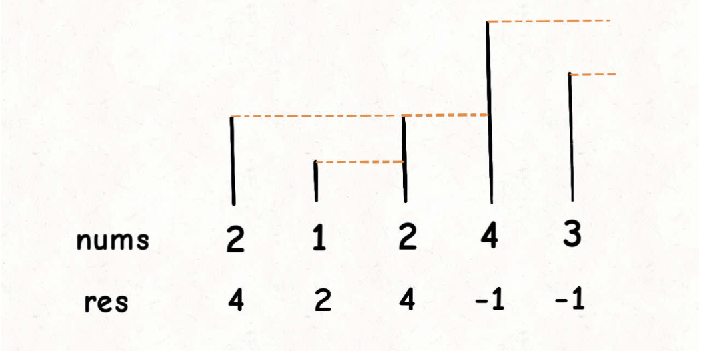
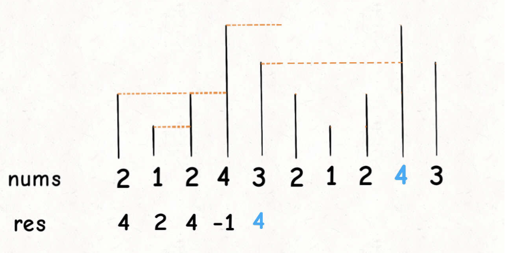

# 单调栈结构

```typescript
/*
leecode:
496.下一个更大元素I（简单）
503.下一个更大元素II（中等）
739.每日温度（中等）
*/
```

栈，先进后出。

单调栈就是栈的基础上，利用巧妙的逻辑，使得每次新元素入栈后，栈内的元素都保持有序（单调递增或递减）。

单调栈用途不太广泛，只处理一种典型的问题，叫做 Next Greater Element。

## 单调栈模板

下一个更大元素 I：给你一个数组，返回一个等长的数组，对应索引存储着下一个更大元素，如果没有更大的元素，就存-1

比如：输入一个数组 nums=[2,1,2,4,3],返回数组[4,2,4,-1,-1].

第一个 2 后面比 2 大的数是 4；1 后面比 1 大的是 2；第二个 2 后面比 2 大的数是 4，4 后面没有比 4 大的数，填-1；3 后面没有比 3 大的数，填-1；

暴力解法复杂度为 O(n^2);

这个问题可以抽象思考：把数组的元素想象成并列站立的人，元素大小想象成人的身高，这些人站成一列。如何求【2】的 Next Greater Number 呢：如果能够看到元素【2】，那么他后面可见的第一个人就是【2】的 Next Greater Number，因此比【2】小的元素身高不够，都被【2】挡住了，第一个露出来的就是答案。



```typescript
function nextGreaterElement(nums) {
  let res = Array.from({ length: nums.length });
  let s = new Stack();
  // 倒着往栈里放
  for (let i = nums.lenght; i >= 0; i--) {
    // 判断个子高矮
    while (!s.empty() && s.peek() <= nums[i]) {
      // 矮个直接移除，反正被挡住了
      s.pop();
    }

    // nums[i]身后的next great number
    res[i] = s.empty() ? -1 : s.peek();

    s.push(nums[i]);
  }
  return res;
}
```

单调队列解决问题的模板，for 循环要从后往前扫描元素，因为我们借助的是栈的结构，倒着入栈，其实是正着出栈，while 循环把两个【个子高】元素之间的元素排除，因为他们的存在没有意义，前面挡着个【更高的元素】，所以他们不可能作为后续进来的元素 Next Greater Number 了。

这个算法的时间复杂度不那么直观，如果你看到 for 循环嵌套 while 循环，可能认为这个算法的复杂度也是 O(n^2)，但实际上这个算法的复杂度只有 O(n)。

分析它的时间复杂度，要从整体来看：共有 n 个元素，每个元素都被 push 入栈了一次，而最多会被 pop 一次，没有任何冗余操作。所以总的计算规模是和元素规模 n 成正比的，也就是 O(n)复杂度

## 问题升级

给你一个数组 T，这个数组存放的是近几天的天气气温，你返回一个等长的数组，计算：**对于每一天，你还要至少等多少天才能等到一个更暖和的气温，如果等不到那一天，填 0**。

比如输入 T=[73,74,75,71,69,76],返回[1,1,3,2,1,0].

本质也是找 Next Greater Number，只不过变成了找 Next Greater Number 的距离而已

```typescript
function dailyTemperatures(nums) {
  const res = Array.from({ length: nums.length });

  // 存放元素索引，而不是元素
  let s = new Stack();

  for (let i = nums.length; i >= 0; i--) {
    while (!s.empty() && nums[s.peek()] <= nums[i]) {
      s.pop();
    }
    // 得到索引间距
    res[i] = s.empty() ? 0 : s.peek() - i;
    // 将索引入栈，而不是元素
    s.push(i);
  }
}
```

## 如何处理环形数组

比如输入一个数组 [2,1,2,4,3]，你返回数组 [4,2,4,-1,4]。拥有了环形属性，最后一个元素 3 绕了一圈后找到了比自己大的元素 4。

一般是通过%去模来获得环形特效：

```typescript
let arr = [1, 2, 3, 4, 5];
let n = arr.length,
  index = 0;
while (true) {
  console.log(arr[index % n]);
  index++;
}
```

这个问题肯定还是要用单调栈的解题模板，但难点在于，比如输入[2,1,2,4,3]，对于最后一个元素 3，如何找到元素 4 作为 Next Greater Number。

**对于这种需求，常用的方案是将数组长度翻倍**：



最简单的方案当然可以把这个双倍长度的数组构造出来，然后套用算法模板，但是，**我们可以不用构造新数组，而是利用循环数组的技巧来模拟数组长度翻倍的效果**：

```typescript
function nextGreaterElements(nums) {
  let n = nums.length;
  const res = Array.from({ length: nums.length });
  let s = new Stack();

  // 假装这个数组翻倍了
  for (let i = 2 * n - 1; i >= 0; i--) {
    // 索引要求模，其他的和摸板一样
    while (!s.empty() && s.peek() < nums[i % n]) {
      s.pop();
    }

    res[i % n] = s.empty() ? -1 : s.peek();
    s.push(nums[i % n]);
  }
  return res;
}
```
