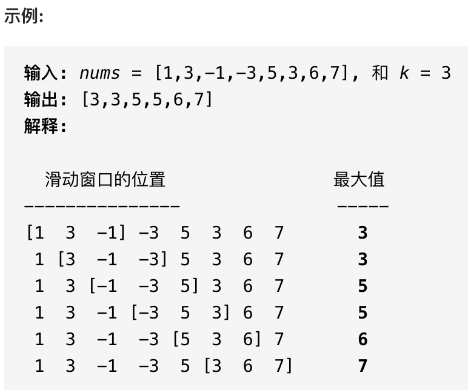

# 单调队列

```typescript
/*
leecode:
239.滑动窗口最大值（困难）
*/
```

**队列中的元素全都是单调递增或递减的**，【单调栈】主要解决 Next Great Number 一类算法问题，【单调队列】可以解决滑动窗口相关问题：

给你输入一个数组 nums 和一个正整数 k，有一个大小为 k 的窗口，在 nums 上从左至右滑动，请你输出每次窗口中 k 个元素的最大值。



## 解题框架

这道题难点在于如何在 O(1) 时间算出每个【窗口】中的最大值，使得整个算法在线性时间完成。这种问题的特点在于：【窗口】是不断滑动的，也就是你得**动态地**计算窗口中的最大值。 对于这种动态的场景，很容易得到一个结论：

**在一堆数字中，已知最值为 A，如果给这堆数添加一个数 B，那么比较一下 A 和 B 就可以立即算出新的最值；但如果减少一个数，就不能直接得到最值了，因为如果减少的这个恰好是 A，就需要遍历所有数重新找最新的最值**。(有些情形可以尝试保留最大和第二大的两个值)

回到这道题，每个窗口前进的时候，要添加一个数同时减少一个数，所以想在 O(1)的时间得出新的最值，不是那么容易的，需要【单调队列】这种特殊的数据结构来辅助。

一个普通队列：

```typescript
class Queue {
  // enqueue操作，在队尾加入元素n
  push(n: number) {}
  // dequeue操作，删除队头元素
  pop() {}
}
```

一个单调队列操作也差不多：

```typescript
class MonotonicQueue {
  push(n: number) {}
  max() {}
  // 队头元素如果是n，删除它
  pop(n: number);
}
```

单调队列的方法需要特殊实现(暂且跳过)

【滑动窗口】题目的解答框架：

```typescript
function maxSlidingWindow(nums: number, k: number) {
  const window = new MonotonicQueue();
  const res = [];

  for (let i = 0; i < nums.length; i++) {
    if (i < k - 1) {
      // 先把窗口的前k-1填满
      window.push(nums[i]);
    } else {
      // 窗口开始向前滑动
      // 移入新元素
      window.push(nums[i]);
      // 将当前窗口中的最大元素记入结果
      res.add(window.max());
      // 移出最后的元素
      window.pop(nums[i - k + 1]);
    }
  }
  return res;
}
```


## 单调队列数据结构的实现

观察滑动窗口的过程就能发现，实现单调队列必须使用一种数据结构支持在头部和尾部进行插入和删除，很明显双链表是满足这个条件的。

【单调队列】的核心思路和【单调栈】类似，push 方法依然在队尾添加元素，但是要把前面比自己小的元素都删掉：

```typescript
class MonotonicQueue {
  // 双链表，支持头部和尾部增删元素
  private q: LinkedList<number> = new LinkedList();
  push(n: number) {
    // 将小于 n 的元素全部删除
    while (!q.isEmpty() && q.getLast() < n) {
      q.pollLast();
    }
    //然后将 n 加入尾部
    q.addLast(n);
  }

  max() {
    return q.getFirst();
  }

  pop(n) {
    if (n == q.getFirst()) {
      q.pollFirst();
    }
  }
}
```
