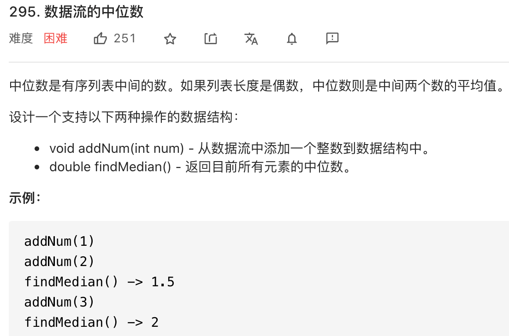
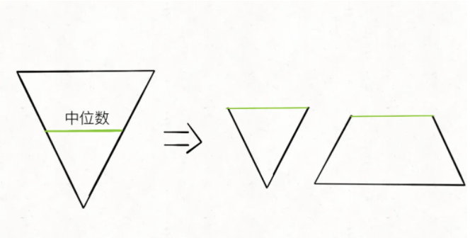
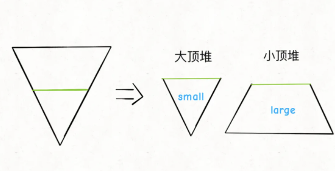
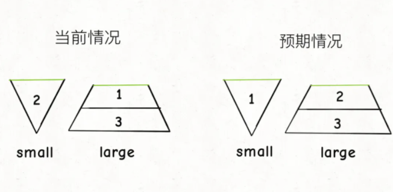

# 数据流中位数

```typescript
/*
leecode:
295.数据流的中位数（困难）
*/
```

求中位数，如果数据规模非常大，排序不太现实



## 分析

一个直接的解法可以用一个数组记录所有 addNum 添加进来的数字，通过插入排序的逻辑保证数组中的元素有序，当调用 findMedian 方法时，可以通过数组索引直接计算中位数。

但是用数组作为底层容器的问题也很明显，addNum 搜索插入位置的时候可以用二叉搜索算法，但是插入操作需要搬移数据，所以最坏时间复杂度为 O(N)。

如果是链表，链表插入速度很快，但是查找插入位置的时候只能线性遍历，最坏时间复杂度还是 O(N)，而且 finMedian 方法也需要遍历寻找中间索引，最坏时间复杂度也是 O(N)。

如果是平衡二叉树，增删改查复杂度都是 O(logN)。但是会有两个问题：

- 1.TreeSet 是一种 Set，其中不存在重复的元素，但是我们的数据流可能输入重复数据，而且计算中位数也是需要算上重复元素的

- 2.TreeSet 并没有实现一个通过排名快速计算元素的 API

如果是优先级队列（二叉堆），优先级队列是一种受限的数据结构，只能从堆顶添加/删除元素，我们的 addNum 方法可以从堆顶插入元素，但是 findMedian 函数需要从数据中间取，这个功能优先级队列是没办法提供的。

## 解题思路

**对于动态数据，堆是极好的解决方案**：

**既然目标只是中位数，那所有的操作可以之聚焦在中位数上，不需要完全排序，只需要将比中位数大和比中位数小的树分开即可**。

**我们必须需要有序数据结构，本题的核心思路是适用两个优先级队列**。

中位数是有序数组最中间的元素算出来的，我们可以把【有序数组】抽象成一个倒三角形，宽度可以视为元素的大小，那么这个倒三角的中部就是计算中位数的元素：



把大倒三角从中间切成两半，变成一个小倒三角和一个梯形，这个小倒三角形相当于一个从小到大的有序数组，这个梯形相当于一个从大到小的有序数组。

中位数就可以通过小倒三角和梯形顶部的元素算出来，**小倒三角就是大顶堆，梯形就是小顶锥，中位数可以通过他们的堆顶元素算出来**。



梯形虽然是小顶堆，但其中的元素是较大的，成为 large，倒三角虽然是大顶堆，但其中元素较小，称为 small。

**很容易看出来，两个堆中的元素之差不能超过 1**。假设总数为 n，n 是偶数，我们希望两个堆元素个数是一样的，如果 n 是奇数，我们希望两个堆元素个数分别是 n/2+1 和 n/2,这样元素多的那个堆顶元素就是中位数

```typescript
// todo: PriorityQueue 为java方法，js需要自行实现
class MedianFider {
  large: PriorityQueue;
  small: PriorityQueue;

  constructor() {
    // 排序在这里
    this.large = new PriorityQueue();
    this.small = new PriorityQueue();
  }

  findMedian() {
    if (large.size() < small.size()) {
      return small.peek();
    } else if (large.size > small.size()) {
      return large.peek();
    }
    return (large.peek() + small.peek()) / 2;
  }
}
```

如何实现 addNum 方法，维护【两个堆中元素之差不能超过 1】

```typescript
// 有缺陷的代码

function addNum(num: number) {
  if (small.size() >= large.size()) {
    large.push(num);
  } else {
    small.push(num);
  }
}
```

如果如上述代码调用：

- addNum(1)，现在两个堆元素数量相同都为 0，所以默认把 1 添加进 large 堆

- addNum(2),现在 large 元素比 small 元素多，所以把 2 添加进 small 堆中

- addNum(3),现在两个堆都有一个元素，所以默认把 3 添加进 large 中

调用 findMedian，预期结果应该是 2，但实际得到的结果是 1



**所以，不仅要维护 large 和 small 的元素个数之差不超过 1，还要维护 large 堆的堆顶元素要大于等于 small 堆的堆顶元素**。

```typescript
function addNum(num: number) {
  if (small.size() >= large.size()) {
    small.push(num);
    large.push(small.pop());
  } else {
    large.push(num);
    small.push(small.pop());
  }
}
```

**简单点说，想要往 large 里添加元素，不能直接添加，而是要先往 small 里添加，然后再把 small 的堆顶元素加到 large 中，想 small 中添加元素同理**。
