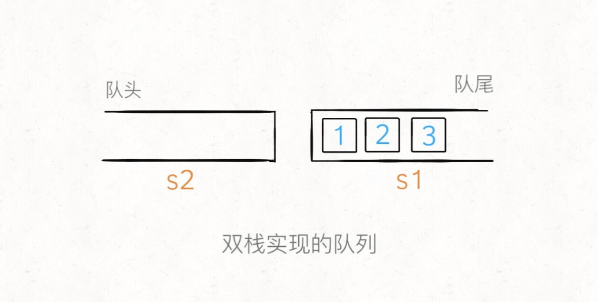
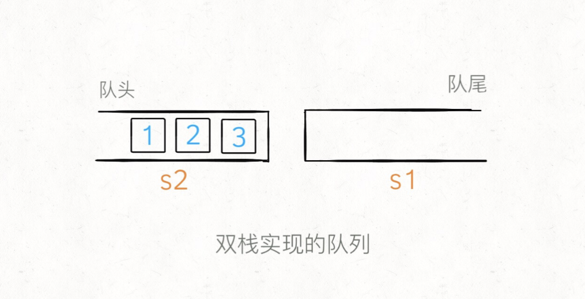

# 队列、栈的互相实现

```typescript
/*
leecode:
232.用栈实现队列（简单）
225.用队列实现栈（简单）
*/
```

队列：先进先出，栈：先进后出

```typescript
function Stack() {
  let items = [];
  this.push = function (element) {
    items.push(element);
  };
  this.pop = function () {
    return items.pop();
  };
  this.peek = function () {
    return item[items.length - 1];
  };
  this.isEmpty = function () {
    return items.length === 0;
  };
  this.size = function () {
    return items.length;
  };
  this.clear = function () {
    items = [];
  };
}

function Queue() {
  let items = [];
  this.enqueue = function (element) {
    items.push(element);
  };
  this.dequeue = function () {
    return items.shift();
  };
  this.front = function () {
    return items[0];
  };
  this.peek = function () {
    return items[items.length - 1];
  };
  this.isEmpty = function () {
    return items.length === 0;
  };
  this.zise = function () {
    return items.length;
  };
  this.empty = function () {
    items = [];
  };
}
```

## 用栈实现队列

使用两个栈 s1，s2 就能实现一个队列的功能

```typescript
class MyQueue {
  s1;
  s2;
  constructor() {
    this.s1 = new Stack();
    this.s2 = new Stack();
  }
}
```

当调用 push 让元素入队时，只要把元素压入 s1 即可，比如说 push 进 3 个元素分别是 1，2，3，那么底层结构就是这样：



```typescript
function push(x: number) {
  s1.push(x);
}
```

如果这时候使用 peek 查看队头的元素怎么办？按道理队头元素应该是 1，但在 s1 中 1 被压在栈底，现在就要轮到 s2 起到一个中转的作用了：当 s2 为空时，可以把 s1 的所有元素取出再添加进 s2，**这时候 s2 中元素就是先进先出的顺序了**。



```typescript
// 返回队头元素
function peek() {
  if (s2.isEmpty()) {
    // 把s1元素压入s2
    while (!s1.isEmpty()) {
      s2.push(s1.pop());
    }
  }
  return s2.peek();
}
```

同理，对于 pop 操作，只要操作 s2 就可以了

```typescript
function pop() {
  // 先调用peek方法保证s2非空
  peek();
  return s2.pop();
}
```

最后，如何判断队列是否为空。如果两个栈都为空的话，就说明队列为空：

```typescript
function empty() {
  return s1.isEmpty() && s2.isEmpty();
}
```

用栈实现一个队列，核心思想是利用两个栈互相配合。时间复杂度**均摊时间复杂度**是 O(1）：对于一个元素，最多只可能被搬运一次，也就是说 peek 操作平均到每个元素的时间复杂度是 O(1）

## 队列实现栈

队列实现栈就比粗暴：

```typescript
class MyStack {
  q = new Queue();
  top_elem = 0;

  // 添加元素到栈顶
  push(x: number) {
    // x 是队列的队尾，是栈的栈顶
    q.enqueue(x);
    top_elem = x;
  }

  // 返回栈顶元素
  top() {
    return top_elem;
  }

  pop() {
    let size = q.size();
    // 队尾留下2个元素
    while (size > 2) {
      q.enqueue(q.dequeue());
      size--;
    }
    // 记录新的队尾元素
    // 这时候的队尾的倒数第二个元素，会变成下一次的队尾元素
    top_elem = q.peek();

    q.enqueue(q.dequeue());
    // 之前的队尾元素已经到了队头
    return q.dequeue();
  }
}
```
