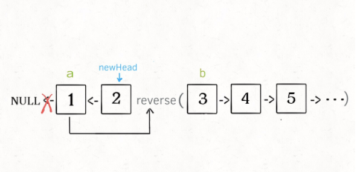
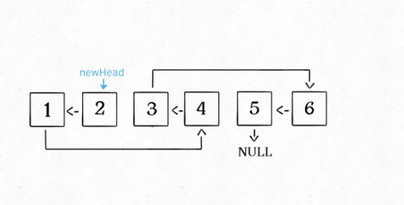

# K 个一组反转一个链表

## 分析问题

链表是一个中兼具递归和迭代性质的数据结构，可以发现**这个问题具有递归性质**。比如我们对这个链表调用 reverseKGroup(head,2)，即以 2 个节点为一组反转链表.

如果设法把前两个节点反转，那么后面的那些节点如何处理，后面的这些节点也是一条链表，而且长度比原来这条还小，这就叫**子问题**

可以直接递归调用 reverseKGroup(cur,2)，因为子问题和原问题的结构完全相同，这就是递归性质

大致思路流程：

- 1.先反转以 head 开头的 K 个元素

- 2.将第 k+1 个元素作为 head 递归调用 reverseKGroup 函数

- 3.将上述两个过程的结果连接起来

注意 base case ：如果最后元素不足 k 个，就保持不变

## 代码实现

要实现一个 reverse 函数反转一个区间之内的元素，在此之前我们再简化一下，给定链表头节点，如何反转整个链表？

```typescript
function reverse(a: ListNode) {
  let pre = null,
    cur = a,
    next = a;
  // 每次都反转pre和cur
  while (cur != null) {
    next = cur.next;
    // cur next指向pre
    cur.next = pre;
    // pre向前进一步变为cur
    pre = cur;
    // cur 向前进一步变为next
    cur = next;
  }
  // 返回反转后的头节点
  return pre;
}
```

反转以 a 为头节点的链表就是反转 a 到 null 之间的节点，反转 a 到 b 之间的节点呢？

```typescript
function reverse(a: ListNode, b: ListNode) {
  let pre = null,
    cur = a,
    next = a;
  // 每次都反转pre和cur
  while (cur != b) {
    next = cur.next;
    // cur next指向pre
    cur.next = pre;
    // pre向前进一步变为cur
    pre = cur;
    // cur 向前进一步变为next
    cur = next;
  }
  return pre;
}
```

迭代实现了反转部分链表的功能，接下来实现 reverseKGroup 函数

```typescript
function reverse(a: ListNode, b: ListNode) {
  let pre = null,
    cur = a,
    next = a;
  // 每次都反转pre和cur
  while (cur != b) {
    next = cur.next;
    // cur next指向pre
    cur.next = pre;
    // pre向前进一步变为cur
    pre = cur;
    // cur 向前进一步变为next
    cur = next;
  }
  return pre;
}
function reverseKGroup(head: ListNode, k: number) {
  if (head == null) return null;
  // 区间[a,b)包含k个待反转元素
  let a = head,
    b = head;

  for (let i = 0; i < k; i++) {
    // 不足k个，不需要反转，base case
    if (b == null) return head;
    b = b.next;
  }

  let newHead = reverse(a, b);
  a.next = reverseKGroup(b, k);
  return newHead;
}
```

for 循环之后的代码，reverse 函数是反转区间[a,b),所以如下：



函数递归完成之后的结果：


