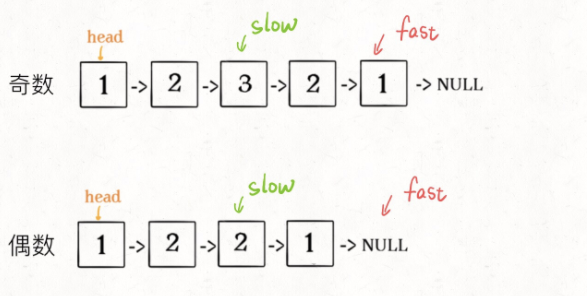
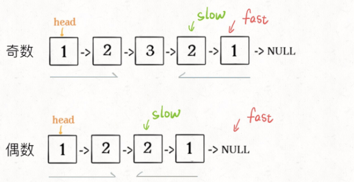
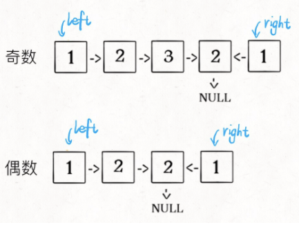

# 回文链表

寻找回文串：核心思想是从中心向两端扩展：

```typescript
function palindrome(s: string, l: number, r: number) {
  // 防止索引越界
  while (l >= 0 && r < s.length && s[l] == s[r]) {
    // 向两边展开
    l--;
    r++;
  }
  // 返回以s[l]和s[r]为中心的最长回文串
  return s.substr(l + 1, r - l - 1);
}
```

因为回文串长度可能为奇数也可能是偶数，长度为奇数时只存在一个中心点，而长度为偶数时存在两个中心点，所以上面这个函数需要传入 l 和 r。

而判读一个字符串是不是回文串就简单很多，不需要考虑奇偶情况，只需要【双指针技巧】，从两端向中间逼近即可：

```typescript
function isPalindrome(s: string) {
  let left = 0,
    right = s.length - 1;
  while (left < right) {
    if (s[left] != s[right]) {
      return false;
    }
    left++;
    right--;
  }
  return true;
}
```

## 判断回文单链表

单链表无法倒着遍历，无法使用双指针技巧，最简单的办法就是，把原始链表反转存入一条新的链表，然后比较这两条链表是否相同。

其实，**借助二叉树后序遍历的思路，不需要显示反转原始链表也可以倒序遍历链表**。

二叉树的几种遍历方式：

```typescript
function traverse(root: TreeNode) {
  // 前序遍历代码
  traverse(root.left);
  // 中序遍历代码
  traverse(root.right);
  // 后序遍历代码
}
```

链表兼具递归结构，树结构不过是链表的衍生，**链表其实也可以有前序遍历和后序遍历**。

```typescript
function traverse(head: ListNode) {
  // 前序遍历代码
  traverse(head.next);
  // 后序遍历代码
}
```

模仿双指针实现回文判断的功能：

```typescript
// 左侧指针
let left;

function isPalindrome(head: ListNode) {
  left = head;
  return traverse(head);
}

function traverse(right: ListNode) {
  if (right == null) return true;
  let res = traverse(right.next);
  // 后序遍历代码
  res = res && right.val == left.val;
  left = left.next;
  return res;
}
```

核心逻辑即：**实际上就是把链表节点放入一个栈，再拿出来，这时候元素顺序是反的**，只不过我们利用的是递归函数的堆栈而已。

无论是造一条反转链条还是利用后序遍历，算法的时间和空间复杂度都是 O(N)

## 优化空间复杂度

思路：

- **1.先通过【双指针技巧】中的快慢针来找到链表的中点**：

```typescript
let slow = head,
  fast = head;
while (fase != null && fase.next != null) {
  slow = slow.next;
  fast = fast.next.next;
}
// slow 指针现在指向链表中点
```



- **2.如果 fast 指针没有指向 null，说明链表长度为奇数，slow 还要再前进一步**：

```typescript
if (fast != null) {
  slow = slow.next;
}
```



- **3.从 slow 开始反转后面的链表，现在就可以开始比较回文串了**：

```typescript
let left = head;
let right = reverse(slow);

while (right != null) {
  if (left.val != right.val) {
    return false;
  }
  left = left.next;
  right = right.next;
}
return true;

function reverse(head: ListNode) {
  let pre = null,
    cur = head;
  while (cur != null) {
    let next = cur.next;
    cur.next = pre;
    pre = cur;
    cur = next;
  }
  return pre;
}
```



## 总结

首先，寻找回文串是从中间向两端扩展，判断回文串是从两端相关中间收缩。对于单链表，无法直接倒序遍历，可以造一条新的反转链表，可以利用链表的后续遍历，也可以用栈结构倒序处理单链表。

具体到回文链的判断问题，由于回文的特殊性，可以不完全反转链表，而是仅仅反转部分链表，将空间复杂度降到 O(1)
