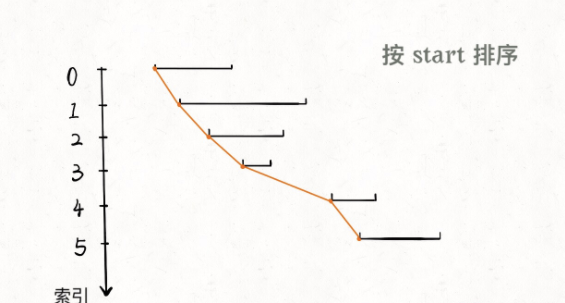
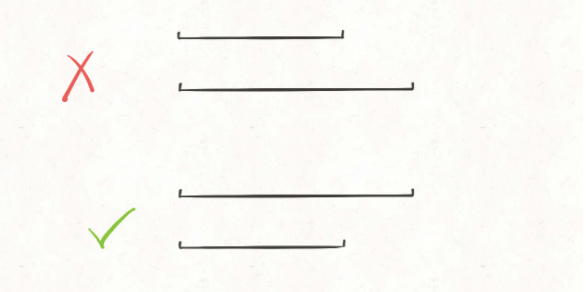

# 区间问题解题框架

```typescript
/*
leecode:
76.最小覆盖子串（困难）
567.字符串的排列（中等）
438.找到字符串中所有字母异位词（中等）
*/
```

取件问题即线段问题，让你合并所有线段、找出线段的交集等。主要两个技巧：

**1、排序**。常见排序的方法就是按照区间起点排序，或者先按照起点升序排序，若起点相同，则按照终点降序排序。按照终点排序，无非对称操作

**2、画图**。两个区间的相对位置到底有几种可能，不同的相对位置我们的代码应该怎么去处理。

## 区间覆盖问题

给你一个区间列表，删除列表中被其他区间所覆盖的区间,返回剩余区间的数目。

**可以先算算，被覆盖区间有多少个，和总数相减就是剩余区间数**。

先按照区间的起点进行升序排序：



排序之后，两个相邻区间可能有如下三种相对位置


根据三种情况，应该这样处理：

- 情况一、找到覆盖区间

- 情况二、两个区间可以合并，成一个大区间

- 情况三、两个区间完全不相交

```typescript
function removeCoveredintervals(intvs: number[][]) {
  // 按照起点升序排列，起点相同时降序排列
  intvs.sort((a, b) => {
    if (a[0] == b[0]) return b[1] - a[1];
    return a[0] - b[0];
  });

  // 记录合并区间的起点和终点
  let left = intvs[0][0];
  let right = intvs[0][1];

  let res = 0;

  for (let i = 1; i < intvs.length; i++) {
    const intv = intvs[i];
    // 情况一、找到覆盖区间
    if (left <= intv[0] && right >= intv[1]) {
      res++;
    }

    // 情况二，找到相交区间，合并
    if (right >= intv[0] && right <= intv[1]) {
      right = intv[1];
    }

    // 情况三、完全不相交、更新起点和终点,新的数组，后续最小值大于right最大值，所以更新left
    if (right < intv[0]) {
      left = intv[0];
      right = intv[1];
    }
  }

  return intvs.length - res;
}
```

起点升序排列，终点降序排列的目的是防止如下情况：



对于这两个起点相同的区间，我们需要保证长的那个区间在上面(按照终点降序)，这样才会被判定为覆盖，否则会被错误判定为相交，少算一个覆盖区间
