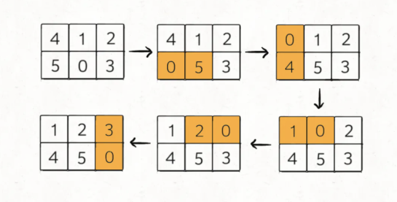
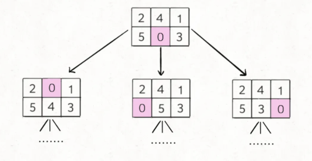
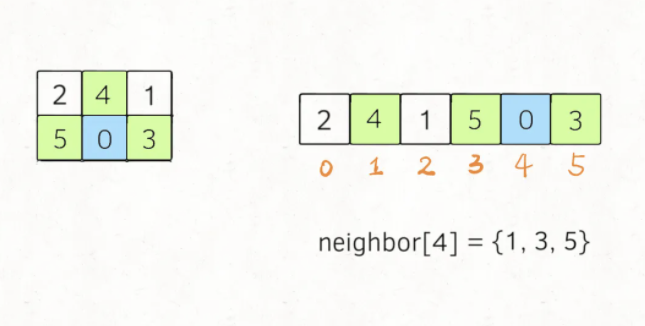

# 拼图游戏

```typescript
/*
leecode:
773.滑动谜题（困难）
*/
```

给你一个 2x3 的滑动拼图，用一个 2x3 的数组 board 表示。拼图中有数字 0~5 六个数，其中数字 0 就表示那个空着的格子，你可以移动其中的数字，当 board 变为[[1,2,3],[4,5,0]]时，赢得游戏。

请你写一个算法，计算赢得游戏需要的最少移动次数，如果不能赢得游戏，返回 -1。

比如说输入的二维数组 board = [[4,1,2],[5,0,3]]，算法应该返回 5：

如果输入的是 board = [[1,2,3],[4,0,5]]，则算法返回 -1，因为这种局面下无论如何都不能赢得游戏。



## 思路分析

对于这种计算最小步数的问题，要敏感地想到 BFS 算法。

这个题目转换成 BFS 面临如下问题：

- 1.一般的 BFS 算法，是从一个起点 start 开始，向终点 target 进行寻路，但是拼图问题不是在寻路，而是在不断交换数字，应该如何转换成 BFS 算法问题呢？

- 2.即便这个问题能够转换成 BFS 问题，如何处理起点 start 和终点 target?它们都输数组，把数组放进队列，套 BFS 框架，麻烦且低效

**BFS 算法并不只是一个寻路算法，而是一种暴力搜索算法，**只要涉及暴力穷举问题，BFS 就可以用，而且可以最快找到答案。

将问题转换成：**如何穷举出 board 当前局面下可能衍生出的所有局面**？看数字 0 的位置，和上下左右的数字进行交换即可。



这样其实就是一个 BFS 问题，每次先找到数字 0，然后和周围的数字进行交换，形成新的局面加入队伍...当第一次到达 target 时，就得到了赢得游戏的最少步数。

对于第二个问题，我们这里的 borad 仅仅是 2\*3 的二维数组，所以可以压缩成一个一维字符串。**其中比较有技巧性的点在于，二维数组有【上下左右】的概念，压缩成一维后，如何得到某一个索引上下左右的索引**？

手动写出这个映射即可：

```typescript
let neighbor = [
  [1, 3],
  [0, 4, 2],
  [1, 5],
  [0, 4],
  [3, 1, 5],
  [4, 2],
];
```

**这个含义就是，在一维字符串中，索引 i 在二维数组中的的相邻索引为 neighbor[i]，**:



```typescript
function slidingPuzzle(board: number[][]) {
  let m = 2,
    n = 3;
  let start = "";
  let target = "";
  // 将 2x3 的数组转化成字符串
  for (let i = 0; i < m; i++) {
    for (let j = 0; j < n; j++) {
      start += board[i][j] + "0";
    }
  }
  // 记录一维字符串的相邻索引
  let neighbor = [
    [1, 3],
    [0, 4, 2],
    [1, 5],
    [0, 4],
    [3, 1, 5],
    [4, 2],
  ];

  // BFS 算法

  let q = [];
  let visited = new Set();
  q.push(start);
  visited.add(start);

  let step = 0;
  while (q.length != 0) {
    for (let i = 0; i < q.length; i++) {
      let cur = q[0];
      q.pop();
      // 判断是否到达目标局面
      if (target == cur) return step;

      let index = 0;
      // 找到数字0的索引
      while (cur[index] !== "0") {
        index++;
      }

      // 将数字0和相邻的数字交换位置
      for (const adj of neighbor[index]) {
        let new_board = cur;
        new_board[adj] = cur[index];
        new_board[index] = cur[adj];
        // 防止走重复的路
        if (!visited.has(new_board)) {
          q.push(new_board);
          visited.add(new_board);
        }
      }
    }
    step++;
  }
  return -1;
}
```
