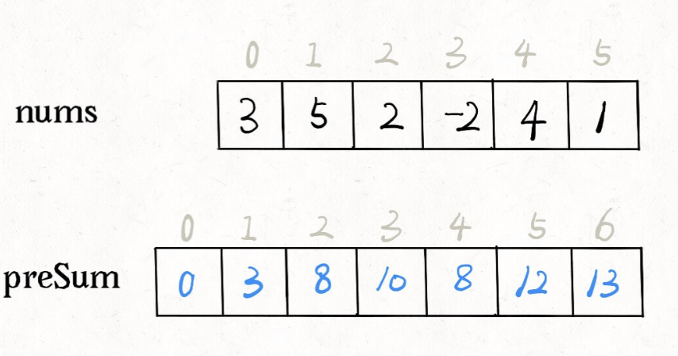

# 前缀和数组

```typescript
/*
leecode:
560.和为K的子数组（中等）
*/
```

**前缀和主要适用的场景是原始数组不会被修改的情况下，频繁查询某个区间的累加和。**


关键是，**如何快速得到某个数组的和呢？**比如说给你一个数组 nums，让你实现一个接口 sum(i,j),这个接口要返回 nums[i..j]的和，而且会被多次调用，如何实现？

因为接口要被多次调用，显然不能每次都去遍历 nums[i..j]，有没有一种快速的方法在 O(1)时间内算出 num[i..j]呢？这就需要**前缀和**技巧了

## 什么是前缀和技巧

前缀和的思路是：对于一个给定的数组 nums，我们额外开辟一个前缀和数组进行预处理：

```typescript
let n = nums.length;
let preSum = Array.from({ length: n });
preSum[0] = 0;
for (let i = 0; i < nums.length; i++) {
  const element = nums[i];
  preSum[i + 1] = preSum[i] + element;
}
```



preSum[i]就是 nums[0..i-1]的和，如果我们想求 nums[i..j]的和，只需 presum[j+1]-preSum[i]即可，不需要重新遍历数组了。

解法：

```typescript
function subarraySum(nums: number[], k: number) {
  let n = nums.length;

  const sum = Array.from({ length: n });

  sum[0] = 0;
  for (let i = 0; i < n; i++) {
    sum[i + 1] = sum[i] + nums[i];
  }

  let ans = 0;
  for (let i = 1; i <= n; i++) {
    for (let j = 0; j < i; j++) {
      if (sum[i] - sum[j] == k) {
        ans++;
      }
    }
  }
  return ans;
}
```

这个解法的时间复杂度 O(N^2) 空间复杂度 O(N)，并不是最优的解法。不过通过这个解法理解了前缀和数组的工作原理之后，可以使用一些巧妙的办法把时间复杂度进一步降低。

## 优化解法

优化思路：**直接记录有几个 sum[j]和 sum[i] - k 相等，直接更新结果，就避免了内层的 for 循环**。可以用 map，记录前缀和的同时记录该前缀和出现的次数

```typescript
function subarraySum(nums: number, k: number) {
  let n = nums.length;
  // map : 前缀和 -》 该前缀和出现的次数
  const preSum = new Map();
  // base case
  preSum.set(0, 1);

  let ans = 0,
    sumI = 0;
  for (let i = 0; i < n; i++) {
    sumI += nums[i];
    // 这是我们想找的前缀和 nums[0..j]
    let sumJ = sumI - k;
    // 如果前面有这个前缀和，则直接更新答案
    if (preSum.has(sumJ)) {
      ans += preSum.get(sumJ);
    }
    // 把前缀和nums[0..i]加入并记录出现次数
    preSum.set(sumI, preSum.has(sumJ) ? preSum.get(sumJ) + 1 : 1);
  }

  return ans;
}
```

时间复杂度降到了 O(N)
