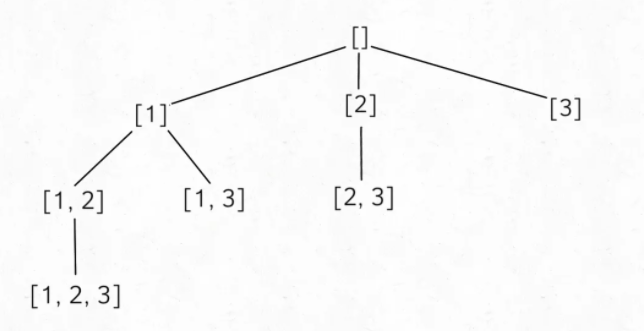
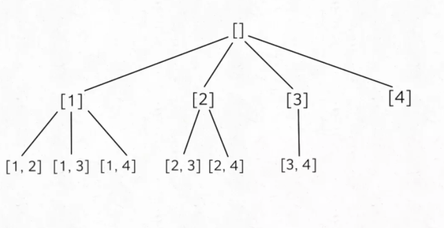
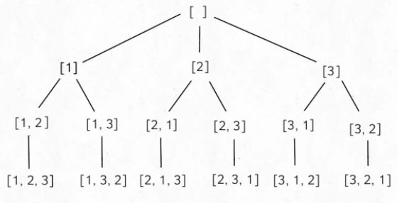

# 排列、组合、子集

```typescript
/*
leecode:
78.子集（中等）
46.全排列（中等）
77.组合（中等）
*/
```

## 子集

输入一个不包含重复数字的数组，要求算法输出这些数字的所有子集。比如输入 nums = [1,2,3]，你的算法应输出 8 个子集，包含空集和本身，顺序可以不同：

[ [],[1],[2],[3],[1,3],[2,3],[1,2],[1,2,3] ]

**第一个解法是利用数学归纳的思想**：这就是一个典型的递归结构嘛，[1,2,3] 的子集可以由 [1,2] 追加得出，[1,2] 的子集可以由 [1] 追加得出，base case 显然就是当输入集合为空集时，输出子集也就是一个空集。

```typescript
function subsets(nums:number[]){
    if(nums.length==0) return {{}}
    let n =nums.pop()
    const res=subsets(nums);
    for (let i = 0; i < nums.length; i++) {
        const newItem=res[i].push(n)
        res.push(newItem)
    }
    return res
}
```

时间复杂度 O(N\*2^N),空间复杂度 O(N)

**回溯算法摸板**：

```typescript
const result = []
function backtrack(路径，选择列表){
    if(满足结束条件){
        result.add(路径);
        return
    }

    for (const 选择 of 选择列表) {
        做选择
        backtrack(路径，选择列表)
        撤销选择
    }
}
```

```typescript
let res;

function subsets(nums: number[]) {
  let track = [];
  backtrack(nums, 0, track);
  return res;
}

function backtrack(nums: number, start: number, track: number[]) {
  res.push([...track]);
  for (let i = start; i < nums.length; i++) {
    track.push(nums[i]);
    backtrack(nums, i + 1, track);
    track.pop(nums[i]);
  }
}
```

可以看见，对 res 的更新是一个前序遍历，也就是说，res 就是树上的所有节点：



## 组合

输入两个数字 n, k，算法输出 [1..n] 中 k 个数字的所有组合。

比如输入 n = 4, k = 2，输出如下结果，顺序无所谓，但是不能包含重复（按照组合的定义，[1,2] 和 [2,1] 也算重复）：

[[1,2],[1,3],[1,4],[2,3],[2,4],[3,4]]

这就是典型的回溯算法，k 限制了树的高度，n 限制了树的宽度，直接套我们以前讲过的回溯算法模板框架就行了：



```typescript
let res;

function combine(n: number, k: number) {
  if (k <= 0 || n <= 0) return res;
  let track = [];
  backtrack(n, k, 1, track);
  return res;
}

function backtrack(n: number, k: number, start: n, track: number[]) {
  if (k == track.length) {
    res.push([...track]);
    return;
  }
  for (let i = start; i < n; i++) {
    track.push(i);
    backtrack(n, k, i + 1, track);
    track.pop();
  }
}
```

backtrack 函数和计算子集的差不多，**区别在于，更新 res 的地方是树的底端**。

## 排列

输入一个不包含重复数字的数组 nums，返回这些数字的全部排列。

比如说输入数组 [1,2,3]，输出结果应该如下，顺序无所谓，不能有重复：[[1,2,3],[1,3,2],[2,1,3],[2,3,1],[3,1,2],[3,2,1]]

回溯算法详解 中就是拿这个问题来解释回溯模板的。这里又列出这个问题，是将「排列」和「组合」这两个回溯算法的代码拿出来对比。



```typescript
let res = [];

function permute(nums: number[]) {
  let track = [];
  backtrack(nums, track);
  return res;
}

function backtrack(nums: number[], track: number[]) {
  if (track.length == nums.length) {
    // 需要赋值一份track的值
    res.push([...track]);
    return;
  }

  for (let i = 0; i < nums.length; i++) {
    // 排除不合法的选择
    if (track.includes(nums[i])) continue;

    track.push(nums[i]);
    backtrack(nums, track);
    track.pop();
  }
}
```

## 总结

子集问题可以利用数学归纳思想，假设已知一个规模较小的问题的结果，思考如何推导出原问题的结果。也可以用回溯算法，要用 start 参数排除已选择的数字。

组合问题利用的是回溯思想，结果可以表示成树结构，我们只要套用回溯算法模板即可，关键点在于要用一个 start 排除已经选择过的数字。

排列问题是回溯思想，也可以表示成树结构套用算法模板，不同之处在于使用 contains 方法排除已经选择的数字，这里主要是和组合问题作对比。
