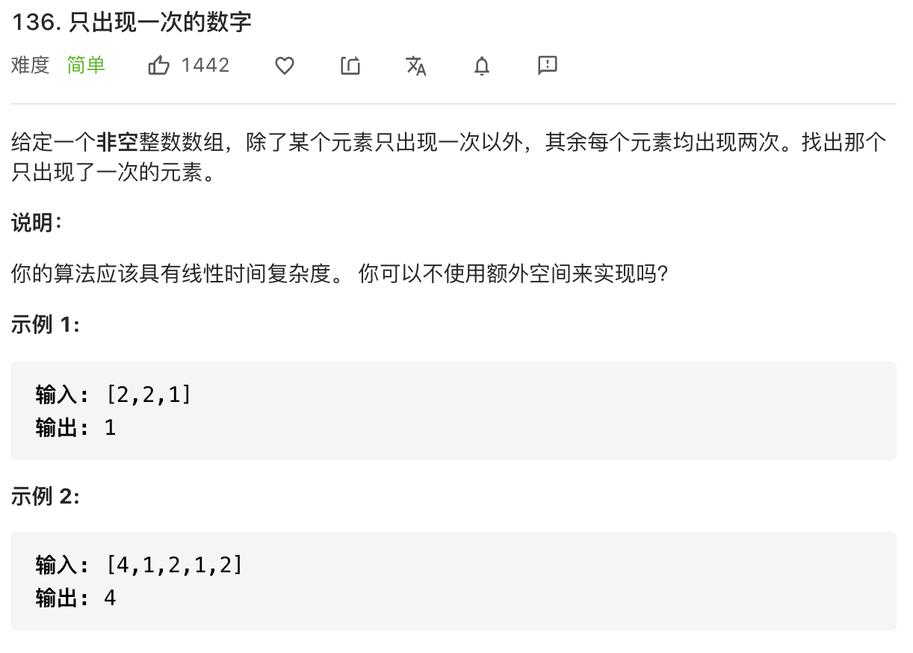

# 常用位操作

```typescript
/*
leecode:
191.位1的个数（简单）
231.2的幂（简单）
*/
```

## 算法常用操作

n&(n-1) 这个操作是算法中常见的，作用是消除数字 n 的二进制表示中的最后一个 1。


核心逻辑就是：n-1 一定可以消除最后一个 1，同时把其后的 0 都变成 1，这样再和 n 做一次&运算，就可以仅仅把最后一个 1 变成 0

### 1.计算汉明权重


就是让你返回 n 的二进制表示中有几个 1。因为 n & (n - 1) 可以消除最后一个 1，所以可以用一个循环不停地消除 1 同时计数，直到 n 变成 0 为止。

```typescript
function hanmingWeight(n: number) {
  let res = 0;
  while (n != 0) {
    n = n & (n - 1);
    res++;
  }
  return res;
}
```

### 2.判断一个数是不是 2 的指数

```typescript
2^0 = 1 = 0b0001
2^1 = 2 = 0b0010
2^2 = 4 = 0b0100
```

如果是用 n&(n-1)的技巧就很简单(主义运算符优先级，括号不可以省略)

```typescript
function isPowerOfTwo(n: number) {
  if (n <= 0) return false;
  return (n & (n - 1)) == 0;
}
```

### 3.查找只出现一次的元素



这里就可以运用异或运算的性质：

一个数和它本身做异或运算结果为 0，即 a ^ a = 0；一个数和 0 做异或运算的结果为它本身，即 a ^ 0 = a。

对于这道题目，我们只要把所有数字进行异或，成对儿的数字就会变成 0，落单的数字和 0 做异或还是它本身，所以最后异或的结果就是只出现一次的元素：

```typescript
function singleNumber(nums: number[]) {
  let res = 0;
  for (const n of nums) {
    res ^= n;
  }

  return res;
}
```
