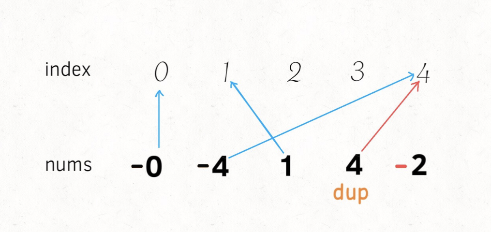
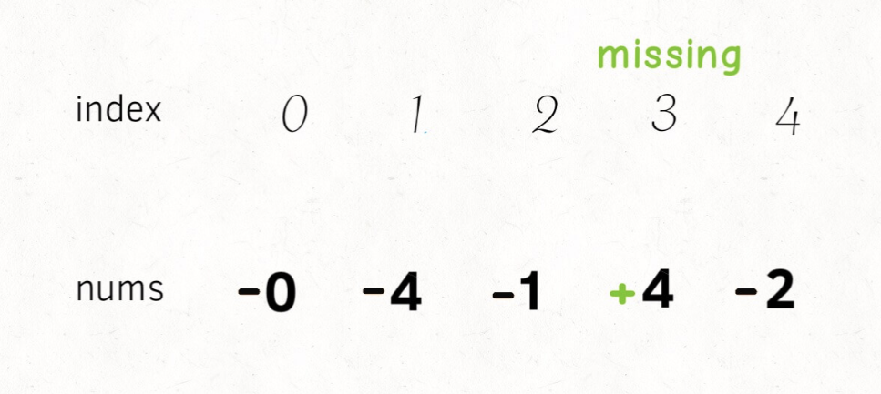

# 查找缺失和重复元素

```typescript
/*
leecode:
645.错误的集合（简单）
*/
```

给一个长度为 N 的数组 nums，其中本来装着 [1..N] 这 N 个元素，无序。但是现在出现了一些错误，nums 中的一个元素出现了重复，也就同时导致了另一个元素的缺失。请你写一个算法，找到 nums 中的重复元素和缺失元素的值。

比如说输入：nums = [1,2,2,4]，算法返回 [2,3]。

其实很容易解决这个问题，先遍历一次数组，用一个哈希表记录每个数字出现的次数，然后遍历一次 [1..N]，看看那个元素重复出现，那个元素没有出现，就 OK 了。

但问题是，这个常规解法需要一个哈希表，也就是 O(N) 的空间复杂度。你看题目给的条件那么巧，在 [1..N] 的几个数字中恰好有一个重复，一个缺失，事出反常必有妖，对吧。

O(N) 的时间复杂度遍历数组是无法避免的，所以我们可以想想办法如何降低空间复杂度，是否可以在 O(1) 的空间复杂度之下找到重复和确实的元素呢？

## 思路分析

这个问题的特点是，每个元素和数组索引有一定的对应关系。

改造下问题：**暂且将 nums 中的元素变为[0..N-1],这样每个元素就和一个数组索引完全对应了**

如果说 nums 中不存在重复元素和缺失元素，则一一对应，现在一个重复，一个缺失**会导致有两个元素对应到了同一个索引，而且会有一个索引没有元素对应过去**。

那么，如果能通过某些方法，找到这个重复对应的索引，不就找到了那个重复元素吗？找到那个没有元素对应的索引，不就找到了那个缺失的元素吗？

所以，如何不适用额外空间判断某个元素对应呢？

**通过将每个索引对应的元素变成负数，以表示这个索引被对应过一次了**。

如果出现重复元素 4，至关结果就是，索引 4 对应的元素已经是负数了。



对于缺失元素 3，直观结果就是，索引 3 所对应的元素是正数：



```typescript
function findErrorNums(nums: number[][]) {
  let l = nums.length;
  let dup = -1;
  for (let i = 0; i < n; i++) {
    let index = Math.abs(nums[i] - 1);
    if (nums[index] < 0) {
      // nums[index] 小于0则说明重复访问
      dup = Math.abs(nums[i]);
    } else {
      nums[index] *= -1;
    }
  }

  let missing = -1;
  for (let i = 0; i < n; i++) {
    // nums[i]大于0则说明没有访问
    if (nums[i] > 0) {
      missing = i + 1;
    }
  }
  return [dup, missing];
}
```

## 总结

**对于数组问题，关键点在于元素和索引是成对出现的，常用的方法是排序、映射**。

映射的思路就是上述分析，将每个索引和元素映射起来，通过正负号记录某个元素是否被映射。

排序的方法很好理解，对于这个问题，可以想象如果元素被从小到大排序，如果发现索引对应的元素如果不相符，就可以找到重复和缺失的元素。
