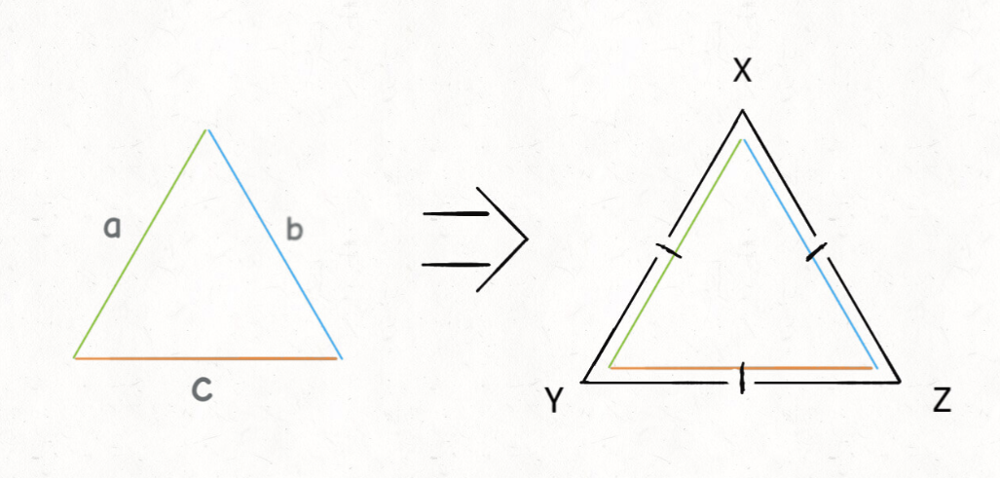
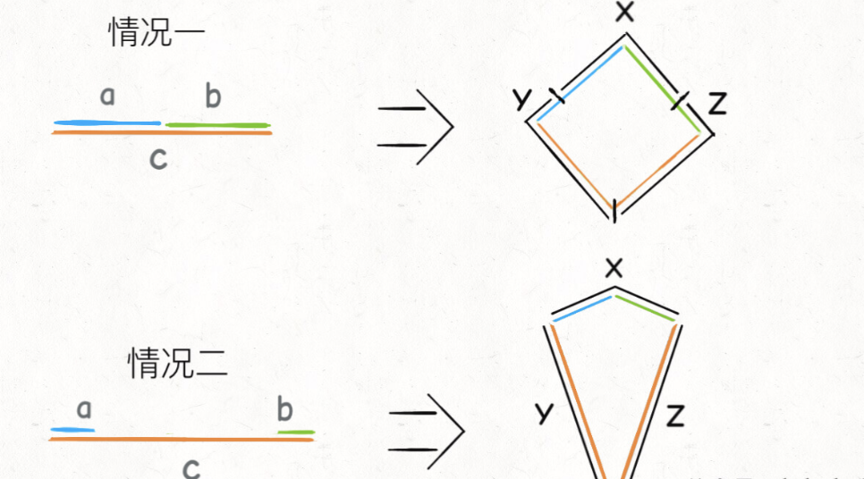

# 分葡萄

有三种葡萄，每种分别有 a, b, c 颗，现在有三个人，第一个人只吃第一种和第二种葡萄，第二个人只吃第二种和第三种葡萄，第三个人只吃第一种和第三种葡萄。

现在给你输入 a, b, c 三个值，请你适当安排，让三个人吃完所有的葡萄，算法返回**吃的最多的人最少要吃多少颗葡萄**。

## 题目解析

首先来理解一下题目，你怎么做到使得「吃得最多的那个人吃得最少」？

可以这样理解，我们先不管每个人只能吃两种特定葡萄的约束，你怎么让「吃得最多的那个人吃得最少」？

显然，只要平均分就行了，每个人吃 (a+b+c)/3 颗葡萄。即便不能整除，比如说 a+b+c=8，那也要尽可能平均分，就是说一个人吃 2 颗，另两个人吃 3 颗。

综上，「吃得最多的那个人吃得最少」就是让我们尽可能地平均分配，**而吃的最多的那个人吃掉的葡萄颗数就是 (a+b+c)/3 向上取整的结果，也就是 (a+b+c+2)/3**。

**思路还是要回到如何「尽可能地平均分配」上面，那么事情就变得有意思起来**。

如果把葡萄的颗数 a, b, c 作为三条线段，它们的大小作为线段的长度，想一想它们可能组成什么几何图形？我们的目的是否可以转化成「尽可能平分这个几何图形的周长」？

三条线段组成的图形，那不就是三角形嘛？不急，我们小学就学过，三角形是要满足两边之和大于第三边的，假设 a < b < c，那么有下面两种情况：

如果 a + b > c，那么可以构成一个三角形，只要在这个三角形中间画一个顶点都在边 a, b, c 上的等边三角形，这三点就一定可以把这个三角形的周长平分成三份，且每一份都包含两条边：



也就是说，这种情况下，三个人依然是可以平均分配所有葡萄的，吃的最多的人最少可以吃到的葡萄颗数依然是 (a+b+c+2)/3。

**如果 a + b <= c**，这三条边就不能组成一个封闭的图形了，那么我们可以将最长边 c「折断」，也就是形成一个四边形。

这里面有两种情况：



对于情况一，a + b 和 c 的差距还不大的时候，可以看到依然能够让三个人平分这个四边形，那么吃的最多的人最少可以吃到的葡萄颗数依然是 (a+b+c+2)/3。

随着 c 的不断增大，就会出现情况二，此时 c > 2\*(a+b)，由于每个人口味的限制，为了尽可能平分，X 最多吃完 a 和 b，而 c 边需要被 Y 或 Z 平分，也就是说此时吃的最多的人最少可以吃到的葡萄颗数就是 (c+1)/2，即平分 c 边向上取整。

```typescript
function solutioin(a: number, b: number, c: number) {
  const nums = [a, b, c];
  nums.sort();
  let sum = a + b + c;

  // 能够构成三角形，可完全平分
  if (nums[0] + nums[1] > nums[2]) {
    return (sum + 2) / 3;
  }
  // 不能构成三角形，平分最长边的情况
  if ((nums[0] + nums[1]) * 2 < nums[2]) {
    return (nums[2] + 1) / 2;
  }
  // 不能构成三角形，但依然可以完全平分的情况
  return (sum + 2) / 3;
}
```
