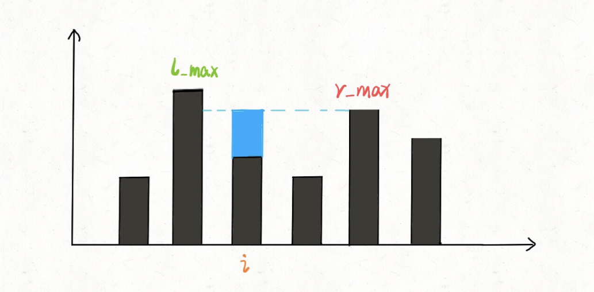

# 接雨水

```typescript
/*
leecode:
42.接雨水（困难）
*/
```


## 一、核心思路

所以对于这种问题，我们不要想整体，而应该去想局部；就像之前的文章写的动态规划问题处理字符串问题，不要考虑如何处理整个字符串，而是去思考应该如何处理每一个字符。

这么一想，可以发现这道题的思路其实很简单。具体来说，仅仅对于位置 i，能装下多少水呢？


能装 2 格水，因为 height[i] 的高度为 0，而这里最多能盛 2 格水，2-0=2。

为什么位置 i 最多能盛 2 格水呢？因为，位置 i 能达到的水柱高度和其左边的最高柱子、右边的最高柱子有关，我们分别称这两个柱子高度为 l_max 和 r_max；位置 i 最大的水柱高度就是 min(l_max, r_max)。

更进一步，对于位置 i，能够装的水为：

```typescript
water[i]=Math.min(
    Math.max(height[0..i],
    Math.max(height[i...end]))
    )-height[i]
```



暴力解法：

```typescript
function trap(height: number[]) {
  let n = height.length;
  let res = 0;
  for (let i = 1; i < n - 1; i++) {
    let l_max = 0,
      r_max = 0;
    // 找右边最高的柱子
    for (let j = i; j < n; j++) {
      r_max = Math.max(r_max, height[j]);
    }
    // 找左边最高的柱子
    for (let j = i; j >= 0; j--) {
      l_max = Math.max(l_max, height[j]);
    }

    // 如果自己最高的话
    // l_max == r_max == height[i]
    res += Math.min(l_max, r_max) - height[i];
  }
  return res;
}
```

有之前的思路，这个解法应该是很直接粗暴的，时间复杂度 O(N^2)，空间复杂度 O(1)。但是很明显这种计算 r_max 和 l_max 的方式非常笨拙，一般的优化方法就是备忘录。

## 备忘录优化

**我们开两个数组 r_max 和 l_max 充当备忘录，l_max[i] 表示位置 i 左边最高的柱子高度，r_max[i] 表示位置 i 右边最高的柱子高度**。预先把这两个数组计算好，避免重复计算：

```typescript
function trap(height: number[]) {
  if (height.length == 0) return 0;
  // 数组充当备忘录
  let n = height.length;
  let res = 0;
  // 初始化base case
  let l_max = Array.from({ length: n });
  let r_max = Array.from({ length: n });
  l_max[0] = height[0];
  r_max[n - 1] = height[n - 1];

  // 从左向右计算l_max
  for (let i = 1; i < n; i++) {
    l_max[n] = Math.max(height[i], l_max[i - 1]);
  }
  // 从右向左计算r_max
  for (let i = n - 1; i >= 0; i--) {
    r_max[n] = Math.max(height[i], r_max[i + 1]);
  }

  //  计算答案
  for (let i = 1; i < n - 1; i++) {
    res += Math.min(l_max[i], r_max[i]) - height[i];
  }

  return res;
}
```

这个优化其实和暴力解法思路差不多，就是避免了重复计算，把时间复杂度降低为 O(N)，已经是最优了，但是空间复杂度是 O(N)。
