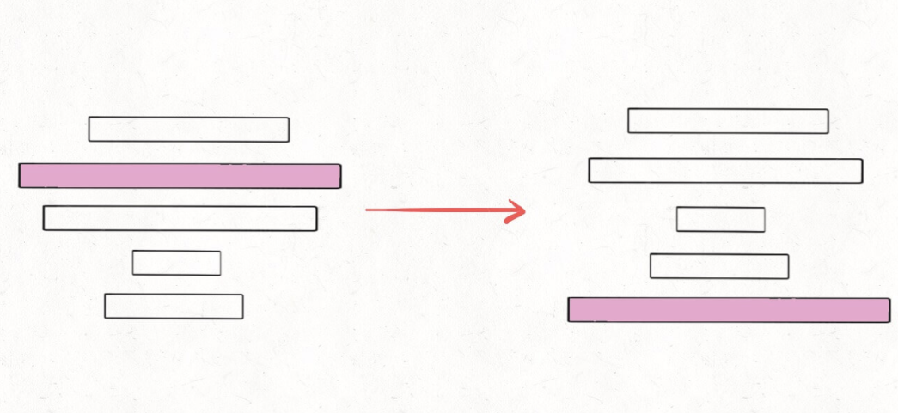
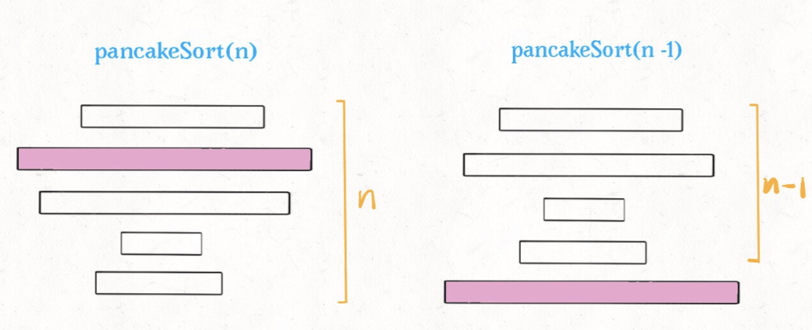

# 煎饼排序

```typescript
/*
leecode:
969.煎饼排序（中等）
*/
```

烧饼排序是个很有意思的实际问题：假设盘子上有 n 块面积大小不一的烧饼，你如何用一把锅铲进行若干次翻转，让这些烧饼的大小有序（小的在上，大的在下）？设想一下用锅铲翻转一堆烧饼的情景，其实是有一点限制的，我们每次只能将最上面的若干块饼子翻转


## 思路分析

为什么说这个问题有递归性质？比如说我们需要实现这样一个函数：

```typescript
// cakes 是一堆煎饼，函数会将前n个烧饼排序
function sort(cakes: number[], n: number);
```

如果我们找到了前 n 个煎饼中那个最大的那个，然后设法将这个煎饼翻转到最底下



那么，原问题的规模就可以减小，递归调用 pancakeSort(A,n-1)即可：



接下来，对于上面 n-1 块饼，如何排序？还是找到最大的那块，放到地下，再递归调用 parcakeSort(A,n-1-1)...

这就是递归性质，总结一下思路就是：

- 1、找到 n 个饼中最大的那个。
- 2、把这个最大的饼移到最底下。
- 3、递归调用 pancakeSort(A, n - 1)。

base case：n == 1 时，排序 1 个饼时不需要翻转。

**如何设法将某块煎饼翻到最后呢**？

比如第 3 块饼是最大的，我们想把它换到最后，也就是换到第 n 块，可以这样操作：

- 1.将前 3 块翻转一下，这样最大的饼就翻到最上面了

-2。将 n 块全部翻转，这样最大的饼就翻到了第 n 块，即最后一块。

## 代码实现

只要把上述的思路用代码实现即可，唯一需要注意的是，数组索引从 0 开始，而我们要返回的结果是从 1 开始算的。

```typescript
let res = [];

function pancakeSort(cakes: number[]) {
  sort(cakes, cakes.length);
  return res;
}

function sort(cakes: number[], n: number) {
  if (n == 1) return;

  // 寻找最大饼的索引
  let maxCake = 0;
  let maxCakeIndex = 0;
  for (let i = 0; i < n; i++) {
    if (cakes[i] > maxCake) {
      maxCake = cakes[i];
      maxCakeIndex = i;
    }
  }

  // 第一次翻转，将最大饼翻到最上面
  reverse(cakes, 0, maxCakeIndex);
  res.add(maxCakeIndex + 1);

  // 第二次翻转，将最大饼翻到最小面
  reverse(cakes, 0, n - 1);
  res.add(n);

  // 递归调用
  sort(cakes, n - 1);
}

function reverse(arr: number[], i: number, j: number) {
  return [
    ...arr.slice(0, i),
    ...arr.slice(i, j + 1).reverse(),
    ...arr.slice(j),
  ];
}
```

算法的时间复杂度很容易计算，因为递归调用的次数是 n，每次递归调用都需要一次 for 循环，时间复杂度是 O(n)，所以总的复杂度是 O(n^2)。
