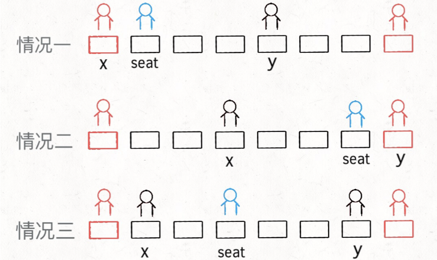
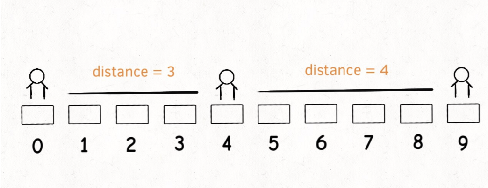
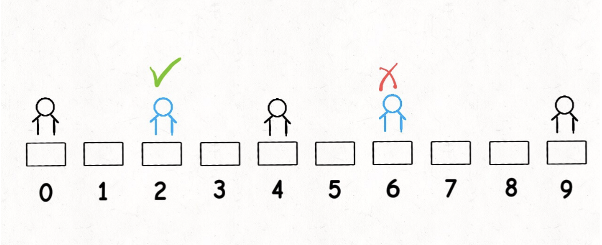

# 考场就座

```typescript
/*
leecode:
855.考场就座（中等）
*/
```

假设有一个考场，考场有一排共 N 个座位，索引分别是 [0..N-1]，考生会陆续进入考场考试，并且可能在任何时候离开考场。你作为考官，要安排考生们的座位，满足：**每当一个学生进入时，你需要最大化他和最近其他人的距离；如果有多个这样的座位，安排到他到索引最小的那个座位**。这很符合实际情况对吧

```typescript
class ExamRoom {
  // 总座位数N
  constructor(N: number) {}
  // 来了一位考生，返回分配的座位
  public seat(): number;
  // 坐在p位置的考生离开了
  // 可以认为p位置一定坐有考生
  public leave(p: number): void;
}
```

比方说考场有 5 个座位，分别是 [0..4]：

第一名考生进入时（调用 seat()），坐在任何位置都行，但是要给他安排索引最小的位置，也就是返回位置 0。

第二名学生进入时（再调用 seat()），要和旁边的人距离最远，也就是返回位置 4。

第三名学生进入时，要和旁边的人距离最远，应该做到中间，也就是座位 2。

如果再进一名学生，他可以坐在座位 1 或者 3，取较小的索引 1。

规律：

**如果将每两个相邻的考生看做线段的两端点，新安排考生就是找最长的线段，然后让该考生在中间把这个线段「二分」，中点就是给他分配的座位。leave(p) 其实就是去除端点 p，使得相邻两个线段合并为一个。**

## 思路分析

根据上述思路，首先需要把坐在教室的学生抽象成线段，我们可以简单的用一个大小为 2 的数组表示。

另外，思路需要我们找到「最长」的线段，还需要去除线段，增加线段。

**但凡遇到在动态过程中取最值的要求，肯定要使用有序数据结构，我们常用的数据结构就是二叉堆和平衡二叉搜索树了**。二叉堆实现的优先级队列取最值的时间复杂度是 O(logN)，但是只能删除最大值。平衡二叉树也可以取最值，也可以修改、删除任意一个值，而且时间复杂度都是 O(logN)。

综上，二叉堆不能满足 leave 操作，应该使用平衡二叉树。所以这里我们会用到 Java 的一种数据结构 TreeSet，这是一种有序数据结构，底层由红黑树维护有序性。

这里顺便提一下，一说到集合（Set）或者映射（Map），有的读者可能就想当然的认为是哈希集合（HashSet）或者哈希表（HashMap），这样理解是有点问题的。

因为哈希集合/映射底层是由哈希函数和数组实现的，特性是遍历无固定顺序，但是操作效率高，时间复杂度为 O(1)。

而集合/映射还可以依赖其他底层数据结构，常见的就是红黑树（一种平衡二叉搜索树），特性是自动维护其中元素的顺序，操作效率是 O(logN)。这种一般称为「有序集合/映射」。

我们使用的 TreeSet 就是一个有序集合，目的就是为了保持线段长度的有序性，快速查找最大线段，快速删除和插入。

## 简化问题

首先，如果有多个可选座位，需要选择索引最小的座位，**我们先简化一下问题，暂时不管这个需求**，实现上述思路。

这个问题还用到一个常用的编程技巧，就是使用一个【虚拟线段】让算法正确启动，这和链表相关的算法需要【虚拟头节点】一个道理。

```typescript
// 以端点p映射到以p为左端点的线段
let startMap = new Map();
// 以端点p映射到以p为右端点的线段
let endMap = new Map();
// 根据线段长度从小到大存放所有线段
let pq = new TreeSet(); // todo TreeSet
let N: number;

function examRoom(N: number) {
  pq = new TreeSet((a, b) => {
    // 算出两个线段的长度
    let distA = distance(a);
    let distB = distance(b);
    // 长度更长的更大，排后面
    return distA - distB;
  });
  // 在有序集合中先放一个虚拟线段
  addInterval([-1, N]);
}
// 去除一个线段
function removeInterval(intv: number) {
  qp.remove(intv);
  startMap.remove(intv[0]);
  endMap.remove(intv[1]);
}
// 增加一个线段
function addInterval(intv: number[]) {
  qp.add(intv);
  startMap.put(intv[0], intv);
  endMap.put(intv[1], intv);
}
// 计算一个线段的长度
function distance(intv: number[]) {
  return intv[1] - intv[0] - 1;
}
```

```typescript
function seat() {
  // 从有序集合拿出最长的线段
  let longest = pq.last();
  let x = longest[0];
  let y = longest[1];
  let seat;

  if (x == -1) {
    // 情况一
    seat = 0;
  } else if (y == N) {
    // 情况二
    seat = N - 1;
  } else {
    // 情况三
    seta = (y - x) / 2 + x;
  }
  // 将最长的线段分成两段
  let left = [x, seat];
  let right = [seat, y];
  removeInterval(longest);
  addInterval(left);
  addInterval(right);
  return seat;
}

function leave(p: number) {
  // 将p左右的线段找出来
  let right = startMap.get(p);
  let left = endMap.get(p);
  // 合并两个线段成为一个线段
  let merged = [left[0], right[1]];
  removeInterval(left);
  removeInterval(right);
  addInterval(merged);
}
```



思路很简单：找最长的线段，从中间分隔成两段，中点就是 seat（）的返回值；找 p 的左右线段，合并成一个线段，这就是 leave(p)的逻辑

## 进阶问题

题目要求多个选择时选择索引最小的那个座位，我们刚才忽略了这个问题。比如下面这种情况会出错：



现在有序集合里有线段 [0,4] 和 [4,9]，那么最长线段 longest 就是后者，按照 seat 的逻辑，就会分割 [4,9]，也就是返回座位 6。但正确答案应该是座位 2，因为 2 和 6 都满足最大化相邻考生距离的条件，二者应该取较小的。



**遇到题目的这种要求，解决方式就是吸怪有序数据结构的排序方式**，具体就是修改 TreeMap 的比较函数逻辑

```typescript
pq = new TreeSet((a, b) => {
  let distA = distance(a);
  let distB = distance(b);
  // 如果长度相同，就比较索引
  if (distA == distB) return b[0] - a[0];
  return distA - distB;
});
```

除此之外，还要改变 distance 函数，**不能简单地让它计算一个线段两个端点间的长度，而是让它计算该线段中间和端点之间的长度**。

```typescript
function distance(intv: number[]) {
  let x = intv[0];
  let y = intv[1];
  if (x == -1) return y;
  if (y == N) return N - 1 - x;
  // 中点和端点之间的长度
  return (y - x) / 2;
}
```


这样，[0,4] 和 [4,9] 的 distance 值就相等了，算法会比较二者的索引，取较小的线段进行分割。到这里，这道算法题目算是完全解决了

## 总结

处理动态问题一般都会用到有序数据结构，比如平衡二叉搜索树和二叉堆，二者的时间复杂度差不多，但前者支持的操作更多。

既然平衡二叉搜索树那么好用，还用二叉堆干嘛呢？因为二叉堆底层就是数组，实现简单。红黑树，操作复杂，而且消耗的空间相对来说会多一些。
