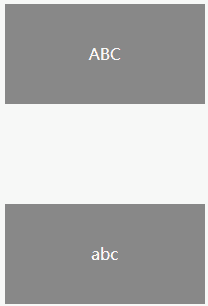
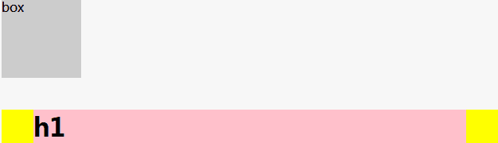
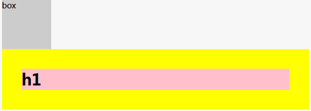
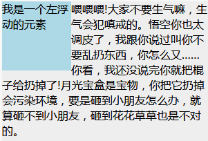
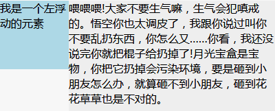
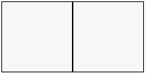

# BFC

## 一.什么是BFC

常见的Formatting context有Block formatting context(BFC)和Inline formatting context（IFC）。**Block formatting context直译为‘块级格式化上下文’。它是一个独立的渲染区域，只有Block-level box参与，它规定了内部的Block-level Box如何布局，并且与这个区域外部毫不相干，通俗地讲，BFC是一个容器，用于管理块级元素**

## 二.如何创建BFC

* float为left | right
* overflow 为 hidden | auto | scroll
* display 为 table-cell | table-caption | inline-block | inline-flex | flex 
* position 为 absolute | fixed
* 根元素

## 三.BFC布局规则

* 内部的Box会在垂直方向，一个接一个的放置（即块级元素独占一行）
* BFC的区域不会与float box重叠（利用这点可以实现自适应两栏布局）
* 内部的Box垂直方向的距离由margin决定，属于同一个BFC的两个的margin会发生重叠（**margin重叠的三个条件；同属于一个BFC，相邻，块级元素**）
* 计算BFC的高度时，浮动元素也参与计算（清除浮动 haslayout）
* BFC就是页面上的一个隔离的独立容器，容器里面的子元素不会影响到外面的元素，反之也如此

## 四.BFC有哪些特性

### 特性1.BFC会组织垂直外边距折叠

**按照BFC的定义，只有同属于一个BFC时，两个元素才有可能发生垂直margin的重叠**，这个包括相邻元素或者嵌套元素，只要他们之间没有阻挡（比如边框，非空内容，padding等）就会发生margin重叠

#### 1.相邻兄弟元素margin重叠问题

```html
<style>
p{
    color:#fff;
    background:#777;
    width:200px;
    line-height:100px;
    text-align:center;
    margin:100px;
}
</style>
<body>
    <p>ABC</p>
    <p>abc</p>
</body>
```



上面例子中两个p元素之间的距离本应该为200px，然而实际上只有100px，发生了margin重叠，如何处理？  
**只需要在p外面包裹一层容器，并触发该容器生成一个BFC，那么两个p便不属于同一个BFC，就不会发生margin重叠了**

```html
<body>
    <p>ABC</p>
    <div>
        <p>abc</p>
    </div>
</body>

#### 2.父子元素margin重叠问题

```html
<style>
.box{
    width:100px;
    height:100px;
    background:#ccc;
}
.wrap{
    background:yellow;
}
.wrap h1{
    background:pink;
    margin:40px
}
</style>

<body>
    <div class="box">box</div>
    <div class="wrap">
        <h1>h1</h1>
    </div>
</body>
```



上面wrap元素与h1元素之间理论上本该有个40px的上下margin值，然而实际上父子元素并没有存在margin值，与此同时，两个div元素的间距为40px  
处理方法很多：

* 在wrap元素中添加 overflow:hidden或者overflow:auto，使其父元素形成一个BFC
* 在wrap元素中添加border:1px solid或者 padding:1px



### 特性2.BFC不会重叠浮动元素

利用这个特性，可以创造自适应两栏布局

```html
<style>
.box1{
  height: 100px;
  width: 100px;
  float: left;
  background: lightblue;
}
.box2{width: 200px;
  height: 200px;
  background: #eee;
}
</style>
<body>
    <div class="box1">我是一个左浮动的元素</div>
    <div class="box2">喂喂喂!大家不要生气嘛，生气会犯嗔戒的。悟空你也太调皮了，
        我跟你说过叫你不要乱扔东西，你怎么又……你看，我还没说完你就把棍子给扔掉了!
        月光宝盒是宝物，你把它扔掉会污染环境，要是砸到小朋友怎么办，就算砸不到小朋友，
        砸到花花草草也是不对的。
    </div>
</body>
```



上图中，文字围绕着浮动元素排列，不过在这里，显然不是我们想要的，可以**为box2元素的样式加上overflow:hidden，使其建立一个BFC，让其内容消除对外界浮动元素的影响**



这个方法可以实现两列自适应布局，此时左边的宽度固定，右边的内容自适应宽度，如果我们改变文字的大小或者左边浮动元素的大小，两栏布局结构依然没有改变

### 特性3.可以包含浮动--清除浮动

浮动会脱离文档流

```html
<style>
.box1{
  width:100px;
  height:100px;
  float:left;
  border: 1px solid #000;
}
.box2{
  width:100px;
  height:100px;
  float:left;
  border: 1px solid #000;
}
.box{
  background:yellow
}
</style>
<body>
<div class="box">
  <div class="box1"></div>
  <div class="box2"></div>
</div>
</body>
```



由于容器内两个div元素浮动，脱离了文档流，父容器内容宽度为0（即发生了高度坍塌），未能将子元素包裹住  
**只需要把副元素变成一个BFC就行可，常用的办法是给父元素设置overflow:hidden**


