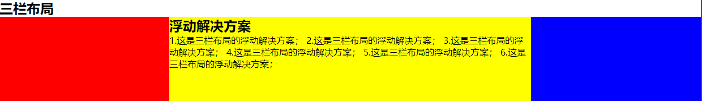

# 三栏布局

**三栏布局，两边固定，中间自适应**，假设高度已知，左右栏宽度各为300px

## 一.浮动布局

```html
<!DOCTYPE html>
<html>
<head>
    <meta charset="utf-8">
    <title>Layout</title>
    <style media="screen">
        html * {
            padding: 0;
            margin: 0;
        }
        .layout article div {
            min-height: 150px;
        }
    </style>
</head>
<body>
    <!--浮动布局  -->
    <section class="layout float">
        <style media="screen">
            .layout.float .left {
                float: left;
                width: 300px;
                background: red;
            }
            .layout.float .center {
                background: yellow;
            }
            .layout.float .right {
                float: right;
                width: 300px;
                background: blue;
            }
        </style>
        <h1>三栏布局</h1>
        <article class="left-right-center">
            <div class="left"></div>
            <div class="right"></div> // 右栏部分要写在中间内容之前
            <div class="center">
                <h2>浮动解决方案</h2>
                1.这是三栏布局的浮动解决方案； 2.这是三栏布局的浮动解决方案； 3.这是三栏布局的浮动解决方案； 4.这是三栏布局的浮动解决方案； 5.这是三栏布局的浮动解决方案； 6.这是三栏布局的浮动解决方案；
            </div>
        </article>
    </section>
</body>
</html>
``` 



这种布局方式，dom结构必须是先写浮动部分，然后再中间块，否则右浮动块会掉到下一行。  
**浮动布局的优点是比较简单，兼容性也比较好，但浮动布局是有局限的，浮动元素脱离文档流，要做清除浮动，这个处理不好的话，会带来很多问题，比如父容器高度坍塌等**

## 二.绝对布局

```html
<!--绝对布局  -->
<section class="layout absolute">
    <style>
        .layout.absolute .left-center-right>div{
            position: absolute;//三块都是绝对定位
        }
        .layout.absolute .left {
            left:0;
            width: 300px;
            background: red;
         }
        .layout.absolute .center {
            right: 300px;
            left: 300px;//离左右各三百
            background: yellow;
        }
        .layout.absolute .right {
            right: 0;
            width: 300px;
            background: blue;
        }
    </style>
    <h1>三栏布局</h1>
    <article class="left-center-right">
        <div class="left"></div>
        <div class="center">
            <h2>绝对定位解决方案</h2>
                1.这是三栏布局的浮动解决方案； 2.这是三栏布局的浮动解决方案； 3.这是三栏布局的浮动解决方案； 4.这是三栏布局的浮动解决方案； 5.这是三栏布局的浮动解决方案； 6.这是三栏布局的浮动解决方案；
        </div>
        <div class="right"></div>
    </article>
</section>
```

**绝对定位布局优点就是快捷，设置很方便，并且也不容易出问题，缺点就是，容器脱离了文档流，后代元素也脱离了文档流，高度未知的时候，会有问题，这就导致了这种方法的有效性可使用性是比较差的**。

## 三.flexbox布局

```html
<!--flexbox布局-->
<section class="layout flexbox">
    <style>
        .layout.flexbox .left-center-right{
            display: flex;
        }
        .layout.flexbox .left {
            width: 300px;
            background: red;
        }
        .layout.flexbox .center {
            background: yellow;
            flex: 1;
        }
        .layout.flexbox .right {
            width: 300px;
            background: blue;
        }
    </style>
    <h1>三栏布局</h1>
    <article class="left-center-right">
        <div class="left"></div>
        <div class="center">
            <h2>flexbox解决方案</h2>
                1.这是三栏布局的浮动解决方案； 2.这是三栏布局的浮动解决方案； 3.这是三栏布局的浮动解决方案； 4.这是三栏布局的浮动解决方案； 5.这是三栏布局的浮动解决方案； 6.这是三栏布局的浮动解决方案；
        </div>
        <div class="right"></div>
    </article>
</section>
```

**flexbox布局是css3里新出的属性，它就是为了解决上述两种方式的不足出现的，是比较完美的一个，且目前移动端的布局也都是用flexbox，flexbox的缺点就是IE10开始支持，但是IE10的是-ms形式**。

## 四.表格布局

```html
<!--表格布局-->
<section class="layout table">
    <style>
        .layout.table .left-center-right {
            display: table;
            height: 150px;
            width: 100%;
        }
        .layout.table .left-center-right>div {
            display: table-cell;
        }
        .layout.table .left {
            width: 300px;
            background: red;
        }
        .layout.table .center {
            background: yellow;
        }
        .layout.table .right {
            width: 300px;
            background: blue;
        }
    </style>
    <h1>三栏布局</h1>
    <article class="left-center-right">
        <div class="left"></div>
        <div class="center">
            <h2>表格布局解决方案</h2>
                1.这是三栏布局的浮动解决方案； 2.这是三栏布局的浮动解决方案； 3.这是三栏布局的浮动解决方案； 4.这是三栏布局的浮动解决方案； 5.这是三栏布局的浮动解决方案； 6.这是三栏布局的浮动解决方案；
        </div>
        <div class="right"></div>
    </article>
</section>
```

**表格布局的兼容性很好，在flex布局不兼容的时候，可以尝试表格布局，当内容溢出时会自动撑开父元素**。  
**表格布局也是有缺陷的：**

* 无法设置栏边距
* 对seo不友好
* 当其中一个单元格高度超出的时候，两侧的单元格也会跟着一起变高

## 五.网格布局

```html
<!--网格布局-->
<section class="layout grid">
    <style>
        .layout.grid .left-center-right {
            display:grid;
            width:100%;
            grid-template-columns:300px auto 300ox;
            grid-template-rows:150px;
        }
        .layout.grid .left {
            background: red;
        }
        .layout.grid .center {
            background: yellow;
        }
        .layout.grid .right {
            background: blue;
        }
    </style>
    <h1>三栏布局</h1>
    <article class="left-center-right">
        <div class="left"></div>
        <div class="center">
            <h2>网格布局解决方案</h2>
                1.这是三栏布局的浮动解决方案； 2.这是三栏布局的浮动解决方案； 3.这是三栏布局的浮动解决方案； 4.这是三栏布局的浮动解决方案； 5.这是三栏布局的浮动解决方案； 6.这是三栏布局的浮动解决方案；
        </div>
        <div class="right"></div>
    </article>
</section>
```

**CSS Grid是创建网格布局最强大和最简单的工具，就像表格一样，网格布局是可以让web设计师跟居元素按行或行对齐排列，但他和表格不同，网络布局没有内容结构，从而使各种布局不可能与表格一样，例如，一个网格布局中的子元素都可以定位的位置，这样他们可以重叠和类似元素定位**。  
**但网络布局的兼容性不好，IE10+支持，而且也仅支持部分属性**。
