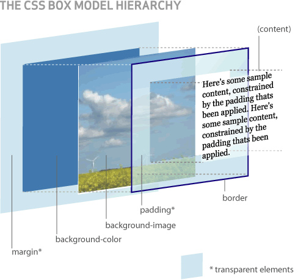

# 何时使用 margin 和 padding

先看这张图，重点是 background-image

> css 边距属性定义元素周围的空间。通过使用单独的属性，可以对上，右，下，左的外边距进行设置，也可以使用简写的外边距属性同时改变所有的外边距。 --W3School  
> margin（边界）：元素周围生成额外的空白区。‘空白区’通常是指其他元素不能出现且父元素背景可见的区域。 --CSS 权威指南  
> padding (内边距)，其判断的依据即边框离内容正文的距离。补白（padding）：补白位于元素框的边界与内容区之间。很自然，用于影响这个区域的属性是 padding --CSS 权威指南

何时使用 margin:  
1.需要在 border 外侧添加空白时。  
2.空白处不需要背景（色）时。  
3.上下相连的两个盒子之间的空白，需要相互抵消时，如 15px+20px 的 margin,将得到 20px 的空白。

何时使用 padding: 1.需要在 border 内侧添加空白时.  
2.空白处需要背景（色）时。  
3.上下相连的两个盒子之间的空白，希望等于两者之和时。如 15px+20px 的 padding，将得到 35px 的空白。

> margin 是用来隔开元素和元素的间距；padding 是用来隔开元素和内容的间隔。margin 用于布局分开元素使元素与元素互不相干；padding 用于元素和内容之间的间隔，让内容（文字）与（包裹）元素之间有一段‘呼吸距离’。
