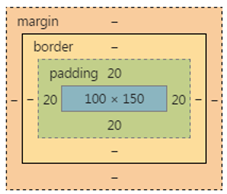

# 响应式布局

响应式布局设计可以让一个网站同时适配多种设备和多个屏幕，可以让网站布局和功能随用户的使用环境(屏幕大小，输入方式，设备/浏览能力)而变化

## 一.视口

**移动前端中常说的viewport（视口）就是浏览器中用于呈现网页的区域，视口通常并不等于屏幕大小，特别是可以缩放浏览器窗口的情况下**。手机端和PC端视口存在差异，电脑端的视口宽度等于分辨率，而移动端的视口宽度和分辨率没有关系，**宽度默认值是设备厂家指定的，ios，android基本都将这个视口分辨率设置为980px**

### 1.为什么手机端视口要设为980px

为了让小屏幕访问大屏幕的页面，需要手机固定一个视口宽度，让手机的视口宽度等于世界上绝大多数PC网页的版心宽度，就是980px，这样，用手机访问电脑网页的时候，旁边刚好没有留白。不过页面缩放后文字变得非常小，用户体验很差。

### 2.约束视口

为了解决前面的问题，可以在网页中添加这行代码

```html
<meta name='viewport' content='width=device-width,initial-scale=1.0,maximum-scale=1.0,user-scalable=0'>
```

* width=device-width 视口为设备宽度（就是人为设置的一个宽度，不设置的话默认为980px）
* initial-scale=1.0  初始化的视口大小是1.0倍
* maximum-scale=1.0  最大的倍数是1.0倍
* user-scalable=0    允许缩放视口

这个视口的标签告诉浏览器怎么渲染页面：按照设备的宽度（device-width来渲染网页内容）。  
此时如果用document.documentElement.clientWidth来测试浏览器屏幕宽度，你会发现当前视口宽度等于手机屏幕的宽度，约数后的视口宽度在320-480之间。  
这个视口的尺寸是手机厂商设置的，能够保证我们的文字比如16px，在自己的这个视口下清晰，大小刚刚合适，所以**大屏幕的手机约束视口>小屏幕的手机的约束视口。这就能保证我们的网页可以用px写字号，写高宽**  

* **约束之后的视口宽度，不是自己的分辨率，每个手机的分辨率，都要比自己的视口宽度大得多得多**
* **前端开发工程师，丝毫不关心手机的分辨率，我们只关系视口**

### 图片

**为了将图片能在不同大小的屏幕中自动缩放** ：

```css
img{
    max-image:100%
}
```

max-width:保证所有图片最大显示为其自身的100%(即最大值可以显示为自身那么大)。**此时，如果包含图片的元素（比如包含图片的body或div）比图片固定宽度小，图片会压缩占满最大可用空间**。

#### 为什么不用width：100%？

要实现图片的自动缩放，也可以使用更通用的width属性，比如：width:100%,然而，这条规则在这里并不适用，因为这条规则会导致它显示的跟它的容器一样宽，**在容器比图片宽的多的情况下，图片会被拉伸**。

## 四.手机浏览器内核

在移动端，仅有四个独立的浏览器内核：

* -ms- 微软的Trident:主要为WP7，8的内置浏览器
* -moz- 火狐的Gecko：火狐浏览器
* -webkit- 开源内核Webkit：Android原生浏览器，苹果的safari，谷歌Chrome都是基于Webkit开源内核开发的
* -o- Opera的Presto：Opera Mobile，OperaMini，欧朋浏览器以及HD Beta版

UC,Android内置,Chrome，Safari，QQ Browser都是webkit内核，占据绝大部分市场份额，所以很多公司干脆只兼容-webkit-

## 五.流式布局

**百分比布局也叫做流式布局，弹性盒布局。手机网页没有版心，都左右撑满**。  
**百分比能够设置的属性是width，height,padding,margin，其他属性比如border,font-size不能用半分比设置**

* 百分比写 width，那么指的是父元素 width 的百分之多少。
* 百分比写 height，那么指的是父元素 height 的百分之多少。
* 百分比写 padding，那么指的是父元素 width 的百分之多少，无论是水平的 padding 还是竖直的 padding。
* 百分比写 margin，那么指的是父元素 width 的百分之多少，无论是水平的 margin 还是竖直的 margin。
* 不能用百分比写 border 的宽度

```css
div{
width:200px;
height:300px;
padding:10px;
}
div p{
width:50%;
height:50%;
padding:10%;
}
/* 此时p的真实宽度是多少？ */
```



p的真实宽度为140px*190px

## 六.媒体查询

### 1.为什么响应式web设计需要媒体查询

**CSS3媒体查询可以让我们针对特定的设备能力或条件为网页应用特定的CSS样式**。如果没有媒体查询，只用CSS式无法大幅度修改网页外观的。这个模块让我们可以提前编写出适应很多不可预知的CSS规则，比如屏幕方向水平或垂直，视口或大或小等。弹性盒子虽然可以让设计适应较多场景，也包括某些尺寸的屏幕，但有时候仍然不够，因为我们还需要对布局进行更细致的调整，媒体查询让这一切成为可能，它就相当于CSS中基本的条件逻辑.

### 2.媒体查询语法

**我们在媒体查询外面写的第一条规则，是‘基本的’样式，它适用于任何设备，在此基础上，我们不再为不同视口，不同能力的设备，渐进增加不同的视觉效果和功能**。

```css
body{
    background-color: grey;
}

@media screen and (min-width:1200px){
    body {
        background-color: #bbb;
    }
}

@media screen and (min-width:700px) and (max-width:1200px){
    body {
        background-color: #fff;
    }
}

@media screen and (max-width:700px){
    body {
        background-color: #333;
    }
}
```

**媒体查询只能包裹选择器，不能包裹k：v对**。  
**IE6,7,8不支持媒体查询，也为了防止手机端的某些浏览器不支持媒体查询，所以不要把所有的选择器都放在媒体查询里面**。

## 七.rem响应式布局

> rem响应式布局思想

* 1.一般不要给元素设置具体的宽度，但是对于一些小图标可以设定具体宽度值
* 2.高度值可以设置固定值，设计稿有多大，我们就严格写多大
* 3.所有设置的固定值都是rem做单位（首先在HTML中设置一个基准值：PX和REM的对应比例，然后在效果图上获取px值，布局的时候转化为rem值）
* 4.JS获取真实屏幕的宽度，让其除以设计稿的宽度，算出比例，把之前的基准值按照比例进行重新设定，这样项目就可以在移动端自适应了

> rem 和 em

* **rem:当前页面中元素的REM单位的样式值都是针对于HTML元素的font-size的值进行动态计算的**
* **em:表示父元素的字号的倍数(注意：在text-indent属性中，表示文字宽度)**

em为单位时，font-size属性计算后继承的，box1计算出来的是40px，那么里面的box2继承的是40px，**em单位不仅仅可以用来设置字号，还可以设置任何盒模型的属性，比如width,height,padding,margin,border**  
**rem有一点优势就是可以配合媒体查询，实现响应式布局**

```css
@media screen and (min-width: 320px) {
    html {font-size: 14px;}
}
@media screen and (min-width: 360px) {
    html {font-size: 16px;}
}
@media screen and (min-width: 400px) {
    html {font-size: 18px;}
}
```