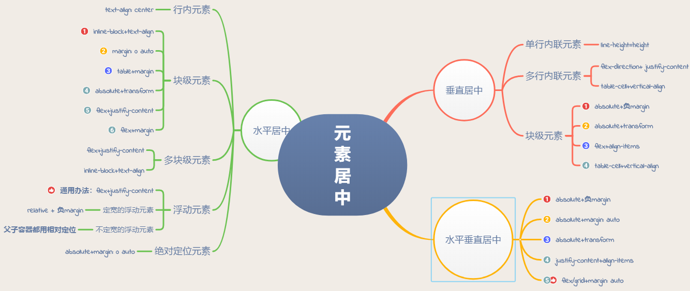
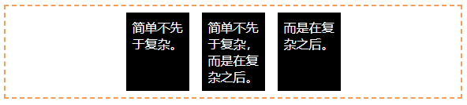

# 如何居中一个元素



## 一.水平居中

### 1.行内元素水平居中

**利用text-align:center可以实现块级元素内部的行内元素水平居中**，此方法对inline,inline-block,inline-table和inline-flex元素水平居中都有效  
此外如果块级元素内部包着也是一个块级元素，**我们可以先将其由块级元素改变行内元素，再通过设置行内元素居中以达到水平居中**

```html
<div class='parent'>
    <div class='child'>Demo</div>
</div>

<style>
.parent{
    text-align:center
}
.child{
    display:inline-block
}
</style>
```

### 2.块级元素的水平居中

* **1.将该块级元素左右外边框margin-left和margin-right设置为auto**

```css
.child{
    width:100px;
    margin:0 auto;
}
```

* **使用table+margin**

**2.先将子元素设置为块级表格显示（类似），再将其设置水平居中**  
**display:table在表现上类似block元素，但是宽度为内容宽**

```html
<div class="parent">
  <div class="child">Demo</div>
</div>
<style>
  .child {
    display: table;
    margin: 0 auto;
  }
</style>
```

* **使用absolute+transform**

**3.先将父元素设置为相对定位，再将子元素设置为绝对定位，向右移动子元素，移动距离为父容器的一半，最后通过向左移动子元素的一半宽度以达到水平居中**.

```html
<div class="parent">
  <div class="child">Demo</div>
</div>
<style>
  .child {
    position:absolute;
    left:50%;
    transform:translateX(-50%);
  }
  .parent {
    position:relative;
  }
</style>
```

* **4.使用flex+justify-content**

```html
<div class="parent">
  <div class="child">Demo</div>
</div>
<style>
  .parent {
    display: flex;
    justify-content:center;
  }
</style>
```

* **5.flex+margin**

**父元素设置为flex布局，子元素居中**。

```html
<div class="parent">
  <div class="child">Demo</div>
</div>
<style>
  .parent {
    display: flex;
  }
  .child {
    margin:0 auto;
  }
</style>
```

### 3.多块级元素水平居中



* **1.利用flex布局**

**利用弹性布局（flex），实现水平居中，其中justify-content用于设置弹性盒子元素在主轴（默认横轴）方向上的对齐方式**。

```css
#container {
    display: flex;
    justify-content: center;
}
```

* **利用inline-block**

**将要水平排列的块状元素设为display：inline-block,然后在父级元素上设置text-align:center，达到与上面的行内元素的水平居中一样的效果**。

```css
.container {
    text-align: center;
}
.inline-block {
    display: inline-block;
}
```

### 4.浮动元素水平居中

* 对于定宽的浮动元素，通过子元素设置relative+负margin

```html
<style>
.child {
   position:relative;
   left:50%;
   margin-left:-250px;
}
</style>
<div class="parent">
  <span class="child" style="float: left;width: 500px;">我是要居中的浮动元素</span>
</div>
```

* 对于不定宽的浮动元素，父子容器都用相对定位

```html
<div class="box">
    <p>我是浮动的</p>
    <p>我也是居中的</p>
</div>
<style>
.box{
    float:left;
    position:relative;
    left:50%;
}
p{
    float:left;
    position:relative;
    right:50%;
}
</style>
```

* 通用方法（不管是定宽还是不定宽）：flex布局

```html
<style>
.parent {
    display:flex;
    justify-content:center;
}
.chlid{
    float: left;
    width: 200px;//有无宽度不影响居中
}
</style>
<div class="parent">
  <span class="chlid">我是要居中的浮动元素</span>
</div>
```

### 5.绝对定位元素水平居中

**通过子元素绝对定位，外加margin:0 auto实现**。

```html
<div class="parent">
    <div class="child">让绝对定位的元素水平居中对齐。</div>
</div>
<style>
.parent{
    position:relative;
}
.child{
    position: absolute; /*绝对定位*/
    width: 200px;
    height:100px;
    background: yellow;
    margin: 0 auto; /*水平居中*/
    left: 0; /*此处不能省略，且为0*/
    right: 0;/*此处不能省略，且为0*/
}
</style>
```

## 二.垂直居中

### 1.单行内联元素垂直居中

```html
<div id="box">
     <span>单行内联元素垂直居中。</span>。
</div>
<style>
 #box {
    height: 120px;
    line-height: 120px;
    border: 2px dashed #f69c55;
    }
</style>
```

### 2.多行内联元素垂直居中

* **flex布局,flex-direction:column**

```html
<div class="parent">
    <p>parent.</p>
</div>
<style>
    .parent {
        height: 140px;
        display: flex;
        flex-direction: column;
        justify-content: center;
        border: 2px dashed #eee;
    }
</style>
```

* **表布局，vertical-align:middle**

```html
<div class="parent">
    <p class="child">child</p>
</div>
 <style>
    .parent {
        display: table;
        height: 140px;
        border: 2px dashed #eee;
    }
    .child {
        display: table-cell;
        vertical-align: middle;
    }
</style>
```

### 3.块级元素垂直居中

#### 1.absolute+负margin（已知高度宽度）

```html
<div class="parent">
    <div class="child">固定高度的块级元素垂直居中。</div>
</div>
<style>
.parent {
    position: relative;
}
.child {
    position: absolute;
    top: 50%;
    height: 100px;
    margin-top: -50px;
}
</style>
```

#### 2.absolute+transform

```html
<div class="parent">
    <div class="child">未知高度的块级元素垂直居中。</div>
</div>
<style>
.parent {
    position: relative;
}
.child {
    position: absolute;
    top: 50%;
    transform:translateY(-50%)
}
</style>
```

#### 3.flex+align-items

```html
<div class="parent">
    <div class="child">未知高度的块级元素垂直居中。</div>
</div>
<style>
.parent {
    display:flex;
    align-items:center;
}
</style>
```

#### 4.table-cell+vertical-align

```html
<div class="parent">
  <div class="child">Demo</div>
</div>
<style>
  .parent {
    display: table-cell;
    vertical-align: middle;
  }
</style>
```

## 三.水平垂直居中

### 1.absolue与-margin（已知高度宽度）

```html
// html部分(这部分不做变化,下面例子直接共用)
<body>
  <div id='container'>
    <div id='center' style="width: 100px;height: 100px;background-color: #666">center</div>
  </div>
</body>

<style>
#container {
    position: relative;
}
#center {
    position: absolute;
    top: 50%;
    left: 50%;
    margin: -50px 0 0 -50px;
}
</style>
```

### 2.absolute与margin:auo（已知高度宽度）

```css
#container {
    position: relative;
    height:100px;//必须有个高度
}
#center {
    position: absolute;
    top: 0;
    left: 0;
    right: 0;
    bottom: 0;
    margin: auto;//注意此处的写法
}
```

### 3.absolute+transform(未知元素高宽)

```css
#container {
    position: relative;
}
#center {
    position: absolute;
    top: 50%;
    left: 50%;
    transform: translate(-50%, -50%);
}
```

### 4.flex（未知元素高宽）

```css
#container{
    display: flex;
    justify-content:center;
    align-items:center;
    height:100vh;//必须有高度
}

```

### 5.flex/grin与margin:auto

```css
#container{
    display:flex;
    height:100vh;
}

#center{
    margin:auto
}
```


