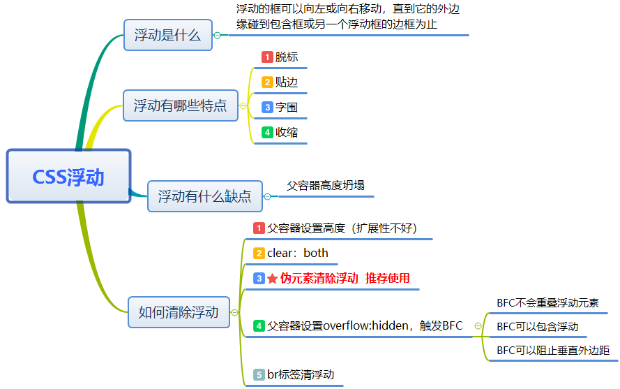
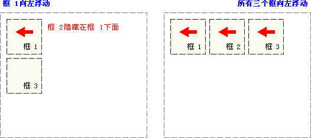
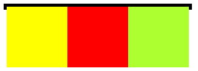

# 浮动



## 一.定义

W3school中给出的浮动定义为**浮动的框可以向左或向右移动，知道它的外边缘碰到包含框或另一个浮动框的边框为止**。由于浮动框脱离文档的普通流中，所以文档的普通流中的块框表现得就像浮动框不存在一样。

## 二.特点

**脱标，贴边，字围，收缩**。



上图中当框1向左浮动时，它脱离文档流(**脱标**)并且向左移动（**贴边**），知道它的左边缘碰到包含框的左边缘。因为它不再处于文档流中，所以不占据空间，实际上覆盖住了框2，使框2从视图中消失，如果框2中有文字，就会围绕框1排开（**字围**）  
如果把所有三个框都向左浮动，那么框1向左浮动直到碰到包含框，另外两个框向左浮动直到碰到前一个浮动框。

* **收缩**

一个浮动的内联元素（比如span img标签）不需要设置display：block就可以设置宽度

```html
<style>
    div{
        float: left;
        background-color: greenyellow;
    }
</style>
</head>
<body>
<div>
    这是一段文字
</div>
</body>
```


我们都知道div标签是块级元素，会独占一行，然而上面的例子中将dib设置为左浮后，将宽度不再是占满一行，而是收紧内部元素的宽度，这就是**收缩**

## 缺陷

### 什么是盒子塌陷

外部盒子本该包裹住内部的浮动盒子，结果却没有

### 出现问题的原因

父元素只包含浮动元素，那么它的高度就会塌缩为零（前提就是你们没有设置高度（height）属性，或者设置了为 auto，就会出现这种情况，如果父元素不包含任何的可见背景，这个问题会很难被注意到。
因为子元素设置了 float 属性，而 float 属性会把元素从标准文档流中抽离，直接结果就是外部盒子丢了内部盒子，因为内部没有其它盒子了，所以外部盒子只包裹文本节点内容，却把内部盒子扔在外面了。

```html
<style>
    .parent{
        border: solid 5px;
        width:300px;
    }
    .child:{
        height: 100px;
        width: 100px;
        float: left;
    }
    .child:nth-child(1){
          background-color: yellow;
    }
    .child:nth-child(2){
        background-color: red;
    }
    .child:nth-child(3){
          background-color: greenyellow;
    }
</style>
</head>
<body>
<div class="parent">
    <div class="child"></div>
    <div class="child"></div>
    <div class="child"></div>
</div>
</body>
```

我们想让父容器包裹着三个浮动元素，却得到这样的结果



## 清除浮动

> 1.上面分析了问题出现的原因，不难找到第一种解决方案(既然子节点丢了，那就去找呗) --给外部盒子添加浮动

把外部盒子也从标准文档流中抽离，让其与子节点相见。  
缺点：可读性差，不易于维护(别人很难理解为何父节点也要加上 float)，而且可能需要调整整个页面布局

> 2.在外部盒子内最下方添上带 clear 属性的空盒子

可以是 div 也可以是其他块级元素，把<div style='clear:both'></div>放在盒内底部，用最下面的空盒子清除浮动，把盒子重新支撑起来。  
缺点：引入了冗余元素

> 3.用 overflow:hidden 清除浮动

这个方案让父容器形成了BFC（块级上下文），而BFC可以包含浮动，通常用来解决浮动父元素高度坍塌的问题。  
可以给父元素添加以下属性来触发BFC：

* float为 left | right
* overflow 为 hidden | auto | scroll
* display 为 table-cell | tablel-caption | inline-block
* position 为 absolute | fixed

这里可以给父元素设置overflow:auto，但是为了兼容IE最好使用overflow：hidden

缺点：**如果有内容出了盒子，用这种办法就会把多的部分裁剪掉，所以这时候不能使用**。

**BFC的主要功能：**

* BFC容器是一个隔音的内容，和其他元素互不干扰，所以我们可以触发两个元素的BFC来解决垂直边距折叠问题
* BFC不会重叠浮动元素
* BFC可以包含浮动，这可以清除浮动

> 4.用 after 伪元素清除浮动

外部盒子的 after 伪元素设置 clear 属性，再隐藏它  
这其实是对空盒子方案的改进，一种纯 css 的解决方案，不用引入冗余元素。

```css
.clearfix {
    *zoom: 1;
}
.clearfix:before,
.clearfix:after {
    display: table;
    line-height: 0;
    content: "";
}
.clearfix:after {
    clear: both;
}
```

> 5.br标签清除浮动

**br标签存在一个属性：clear。这个属性就是能够清除浮动的利器，在br便签中设置属性clear，并赋值all**。

```html
<div id="wrap">
    <div id="inner"></div>
    <br clear="all" />
</div>
<style>
#wrap {
    border: 1px solid;
}
#inner {
    float: left;
    width: 200px;
    height: 200px;
    background: pink;
}
</style>
```
