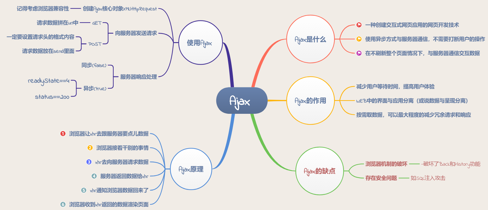

# Ajax



## Ajax的使用

### 1.创建Ajax核心对象XMLHttpRequest（注意兼容性）

```javascript
var xhr=null;
if(window.XMLHttpRequest){
    xhr=XMLHttpRequest()
}else{
    xhr=new ActiveXObject('Microsoft.XMLHTTP')
}
```

### 2.向服务器发送请求

```javascript
xhr.open(method,url,async)
send(string);//post请求时才需要使用字符串参数，否则不用带参数
```

* method：请求类型：GET和POST
* url： 文件在服务器上的位置
* async：true(异步)，false(同步)

**注意：post请求一定要设置请求头的格式内容**。

```javascript
xhr.open('POST','index.html',true);
xhr.setRequestHeader('content-type','application/x-www-form-urlencoded');
xhr.send('fname=zhangsan&lname=lisi');
```

### 3.服务器响应处理（区分同步和异步两种情况）

responseText获得字符串形式的响应数据  
responseXML获得XML形式的响应数据

* 同步处理

```javascript
xhr.open('GET','index.html',false);
xhr.send();
document.getElementById('div').innerHTML=xhr.responseText;
```

* 异步处理

```javascript
xhr.onreadystatechange=function(){
    if(xhr.readyState===4 && xhr.status==200){
        document.getElementById('div').innerHTML=xhr.responseText;
    }
}
```

#### 什么是readyState

readyState是XMLHttpRequest对象的一个属性，用来标识当前XMLHttpRequest对象处于一个什么状态。  
readyState总共5个状态，分别是0-4

* 0:  未初始化 -- 尚未调用open()方法
* 1:  启动 -- 已经调用open()方法
* 2:  发送 -- 已经调用send()方法
* 3:  接受 -- 已经接收到部分响应数据
* 4:  完成 -- 已经接收到全部响应数据，而且已经可以在客户端使用了

#### 什么是state

* 200 表示从客户端发来的请求在服务端被正常处理了
* 204 表示请求处理成功，但是没有资源返回
* 301 表示永久性重定向。该状态码表示请求的资源已经被分配到了新的URL，以后应使用资源现在所指的URL
* 302 表示临时性重定向
* 304 表示客户端发送附带条件的请求时(指采用GET方法的请求报文中包含if-matched,if-modified-since,if-none-match,if-range,if-unmodified-since任意一个首部)服务器端允许请求访问资源，但因发生请求未满足条件的情况后，直接返回304 Modified（服务端资源未改变，可直接使用客户端未过期的缓存）
* 400 表示请求报文中存在语法错误，当错误发生时，需修改请求的内容后再次发送请求
* 401 表示未授权（Unauthorized），当前请求需要用户验证
* 403 表示对请求紫玉啊你的访问被服务器拒绝了
* 404 表示服务器上无法找到请求的资源
* 500 表示服务端在执行请求时发生了错误
* 503 表示服务器暂时处于超负载或者正在停机维护，现在无法处理请求

#### GET和POST 请求数据区别

* GET参数在URL中显示，而POST则放在send里面
* GET发送数据量小，POST数据量大
* GET安全性低，会被缓存，POST反之


