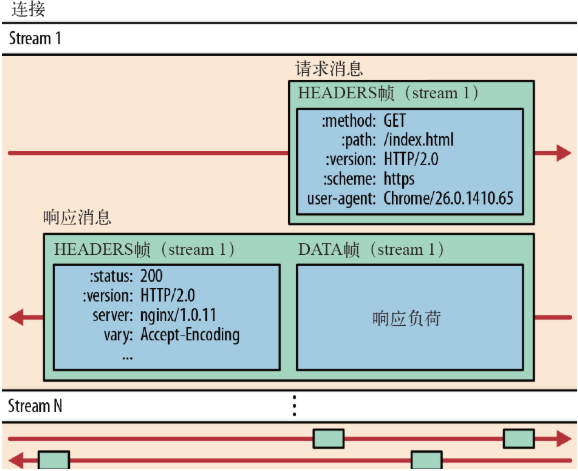
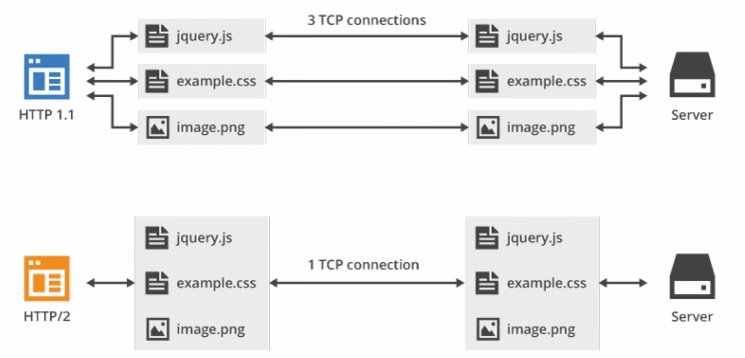

# http1.0,http1.1,http2,http3

## HTTP/1.0

1.无状态：服务器不跟踪不记录请求过的状态  
2.无连接：浏览器每次请求都需要建立tcp链接

### 无状态

对于无状态的特性可以借助cookie/session机制来做身份认证和状态记录

### 无连接 导致的性能缺陷有两种

* **无法复用链接**
每次发送请求，都需要进行一次tcp链接（3次握手4次挥手），使得网络的利用率非常低

* **队头阻塞**
http1.0规定在前一个请求响应到达之后下一个请求才能发送，如果前一个阻塞，后面的请求都会阻塞

## HTTP/1.1

1.长链接：新增Connect字段，可以设置keep-alive值保持链接不断开  
2.管道化：基于上面长链接的基础，管道化可以不等第一个响应继续发送到后面的请求，但是响应的顺序还是按照请求的顺序返回  
3.缓存处理：新增字段cache-control  
4.断点续传

* **长链接**
http/1.1默认保持长链接，数据传输完成保持tcp链接不断开，继续用这个通道传输数据

* **管道化**
基于长链接的基础，虽然管道化可以一次发送多个请求，但是响应仍是顺序返回，仍然无法解决对头阻塞的问题  
持久链接： 请求1->响应1->请求2->响应2->请求3->响应3  
管线化： 请求1->请求2->请求3->响应1->响应2->响应3

## HTTP/2新特性

### 1.二进制传输

**HTTP/2传输数据量的大幅减少，主要有两个原因：以二进制方式传输和Header压缩**，二进制传输，HTTP/2采用二进制格式传输数据，而非HTTP/1.x里纯文本形式的报文，二进制协议解析起来更高效。**HTTP/2将请求和响应数据分隔为更小的帧，并且他们采用二进制编码**  
它把TCP协议的部分特性挪到应用层，把原来的“Header+Body”的消息‘打散’为数个小片的二进制‘帧Frame’，用‘HEADERS’帧存放头数据，‘DATA'帧存放实体数据。HTTP/2数据分帧后“Header+Body”的报文结构就完全消失了，协议看到的只是一个个的碎片

HTTP/2中，同域名下所有通信都在单个链接上完成，该链接可以承载任意数量的双向数据流，每个数据流都以消息的形式发送，而消息又由一个或多个帧组成，**多个帧之间可以乱序发送，根据帧首部的流标识可以重新组装**

### 2.Header压缩

HTTP/2并没有使用传统的压缩算法，而是开发了专门的“HPACK”算法，在客户端和服务器两端建立‘字典’，用索引号表示重复的字符串，还采用哈夫曼编码来压缩整数和字符串，可以达到50%-90%的高压缩率  
具体来说：

* 在客户端和服务端使用‘首部表’来跟踪和存储之前发送的键值对，对于相同的数据，不再通过每次请求和响应发送
* 首部表在HTTP/2的连接存续期内始终存在，由客户端和服务器共同渐进地更新
* 每个新的首部键值对要么被迫加到当前表的末尾，要么替换表中的之前的值

### 3.多路复用

在HTTP/2中引入了多路复用的技术，多路复用很好的解决了浏览器限制统一域名下的请求数量的问题，同时也更容易实现全速传输，毕竟新开一个TCP链接都需要慢慢提升传输速度  
在HTTP/2中，有了二进制分帧之后，HTTP/2不再依赖TCP连接去实现多流并行了，在HTTP/2中

* 同域名下所有通信都在单个连接上完成
* 单个链接可以承载任意数量的双向流数据
* 数据流以消息的形式发送，而消息又有一个或多个帧组成，多个帧之间可以乱序发送，因为根据帧首部的流标识可以重新组装

这一特性，使性能有了极大地提升：

* 同个域名只需要占用一个TCP连接，使用一个连接并行发送多个请求和响应，这样整个页面资源的下载过程只需要一次慢启动，同时也避免了多个TCP连接竞争宽带所带来的问题
* 并行交错地发送多个请求/响应，请求/响应之间互不影响
* 在HTTP/2中，每个请求都可以带一个31bit的优先值，0表示最高优先级，数值越大优先级越低，有了这个优先值，客户端和服务器就可以在处理不同的流时采取不同的策略，以最优的方式发送流，消息和帧

### 4.Server Push

HTTP/2在一定程度上改变了传统的‘请求-应答’工作模式，服务器不再是完全被动地响应请求，也可以新建‘流’主动向客户端发送消息。比如，在浏览器刚请求HTML的时候，就提前把可能会用到的JS，CSS文件发给客户端，减少等待的延迟，这被称为“服务器推送”（Server Push，也叫“Cache push”）

服务器可以主动推送，客户端也有权利选择是否接受，如果服务端推送的资源已经被浏览器缓存过，浏览器可以通过发送RST_STREAM帧来拒收，主动推送也同源策略，换句话说，服务器不能随便将第三方资源推送给客户端，必须经过双方确认才行。

### 5.提高安全性

处于兼容考虑，HTTP/2延续了HTTP/1的‘明文’特点，可以像以前一样使用明文传输数据，不强制使用加密通信，不过格式还是二进制，只是不需要解密  
但由于HTTPS已经是大势所趋，而且主流浏览器Chrome Firefox等都公开宣布只支持加密的HTTP/2，**所以‘事实上’的HTTP/2是加密的**。也即是说，互联网上所能见到的HTTP/2都是使用https协议的，跑在TLS上面，HTTP/2协议定义了两个字符串标识符：‘h2’表示加密的HTTP/2，’h2c‘表示明文的HTTP/2

### HTTP/2的缺点

**主要是底层支撑的TCP协议造成的几个缺点**：

* **TCP以及TCP+TLS建立连接的延时**

HTTP/2都是使用TCP协议来传输的，而如果使用HTTPS的话，还需要使用TLS（SSL 3.1版本）协议进行安全传输，而使用TLS也需要一个握手过程，**这样就需要有两个握手延迟过程**：  
1.建立TCP连接的时候，需要和服务器进行三次握手来确认连接成功，也就是说需要在消耗完1.5个RTT之后才能进行数据传输  
2.进行TLS连接，大致需要1-2个RTT  
在传输数据之前大概需要花掉3-4个RTT

* **TCP的队头阻塞并没有彻底解决**

上文我们提到在HTTP/2中，多个请求是跑在一个TCP管道中的，但当出现丢包时，HTTP/2de表现反倒不如HTTP/1了，因为**TCP为了保证可靠传输，有个特别的‘丢包重传’机制，丢失的包必须要等待重新传输确认**。HTTP/出现丢包时，整个TCP都要开始等待重传，那么就会阻塞该TCP连接中的所有请求。而对于HTTP/1.1来说，可以开启多个TCP连接，出现这种情况反而只会影响其中一个连接，剩余的TCP连接还可以正常传输数据

## HTTP/3

HTTP/3目前还在起草阶段 是个基于UDP协议的 QUIC 协议，让HTTP跑在QUIC上 而不是TCP上

* 实现了类似TCP流量控制，传输可靠性的功能
* 实现了快速握手功能
* 集成了TLS加密功能
* 多路复用，彻底解决TCP中队头阻塞的问题

## 总结

* HTTP/1.1与HTTP/1.0最大的区别是长链接，HTTP/1.1的缺点：安全性不足和性能不高
* HTTP/2完全兼容HTTP/1，是‘更安全的HTTP，更快的HTTPS’，头部压缩，多路复用等技术可以充分利用宽带，降低延迟，从而大幅度提高上网体验
* QUIC基于UDP实现，是HTTP/3中的底层支撑协议
