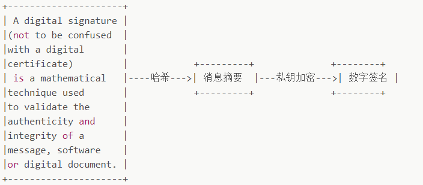
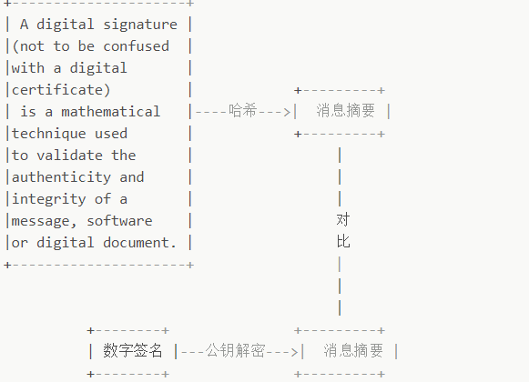

# https

HTTPS是在HTTP上建立SSL加密层，并对传输数据进行加密，是HTTP协议的安全版。  
HTTPS的主要作用是

* 对数据进行加密，并建立一个信息安全通道，来保证传输过程中的数据安全
* 对网站服务器进行真实身份认证

## 一.为什么需要HTTPS

HTTP协议存在哪些问题：

* 通信使用明文（不加密），内容可能被窃听
* 无法证明报文的完整性，所以可能遭篡改
* 即没有任何办法确认，发出的请求/响应和接收到的请求/响应是前后相同的**
* 不验证通信方的身份，因此有可能遭遇伪装
**HTTP协议中的请求和响应不会对通信方进行确认**  

HTTPS比HTTP相比多了以下优势：

* 数据隐私性：内容经过对称加密，每个链接生成一个唯一的加密密钥
* 数据完整性，内容传输经过完整校验
* 身份认证： 第三方无法伪造服务器(客户端)身份

## 二.HTTPS如何解决HTTP上述问题

HTTPS并非是应用层的一种新协议，只是HTTP通信接口部分用SSL和TLS协议替代而已。  
通常HTTP直接和TCP通信，当使用SSL时，则演变成先和SSL通信，再由SSL和TCP通信。  
即**HTTPS，就是身披SSL协议这层外壳的HTTP**  
HTTPS协议的主要功能基本都依赖与TLS/SSL协议，TLS/SSL的功能实现主要 依赖于三类基本算法：散列函数，对称加密和非对称加密。**其利用非对称加密实现身份认证和密钥协商，对称加密算法采用协商的密钥对密码加密，基于散列函数验证信息的完整性**

### 1.解决内容可能被窃听的问题--加密

* 对称加密+非对称加密
使用对称的密钥的好处是解密效率比较快，使用非对称密钥的好处是可以是的传输的内容不能被破解，**在交换密钥环节使用非对称加密方式，之后建立通信交换报文阶段则使用对称加密方式**  
具体做法是：**发送密文的一方使用对方的公钥进行加密处理‘对称的密钥’，然后对方使用自己的私钥解密拿到‘对称的密钥’，这样可以确保交换的密钥是安全的前提下，使用对称加密方式进行通信**

### 2.解决报文可能遭篡改的问题--数字签名

**数字签名有两种功效**：

* 能确定消息是由发送方签名并发出来的，因为别人假冒不了发送方的签名
* 数字签名能确认消息的完整性，证明数据是否被篡改过

**数字签名如何生成**：

将一段文本先Hash函数生成消息摘要，然后发送者的私钥加密生成数字签名，与原文一起传送给接受者，接下来就是接受者校验数字签名的流程了  
**校验数字签名流程**

接收者只有用发送者的公钥才能解密被加密的摘要信息，然后用HASH函数对收到的原文产生一个摘要信息，与上一步得到的摘要信息对比，如果相同，则说明收到的信息是完整的。  
该过程的关键在于公钥是不是在安全的网络中传输，由发送者发给接受者，如果非安全网络，则该公钥可能被篡改。  
此时就需要引入**证书颁发机构（Certificate Authority 简称CA）**，CA数量并不多，客户端内置了所有受信任的CA的证书，CA对服务器的公钥（和其他信息）数字签名后生成证书

### 3.解决通信方身份

数字证书认证机构的业务流程：

* 服务器的运营人员向第三方机构CA提交公钥，组织信息，个人信息（域名）等信息并申请认证
* CA通过线上，线下等多种手段验证申请者提供信息的真实性，如组织是否存在，企业是否合法，是否拥有域名的所有权等
* 如信息审核通过，CA会向申请者签发认证文件-证书。证书包含以下信息：申请者公钥，申请者的组织信息和个人信息，签发机构的CA信息，有效时间，证书序列号等信息的明文，同时包含一个签名，其中签名的产生算法：**首先，使用散列函数计算公开的明文信息的信息摘要，然后，采用CA的私钥对信息加密，密文即签名**
* 客户端向服务器发送请求的时候，服务端返回证书文件
* 客户端读取证书中的相关明文信息，采用相同的散列函数计算得到信息摘要，然后利用对应CA的公钥解密签名数据，对比证书的信息摘要，如果一致，则可以确认证书的合法性，即服务器的公开密钥是值得信赖的
* 客户端还会验证证书相关的域名信息，有效时间等信息，客户端会内置信任CA的证书信息（包括公钥），如果CA不被信任，则找不到对应的CA证书，证书也会被判定非法

## 三.HTTPS工作流程

* 1.Client发起一个HTTPS的请求，HTTPS默认端口为443
* 2.Server把事先**配置好的公钥证书返回给客户端**
* 3.**Client验证公钥证书**：比如是否在有效期内，证书的哦那个他是不是匹配Client的站点，是不是在CRL吊销列表里面，它的上一级证书是否有效，这是一个递归的过程，直到验证到根证书（操作系统内置的Root证书或者Client内置的Root证书），如果验证通过则继续，不通过则显示警告信息。
* 4.Client使用**伪随机数生成加密所使用的对称密钥，然后用证书的加密公钥对这个对称密钥加密**，发送给Server
* 5.Server使用**自己的私钥解密这个信息，得到对称密钥**，至此，Client和Server双方都持有了相同的对称密钥
* 6.Server使用对称密钥加密‘明文信息A’，发送给Client
* 7.Client使用对称密钥解密响应的密文，得到‘明文信息A’
* 8.Client再次发起HTTPS请求，使用对称密钥加密的请求的‘明文内容B’，然后Server使用对称密钥解密密文，得到‘明文内容B’

## 四.HTTP和HTTPS的区别

* HTTP是明文传输协议，HTTPS协议是由HTTP+SSL构建的可进行加密传输，身份认证的网络协议，比HTTP协议安全
* HTTPS比HTTP更安全，对搜索引擎更友好，有利于SEO。google，baidu等优先索引HTTPS页面
* HTTPS需要用SSL证书，而HTTP不用
* HTTPS标准端口为443 HTTP是80
* HTTPS基于传输层 HTTP基于应用层
* HTTP在浏览器显示绿色安全锁，HTTP没有显示
* HTTPS一般会比HTTP更加消耗性能（加密解密），但是结果优化（把证书部署到CDN）后页面性能与HTTP持平甚至小幅提升
