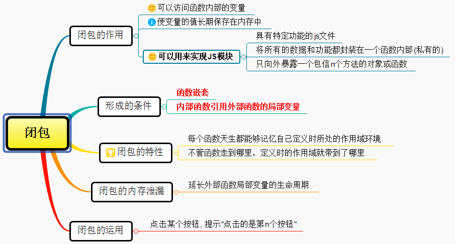

# 闭包



MDN 对闭包的定义为：
>闭包是指那些能够访问自由变量的函数。  
>自由变量是指在函数中使用的，但既不是函数参数也不是函数的局部变量的变量。

由此，我们可以看出闭包共有两部分组成：

>闭包 = 函数 + 函数能够访问的自由变量

* 从理论角度：所有的函数，因为他们都在创建的时候就将上层上下文的数据保存下来了，哪怕是简单的全局变量是如此，因为函数中访问全局变量就相当于是在访问自由变量，这个时候使用最外层的作用域
* 从实践角度：以下函数才算是闭包  
    -即使创建它的上下文已经销毁，它任然存在(比如，内部函数从父函数中返回)  
    -在代码中引用了自由变量  

## 闭包的特性

**每个函数都是闭包，每个函数天生就能记忆自己定义时所处的作用域环境，不管函数走到哪里，定义时的作用域就带到哪里**。

```javascript
var scope= 'global scope'
function checkScope(){
    var scope='local scope'
    function f(){
        return scope;
    }
    return f()
}
var foo=checkScope() ;//local scope


var scope= 'global scope'
function checkScope(){
    var scope='local scope'
    function f(){
        return scope;
    }
    return f
}
var foo=checkScope() ;
foo()   //local scope
```

## 闭包的内存泄露

栈内存提供一个执行环境，即作用域，包括全局作用域和私有作用域，那他们什么时候释放内存？

* **全局作用域：只有当页面关闭的时候全局作用域才会销毁**
* **私有作用域：只有函数执行才会产生**

**一般情况下，函数执行会形成一个新的私有作用域，当私有作用域中的代码执行完成之后，我们当前作用域都会主动的进行释放和销毁，但当遇到函数执行返回一个引用数据类型的值，并且在函数的外面被一个其他的东西给接受了，这种情况下一般形成的私有作用域都不会销毁**。  

**内存泄漏指任何对象在不再拥有或需要它之后仍然存在。闭包不能滥用，否则将会导致内存泄漏，影响网页的性能，闭包使用完后，要立即释放资源，将引用变量指向null**。

```javascript
function outer(){
  var num=0;//内部变量
  return function add(){//通过return返回add函数，就可以在outer函数外访问了
    num++;//内部函数有引用，作为add函数的一部分了
    console.log(num);
  };
}
var func1=outer();
func1();//实际上是调用add函数， 输出1
func1();//输出2 因为outer函数内部的私有作用域会一直被占用
var func2=outer();
func2();// 输出1  每次重新引用函数的时候，闭包是全新的。
func2();// 输出2  
```

## 闭包的作用

* **1.可以读取函数内部的变量**
* **2.可以是变量的值长期保存在内存中，生命周期比较长**。因此不能滥用闭包，否则会造成网页的性能问题
* **3.可以用来实现JS模块**

**JS模块：具有特定功能的js文件，将所有的数据和功能都封装在一个函数的内部（私有的），只有向外暴露一个包含n个方法的对象或者函数，模块的使用者，只需要通过模块暴露的对象调用方法来实现对应的功能**。
[模块加载方案](../javascript拓展/模块加载方案.md)
