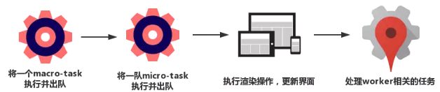
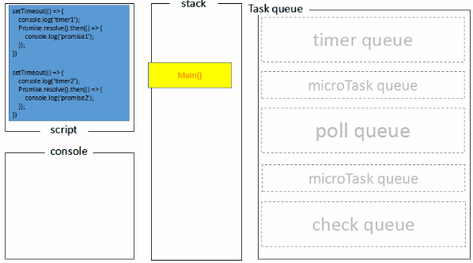

# 浏览器和Node的事件循环（Event Loop）区别

**node版本11以后，事件循环机制与浏览器一致**。

## 一.线程与进程

* **进程是CPU资源分配的最小单位；线程是CPU调度的最小单位**
* **一个进程由一个或多个线程组成，线程是一个进程中代码的不同执行路线**
* **一个进程的内存空间是共享的，每个线程都可用这些共享内存**
* **每个进程之间是独立的**

## 多线程与多进程

* 多进程：在同一个时间里，同一个计算机系统中如果允许两个或两个以上的进程处于运行状态。多进程带来的好处是明显的，比如编辑器和听歌软件之间互不干扰
* 多线程：**程序中包含多个执行流，即在一个程序中可以同时运行多个不同的线程来执行不同的任务，允许单个程序创建多个并执行的线程来完成各自的任务**

以Chrome为例，打开一个tab页时，其实就是创建了一个进程，一个进程中可以有多个线程，比如渲染线程，JS引擎线程，HTTP请求线程等，当你发起一个请求时，其实就是创建了一个线程，当请求结束后，该线程可能就会被销毁。

## 二.浏览器内核

简单来说浏览器内核是通过取得页面内容，整理信息（引用CSS），计算和组合最终输出可视化的图像结果，通常也被称为渲染引擎。  
浏览器内核是多线程，在内核控制下各线程互相配合以保持同步，一个浏览器通常由以下常驻线程组成：

* GUI渲染线程
* JavaScript引擎线程
* 定时触发器线程
* 事件触发线程
* 异步http请求线程

### 1.GUI渲染线程

* 主要负责页面的渲染，解析HTML，CSS，构建DOM树，布局和绘制等
* 当界面需要重绘或者由于某种操作引发回流时，将执行该线程
* 该线程与JS引擎线程互斥，当执行JS引擎线程时，GUI渲染会被挂起，当任务队列空闲时，主线程才会去执行GUI渲染

### 2.JS引擎线程

* 该线程主要负责处理JavaScript脚本，执行代码
* 也是主要负责执行准备好执行的事件，即定时器计时结束，或者异步请求成功并正确返回时，将依次进入任务队列，等待JS引擎线程的执行
* 该线程与GUI渲染线程互斥，当JS引擎线程执行Javascript脚本时间过长，将导致页面渲染的阻塞。

### 3.定时器触发线程

* 负责执行异步定时器一类的函数的线程，如：setTimeout,setInterval
* 主线程一次执行代码时，遇到定时器，会将定时器交给该线程处理，当计数完毕后，事件触发线程会将计数完毕后的事件加入到任务队列的尾部，等待JS引擎线程执行

### 4.事件触发线程

* 主要负责将准备好的事件交给JS引擎线程执行

比如setTimeout定时器定时结束，ajax等异步请求成功并触发回调函数，或者用户点击事件时，该线程会将整装待发的事件一次加入到任务队列的队尾，等待JS引擎线程执行

### 5.异步http请求线程

* 负责执行异步请求一类的函数的线程，如：Promise，axios，ajax等。
* 主线程依次执行代码时，遇到异步请求，会将函数交给该线程处理，当监听到状态码变更，如果有回调函数，事件触发线程将会回调函数加入到任务队列的尾部，等待JS引擎线程执行

## 浏览器中的Event Loop

### 1.Micro-Task 与 Macro-Task

浏览器端事件循环中的异步队列有两种：macro（宏任务）队列和micro（微任务）队列。**宏任务队列可以有多个，微任务队列只有一个**。

* 常见的macro-tack 比如：setTimeout,setInterval,script(整体代码),I/O操作，UI渲染等。
* 常见的micro-tack 比如：new Promise().then(回调)，MutationObsrver(html5新特性)等。

### 2.Event Loop过程解析

一个完整的Event Loop过程：

* 一开始执行栈空，我们可以把**执行栈认为是一个存储函数调用的栈结构，遵循先进后出的原则**。micro队列空，macro队列里有且只有一个script脚本（整体代码）
* 全局上下文（script标签） 被推入执行栈，同步代码执行。在执行的过程中，会判断是同步任务还是异步任务，通过对一些接口的调用，可以产生新的macro-tack与micro-tack，他们会分别被推入格子的任务队列中。同步代码执行完了，script脚本会被移出macro队列，这个过程本质上是队列的macro-tack的执行和出队的过程
* 上一步我们出队的是一个macro-tack，这一步我们处理的是micro-task。但需要注意的是：当macro-task出队时，任务是一个一个执行的。而micro-task出队时，是**一队一队执行的**。因此我们处理micro队列这一步，会逐个执行队列中的任务并把它出队，直到队列被清空。
* **执行渲染操作，更新界面**
* 检查是否存在web worker任务，如果有，则对其进行处理
* 上述过程循环往复，直到两个队列都清空



**当某个宏任务执行完后，会查看是否有微任务队列。如果有，先执行微任务队列中所有的任务，如果没有，会读取宏任务队列中排在最前的任务，执行宏任务的过程中，遇到微任务，依次加入微任务队列。栈空后，再次读取微任务队列里的任务。如此往复**。
demo：

```javascript
Promise.resolve().then(()=>{
  console.log('Promise1')  
  setTimeout(()=>{
    console.log('setTimeout2')
  },0)
})
setTimeout(()=>{
  console.log('setTimeout1')
  Promise.resolve().then(()=>{
    console.log('Promise2')
  })
},0)

//Promise1
//setTimeout1
//Promise2
//setTimeout2
```

* 一开始执行栈的同步任务（这属于宏任务）执行完毕，会去查看是否有微任务队列，上题中存在（有且只有一个），然后执行微任务队列中所有任务输出Promise1，同时会生成一个宏任务setTimeout2
* 然后去查看宏任务队列，宏任务setTimeout1在setTimeout2之前，先执行宏任务setTimeout，输出setTimeout1
* 在执行宏任务setTimeout1时会生成微任务Promise2，放入微任务队列，接着去清空微任务队列中的所有任务，输出Promise
* 清空完微任务队列中的所有任务之后，就又会去宏任务队列取一个，这会执行的是setTimeout2

## 三.Node中的Event Loop

### 1.Node简介

Node中的EventLoop和浏览器中的是完全不相同的东西。Node.js采用V8作为js的解析引擎，而I/O处理使用了自己设计的libuv，libuv是一个基于事件驱动的跨平台抽象层，封装了不同操作系统一些底层特性，对外提供统一的API，事件循环机制也是它里面的实现


Node.js的运行机制如下：

* v8引擎解析JavaScript脚本
* 解析后的代码，调用Node API
* libuv库负责Node API的执行，它将不同的任务分配给不同的线程，形成一个Event Loop（事件循环），以异步的方式将任务的执行结果返回给v8引擎。
* v8 引擎再将结果返回给用户

### 2.六个阶段

其中libuv引擎中的事件循环分为6个阶段，它们会按照顺序反复运行。每当进入某一个阶段的时候，都会从对应的回调队列中取出函数去执行。当队列为空或者执行的回调函数数量到达系统设定的指定的阈值，就会进入下一个阶段


外部输入数据->轮询阶段（poll）-> 检查阶段（check） -> 关闭事件回调阶段（close callback） -> 定时器检测阶段（timer） -> I/O事件回调阶段（I/O callbacks）-> 闲置阶段（idle,prepare）-> 轮询阶段(按照该顺序反复允许)...

* timers阶段：这个阶段执行timer（setTimeout,setInterval）的回调
* I/O callbacks阶段：处理一些上一轮循环中的少数未执行的I/O回调
* idle,prepare阶段：仅node内部使用
* poll阶段：获取新的I/O事件，适当的条件下node将阻塞在这里
* check阶段：执行setImmediate（）回调
* close callbacks阶段： 执行socket的close事件回调

注意：**上面的六个阶段都不包括process.nextTick()**  
timers，poll，check这三个阶段是日常开发中绝大部分异步任务所处阶段

#### 1）timer

tiemr阶段会执行setTimeout和setInterval回调，并且是由poll阶段控制的  
同样，**在Node中定时器指定的时间也不是准确时间，只能是尽快执行**

#### 2）poll

poll 是一个至关重要的阶段，这一阶段中，系统会做两件事情  

1.回到 timer 阶段执行回调  
2.执行 I/O 回调  
并且在进入该阶段时如果没有设定了 timer 的话，会发生以下两件事情

* 如果 poll 队列不为空，会遍历回调队列并同步执行，直到队列为空或者达到系统限制
* 如果 poll 队列为空时，会有两件事发生
a.如果有 setImmediate 回调需要执行，poll 阶段会停止并且进入到 check 阶段执行回调  
b.如果没有 setImmediate 回调需要执行，会等待回调被加入到队列中并立即执行回调，这里同样会有个超时时间设置防止一直等待下去
当然设定了 timer 的话且 poll 队列为空，则会判断是否有 timer 超时，如果有的话会回到 timer 阶段执行回调

#### 3) check

setImmediate()的回调会被加入check队列中，从event loop的阶段图可以知道，check阶段的执行顺序在poll阶段之后。

```javascript
console.log('start')
setTimeout(() => {
  console.log('timer1')
  Promise.resolve().then(function() {
    console.log('promise1')
  })
}, 0)
setTimeout(() => {
  console.log('timer2')
  Promise.resolve().then(function() {
    console.log('promise2')
  })
}, 0)
Promise.resolve().then(function() {
  console.log('promise3')
})
console.log('end')
//start=>end=>promise3=>timer1=>timer2=>promise1=>promise2
```

* 一开始执行栈的同步任务（这属于宏任务）执行完毕后（依次打印出start end，并将2个timer依次放入timer队列）,会先去执行微任务（这点跟浏览器端的一样），所以打印出promise3
* 然后进入timers阶段，执行timer1的回调函数，打印timer1，并将promise.then回调放入microtask队列，同样的步骤执行timer2，打印timer2；这点跟浏览器端相差比较大，timers阶段有几个setTimeout/setInterval都会依次执行，并不像浏览器端，每执行一个宏任务后就去执行一个微任务（关于Node与浏览器的 Event Loop 差异，下文还会详细介绍）

### 3.Micro-Task 与Macro-Task

Node端事件循环中的异步队列也是这两种：macro（宏任务）队列和micro（微任务）队列

* macro-tack ：setTimeout,setInterval,setImmediate,script(整体代码),I/O操作等
* micro-task ：process.nextTick,new Promise().then(回调)等

### 4.注意点

#### 1）setTimeout和setImmediate

二者区别在于调用时机不同

* setImmediate 设计在poll阶段完成时执行，即check阶段
* setTimeout 设计在poll阶段为空闲时，且设定时间到达后执行，但它在timer阶段执行

```javascript
setTimeout(function timeout () {
  console.log('timeout');
},0);
setImmediate(function immediate () {
  console.log('immediate');
});
```

* 对于以上代码来说，setTimeout 可能执行在前，也可能执行在后。
* 首先 setTimeout(fn, 0) === setTimeout(fn, 1)，这是由源码决定的
进入事件循环也是需要成本的，如果在准备时候花费了大于 1ms 的时间，那么在 timer 阶段就会直接执行 setTimeout 回调
* 如果准备时间花费小于 1ms，那么就是 setImmediate 回调先执行了

但当二者在异步i/o callback内部调用时，总是先执行setImmediate，再执行setTimeout

```javascript
const fs = require('fs')
fs.readFile(__filename, () => {
    setTimeout(() => {
        console.log('timeout');
    }, 0)
    setImmediate(() => {
        console.log('immediate')
    })
})
// immediate
// timeout
```

在上述代码中，setImmediate 永远先执行。因为两个代码写在 IO 回调中，IO 回调是在 poll 阶段执行，当回调执行完毕后队列为空，发现存在 setImmediate 回调，所以就直接跳转到 check 阶段去执行回调了。

#### 2) process.nextTick

这个函数其实是独立于EventLoop之外的，它有一个自己的队列，当每个阶段完成后，如果存在nextTick队列，就会清空队列中的所有回调函数，并且优先于其他microtask执行

```javascript
setTimeout(() => {
 console.log('timer1')
 Promise.resolve().then(function() {
   console.log('promise1')
 })
}, 0)
process.nextTick(() => {
 console.log('nextTick')
 process.nextTick(() => {
   console.log('nextTick')
   process.nextTick(() => {
     console.log('nextTick')
     process.nextTick(() => {
       console.log('nextTick')
     })
   })
 })
})
// nextTick=>nextTick=>nextTick=>nextTick=>timer1=>promise1
```

## 四.Node与浏览器的EventLoop差异

**浏览器环境下，microtask的任务队列是每个macrotask执行完之后执行。而NodeJs中，microtask会在事件循环的各个阶段之间执行，也就是一个阶段执行完毕，就会去执行microtask队列的任务**。


通过一个例子说明两者差异

```javascript
setTimeout(()=>{
    console.log('timer1')
    Promise.resolve().then(function() {
        console.log('promise1')
    })
}, 0)
setTimeout(()=>{
    console.log('timer2')
    Promise.resolve().then(function() {
        console.log('promise2')
    })
}, 0)
```

浏览器中运行结果：timer1 promise1 timer2 promise2  
其过程如下：


Node端运行结果分两种情况

* 如果是node11版本一旦执行一个阶段里的一个宏任务（setTimeout，setInterval和setImmediate）就立刻执行微任务，这跟浏览器端运行一致，最后结果为timer,promise1,timer2,promise2
* 如果是node10及其之前版本：要看第一个定时器执行完，第二个定时器是否在完成队列中。
如果是第二个定时器还未在完成队列中，最后的结果为timer1=>promise1=>timer2=>promise2  
如果是第二个定时器已经在完成队列中，则最后的结果为timer1=>timer2=>promise1=>promise2(下文过程解释基于这种情况下)  
1.全局脚本（main()）执行，将2个timer依次放入timer队列，main()执行完毕，调用栈空闲，任务队列开始执行；  
2.首先进入timers阶段，执行timer1的回调函数，打印timer1，并将promise1.then回调放入microtask队列，同样的步骤执行timer2，打印timer2；  
3.至此，timer阶段执行结束，event loop进入下一个阶段之前，执行microtask队列的所有任务，依次打印promise1、promise2



## 总结

* Node端microtask在事件循环的各个阶段之间执行
* 浏览器microtask在事件循环的macrotask执行完之后执行
