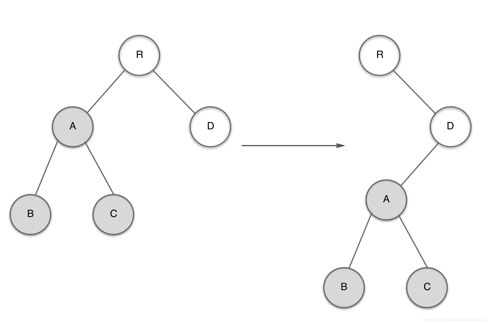
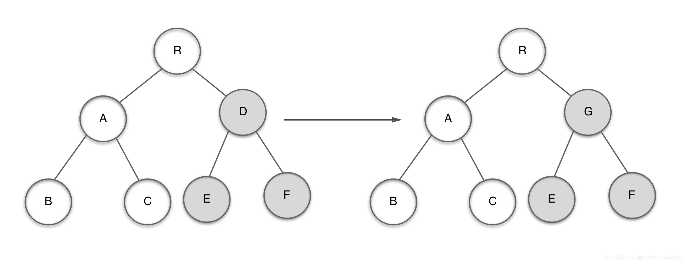
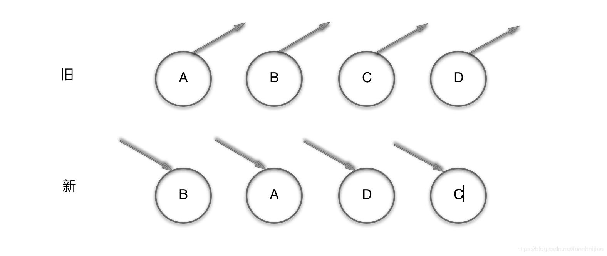
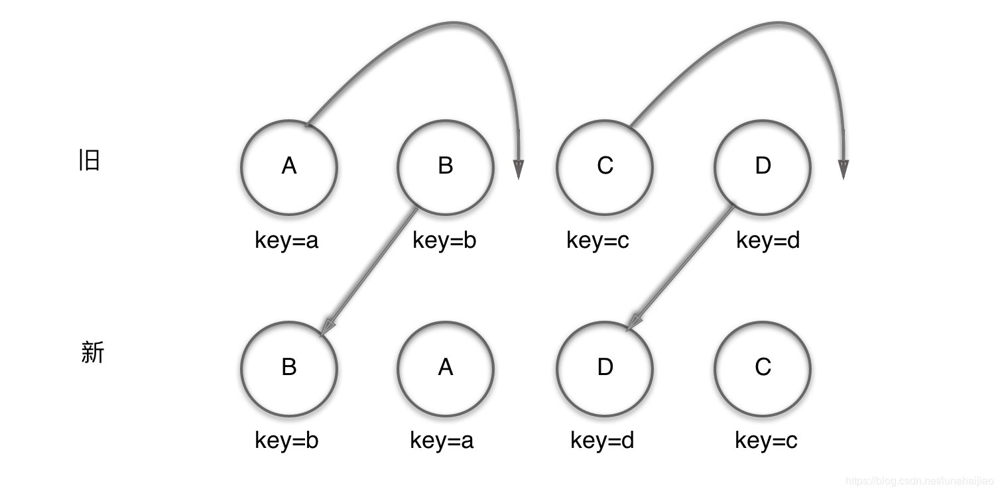
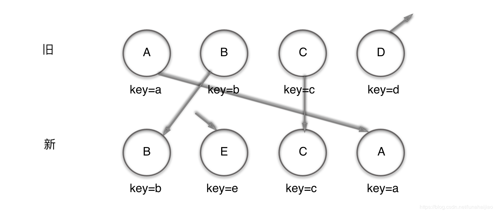

# 深入diff算法

## 一.传统的diff算法

计算一个树形结构转换成另一个树形结构的最少操作，传统diff算法通过循环递归的方法对节点进行操作，算法复杂度为O（n^3）,其中n为树中节点的总数，这效率太低了，如果React只是单纯的引入diff算法，而没有任何优化的话，其效率远远无法满足前端渲染所需要的性能，那么React是如何实现一个高效的稳定的diff算法

## 二.diff源码解读

React将Virtual DOM树转换为actualDOM树的最小操作的过程为调和，diff算法便是调和的结果，React通过指定大胆的策略，将O（n^3）的时间复杂度转换成O（n）

### 1.diff策略

* 策略一：Web UI中DOM节点跨层级的移动操作特别少，可以忽略不计
* 策略二：拥有相同类的两个组件将会生成相似的树形结构，拥有不同类的两个组件将会生成不同的树形结构
* 策略三：对于同一层级的一组子节点，他们可以通过唯一id进行区分

基于以上三个策略，React分别对tree diff，component diff 以及 element diff进行算法优化

### 2.tree diff

对于策略一，React对树的算法进行了简单明了的优化，即对树进行分层比较，两颗树只会对同一层级的节点进行比较  
既然DOM节点跨层级的移动，可以少到忽略不计，针对这种现象，React通过updateDepth对VirtualDOM树进行层级控制，只对相同层级的DOM节点进行比较，即同一父节点下的所有子节点，当发现该节点已经不存在时，则该节点及其子节点会被完全删除掉，不会用于进一步的比较，这样只需要对树进行一次遍历，便能完成整个DOM树的比较。

```javascript
//updateChildren源码
updateChildren:function(nextNestedChildrenElements,transaction,context){
    updateDepth ++;
    var errorThrown=true;
    try {
        this._updateChildren(nextNestedChildrenElements,transaction,context);
        errorThrown=false;
    } finally {
        updateDepth --;
        if(!updateDepth){
            if(errorThrown){
                cleanQueue()
            }else{
                processQueue()
            }
        }
    }
}

```

**如果出现了DOM节点跨层级的移动操作，diff会有怎样的表现呢**？  
A节点（包括其子节点）整个需要跨层级移动到D节点下，React会如何操作？



由于React只会简单的考虑同层级节点的位置变换，对于不同层级的节点，只有创建和删除操作，当根节点R发现子节点中A消失了，就会直接销毁A；当D节点发现多了一个子节点A，就会创建新的A子节点（包括其子节点），执行顺序为：  
create A -> create B -> create C -> delete A  
所以当出现跨级别移动时，并不会像想象中国呢的那样执行移动操作，而是以A为根节点的整个树被整个重新创建，这是影响React性能的操作，所以**官方建议不要进行DOM节点跨层级的操作**

> 在开发组件中，保持稳定的DOM结构有助于性能的提升，例如，可以通过CSS隐藏和显示节点，而不是真正的移除或者添加DOM节点

### 3.component diff

React是基于组件构建应用的，对于组件间的比较所采取的策略也是非常简单高效的

* 如果是同一类型的组件，按照原策略继续比较virtual DOM树即可
* 如果不是，则将该组件判断为dirty component 从而替换整个组件下的所有节点
* 对于同一类型下的组件，有可能其Virtual DOM没有任何变化，如果能确切的知道这一点，那么就可以节省大量的diff算法事件，因此，React允许用户通过shouldComponentUpdate()来判断该组件是否需要大量diff算法分析


当D组件变成G组件时，即使这两个组件机构类似，但一旦React判断D和G是两个不同类型的组件时，就不会再比较这两个组件的结构，直接进行删除组件D，重新创建组件G及其子组件，虽然这两个组件是不同类型但结构类似，diff算法会影响性能，正如React官方所言：  
**不同类型的组件很少存在相似DOM树的情况，因此，这种极端因素很难在实际开发过程中造成重大影响**

### 4.element diff

当节点处于同一层级时，diff提供三种节点操作：

* INSERT_MARKUP（插入）：如果新的组件类型不再旧集合里，即全新的节点，需要对新节点执行插入操作
* MOVE_EXISTING(移动)：旧集合中有新组件类型，且element是可更新的类型，generatorComponentChildren已调用receiveComponent，这种情况下prevChild=nextChild，就需要做移动操作，可以复用以前的DOM节点
* REMOVE_NODE（删除）：旧组件类型，在新集合里也有，但对应的element不同则不能直接复用和更新，需要执行删除操作，或者旧组件不在新集合里的，也需要执行删除操作

```javascript
// INSERT_MARKUP
function makeInsertMarkup(markup, afterNode, toIndex) {
    return {
        type: ReactMultiChildUpdateTypes.INSERT_MARKUP,
        content: markup,
        fromIndex: null,
        fromNode: null,
        toIndex: toIndex,
        afterNode: afterNode
    }
}
// MOVE_EXISTING
function makeMove(child, afterNode, toIndex) {
    return {
        type: ReactMultiChildUpdateTypes.MOVE_EXISTING,
        content: null,
        fromIndex: child._mountIndex,
        fromNode: ReactReconciler.getNativeNode(child),
        toIndex: toIndex,
        afterNode: afterNode
    }
}
// REMOVE_NODE
function makeRemove(child, node) {
    return {
        type: ReactMultiChildUpdateTypes.REMOVE_NODE,
        content: null,
        fromIndex: child._mountIndex,
        fromNode: node,
        toIndex: null,
        afterNode: null
    }
}
```

>例1:旧集合A、B、C、D四个节点，更新后的新集合为B、A、D、C节点，对新旧集合进行 diff 算法差异化对比，发现 B!=A，则创建并插入B节点到新集合，并删除旧集合中A，以此类推，创建A、D、C，删除 B、C、D。


React发现这样操作非常繁琐冗余，实际上只需要移动节点就可以达到效果，针对这一现象，React提出了优化策略：  
**允许开发者对同一层的同组件节点，添加唯一key进行区分，虽然只是小小的改动，但性能上却发生了天翻地覆的变化**  
&nbsp;
进行对新旧集合的diff差异化对比，通过key发现新旧集合中包含的节点是一样的，所以可以通过简单的位置移动就可以更新为新集合，React给出的diff结果为：B,D不做任何操作，A,C移动即可



步骤：

* 初始化，lastIndex=0,nextIndex=0;
* 从新集合取出节点B，发现旧集合中也有节点B，并且B._mountIndex=1,lastIndex=0,不满足B._mountIndex < lastIndex,则不对B操作，并且更新lastIndex = Math.max(prevChild._mountIndex,lastIndex),并将B的位置更新为新集合中的位置prevChild.mountIndex=nextIndex，即B. _mountIndex=0,nextIndex ++ 进入下一步操作
* 从新集合取出节点A，发现旧集合中也有A，并且A._mountIndex=0,lastIndex=1,满足A. _mountIndex< lastIndex，则对A进行移动操作，enqueue(updates,makeMove(prevChild,lastPlacedNode,nextIndex))并且更新lastIndex=Math.max(prevChild. _mountIndex,lastIndex),并将A的位置更新为新集合中的位置prevChild._mountIndex = nextIndex，即A _mountIndex=1,nextIndex++进入下一步
* 依次进行操作，可以根据下面代码执行的步骤实现

```javascript

updateChildren1: function(prevChildren, nextChildren) { // 旧集合 新集合
    var updates = null
    var name
    // lastIndex 是 prevChildren 中最后一个索引，nextIndex 是 nextChildren 中每个节点的索引
    var lastIndex = 0
    var nextIndex = 0

    for (name in nextChildren) { // 对新集合的节点进行循环遍历
        if (!nextChildren.hasOwnProperty(name)) {
            continue
        }
        var prevChild = prevChildren && prevChildren[name]
        var nextChild = nextChildren[name]
        // 通过唯一的key判断新旧集合是否有相同的节点
        if (prevChild === nextChild) {  // 新旧集合有相同的节点
            // 如果子节点的 index 小于 lastIndex 则移动该节点
            if (prevChild._mountIndex < lastIndex) {
                // 获取移动节点
                let moveNode = makeMove(prevChild, lastPlacedNode, nextIndex)
                // 存入差异队列
                updates = enqueue(
                    updates,
                    moveNode
                )
            }
            // 这是一种顺序优化手段，lastIndex 一直在更新表示访问过的节点一直在prevChildren最大的位置，如果当前访问的节点比 lastIndex 大，说明当前访问的节点在旧结构中就比上一个节点靠后，则该节点不会影响其它节点的位置，因此不插入差异队列，不要执行移动操作，只有访问的节点比 lastIndex 小时，才需要进行移动操作。
            // 更新lastIndex
            lastIndex= Math.max(prevChild._mountIndex, lastIndex)
            // 将prevChild的位置更新为在新集合中的位置
            prevChild._mountIndex = nextIndex
        } else {
            if (prevChild) {// 如果没有相同节点且prevChild存在
                // 更新lastIndex
                lastIndex = Math.max(prevChild._mountIndex, lastIndex)
            }
        }
        // 进入下一个节点的判断
        nextIndex ++
    }
    // 如果存在更新，则处理更新队列
    if (updates) {
        processQueue(this, updates)
    }
    // 更新 DOM
    this._renderedChildren = nextChildren
}

function enqueue(queue, update) {
    // 如果有更新，将其存入 queue
    if (update) {
        queue = queue || []
        queue.push(update)
    }
    return queue
}

// 处理队列的更新
function processQueue (inst, updateQueue) {
    ReactComponentEnvironment.processChildrenUpdates(
        inst,
        updateQueue
    )
}
```

>创建，移动，删除节点


```javascript
_updateChildren: function(nextNestedChildrenElements, transaction, context) {
    var prevChildren = this._renderedChildren  // 旧集合
    var removedNodes = {} // 需要删除的节点集合
    var nextChildren = this._reconcilerUpdateChildren(prevChildren, nextNestedChildrenElements, removedNodes, transaction, context) // 新集合
    
    // 如果不存在 prevChildren 及 nextChildren，则不做 diff 处理
    if (!prevChildren && !nextChildren) {
        return
    }
    var updates = null
    var name
    // lastIndex 是 prevChildren 中最后一个索引，nextIndex 是 nextChildren 中每个节点的索引
    var lastIndex = 0
    var nextIndex = 0
    var lastPlacedNode = null
    
    for (name in nextChildren) { // 对新集合的节点进行循环遍历
        if (!nextChildren.hasOwnProperty(name)) { 
            continue
        }
        var prevChild = prevChildren && prevChildren[name] 
        var nextChild = nextChildren[name]
        // 通过唯一的key判断新旧集合是否有相同的节点
        if (prevChild === nextChild) {  // 新旧集合有相同的节点
            // 如果子节点的 index 小于 lastIndex 则移动该节点，并加入差异队列
            updates = enqueue(
                updates,
                this.moveChild(prevChild, lastPlacedNode, nextIndex, lastIndex)
            )// 这是一种顺序优化手段，lastIndex 一直在更新表示访问过的节点一直在prevChildren最大的位置，如果当前访问的节点比 lastIndex 大，说明当前访问的节点在旧结合中就比上一个节点靠后，则该节点不会影响其它节点的位置，因此不插入差异队列，不要执行移动操作，只有访问的节点比 lastIndex 小时，才需要进行移动操作。 
            // 更新lastIndex
            lastIndex= Math.max(prevChild._mountIndex, lastIndex)
            // 将prevChild的位置更新为在新集合中的位置
            prevChild._mountIndex = nextIndex
        } else {
            if (prevChild) {// 如果没有相同节点且prevChild存在
                // 更新lastIndex
                lastIndex = Math.max(prevChild._mountIndex, lastIndex)
                // 通过遍历 removedNodes 删除子节点 prevChild
            }
            // 初始化并创建节点
            updates = enqueue(
                updates,
                this._mountChildAtIndex(nextChild, lastPlacedNode, nextIndex, transaction, context)
            )
        }
        // 进入下一个节点的判断
        nextIndex ++
        lastPlacedNode = ReactReconciler.getNativeNode(nextChild)
    }
    // 如果父节点不存在，则将其子节点全部移除
    for (name in removedNodes) {
        if (removedNodes.hasOwnProperty(name)) {
            updates = enqueue(
                updates,
                this._unmountChild(prevChildren[name], removedNodes[name])
            )
        }
    }
    // 如果存在更新，则处理更新队列
    if (updates) {
        processQueue(this, updates)
    } 
    this._renderedChildren = nextChildren
}

function enqueue(queue, update) {
    // 如果有更新，将其存入 queue
    if (update) {
        queue = queue || []
        queue.push(update)
    }
    return queue
}

// 处理队列的更新
function processQueue (inst, updateQueue) {
    ReactComponentEnvironment.processChildrenUpdates(
        inst,
        updateQueue
    )
}

// 移动节点
moveChild: function(child, afterNode, toIndex, lastIndex) {
    // 如果子节点的 index 小于 lastIndex 则移动该节点
    if (child._mountIndex < lastIndex) {
        return makeMove(child, afterNode, toIndex)
    }
}

// 创建节点
createChild: function(child, afterNode, mountIndex) {
    return makeInsertMarkup(mountIndex, afterNode, child._mountIndex)
}

// 删除节点
removeChild: function(child, node) {
    return makeRemove(child, node)
}

// 卸载已经渲染的子节点
_unmountChild: function(child, node) {
    var update = this.removeChild(child, node)
    child._mountIndex = null
    return update
}

// 通过提供的名称，实例化子节点
_mountChildAtIndex: function(child, afterNode, index, transaction, context) {
    var mountIndex = ReactReconciler.mountComponent(child, transaction, this, this._nativeContainerInfo, context)
    child._mountIndex = index
    return this._createChild(child, afterNode, mountIndex)
}
```
