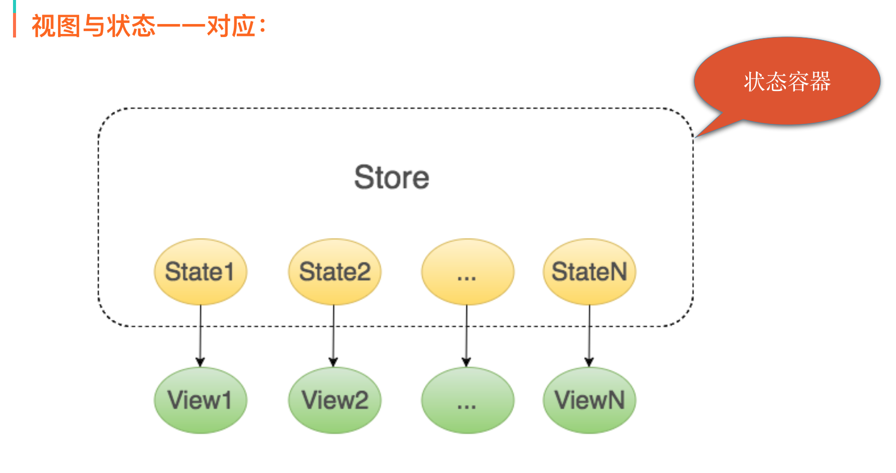
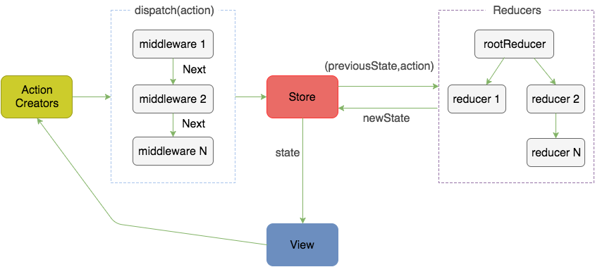
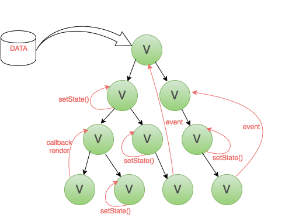
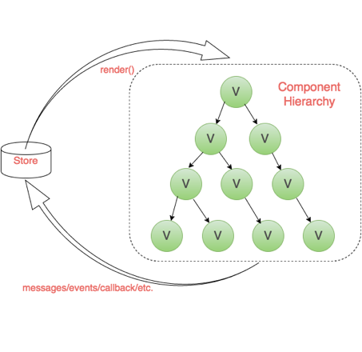
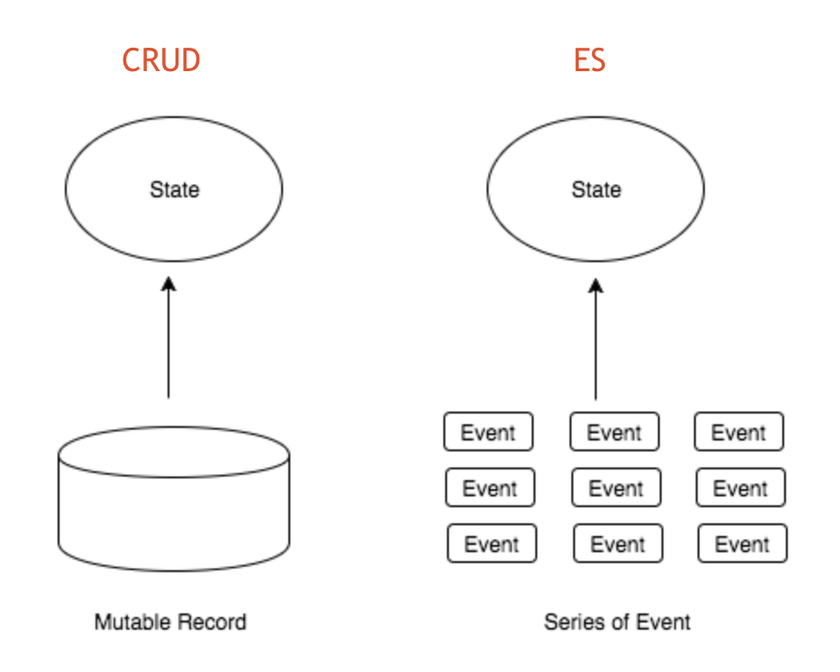
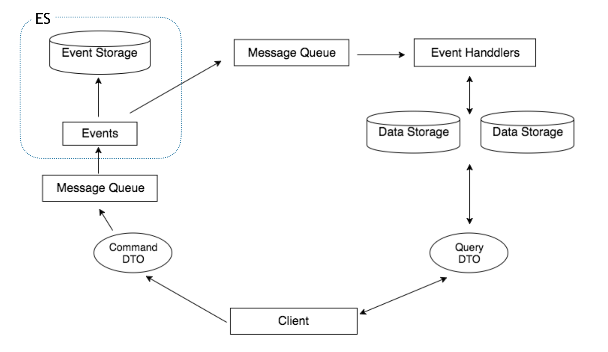
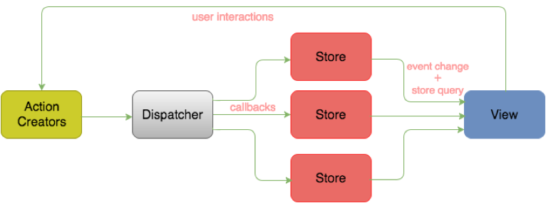
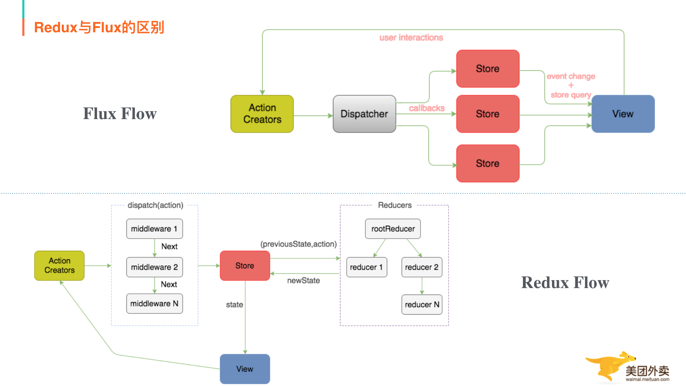
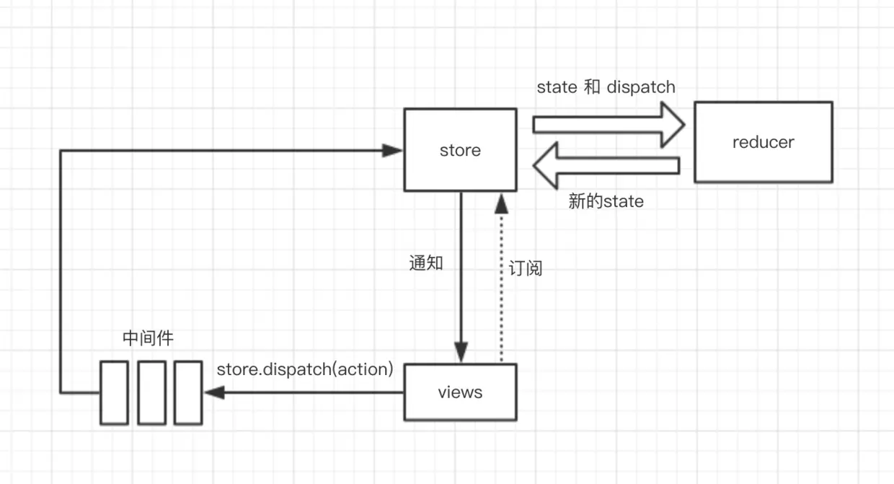

# Redux原理

## Redux是什么

Redux是javascript状态容器，能提供可预测化的状态管理。他认为：

* web应用是一个状态机，视图与状态是一一对应的
* 所有的状态，保存在一个对象里面

**容器状态，视图与状态一一对应，一个对象**三个概念



Store是Redux中的状态容器，它里面存储着所有的状态数据，每个状态都跟一个视图一一对应  
Redux也规定，一个state对应一个View，只要State相同，View就相同，知道了State，就知道View是什么样，反之亦然  
那么redux是如何实现和预测化的？Redux的工作流程：



几个核心概念：

* Store: 保存数据的地方，可以把它看成一个容器，整个应用只能有一个Store
* State: Store对象包含所有数据，如果想得到某个时点的数据，就要对Store生成快照，这种时点的数据集合，就叫做State
* Action: State的变化会导致View的变化，但是，用户接触不到State，只能接触到View，所以，State的变化必须是View导致的。Action就是View发出的通知，表示State应该要发生变化了
* Action Creator: View要发送多少种信息，就会有多少种Action，如果都手写，会很麻烦，所以我们定义一个函数来生成Action，这个函数就叫Action Creator
* Reducer: Store收到Action以后，必须给出一个新的State，这样View才会发生变化，这种State的计算过程叫做Reducer。Reducer是一个函数，它接受Action和当前State作为参数，返回一个新的State
* dispatch: 是View发出Action的唯一方法

工作流程（单向数据流）：  
1.首先，用户（通过view）发出Action，发出方式就用到了dispatch方法  
2.然后，Store自动调用Reducer，并且传入两个参数：当前State和收到的Action，Reducer会返回新的State  
3.State一旦有变化，Store就会调用监听函数，来更新View

## 为什么要用Redux

前端复杂性的根本原因是大量无规律的交互和异步操作
&nbsp;
变化和异步操作的相同作用都是改变了当前view状态，但是他们的无规律性导致了前端的复杂，而且随着代码量越来越大，我们要维护的状态也越来越多。
&nbsp;
我们很容易就对这些状态何时发生，为什么发生以及怎么发生的失去控制，如何将这些状态的变化掌握，复制以及追踪。
&nbsp;
这就是Redux设计的动机所在  
**Redux试图让每个State变化都是可预测的，将应用中所有的动作与状态都统一管理，让一切有据可循**



如上图，如果我们的页面比较复杂，有没有用任何数据层框架的话，就是图片上这个样子：交互上存在父子，子父，兄弟组件间通信，数据也存在跨层，反向的数据流。  
这样的话维护起来就特别复杂，那么我们理想的应用状态是什么样呢？



框架层面上讲，我们希望UI跟数据和逻辑分离，UI只负责渲染，业务和逻辑交由其他部分处理，从数据流向方面来说，单向数据流确保了整个流程清晰  
我们之前的操作可以复制，追踪出来，这也是Redux的主要设计思想：

* 每个State变化可预测
* 动作和状态统一管理

## Redux思想追溯

Reduxa作者在Redux.js官方文档Motivation一章中提到：
> Following in steps of Flux,CQRS, and Event Sourcing,Redux attempts to make state mutations predictable by imposing certain restrictions on how and when updates can happen
我们先了解下Flux，CQRS，ES（Event Sourcing事件溯源）几个概念

### 什么是ES

* 不是保存对象的最新状态，而是保存对象产生的事件
* 通过事件追溯得到对象最新状态



与传统增删改查关系式存储的区别：

* 传统的增删是以结果为导向的数据存储，ES是以过程为导向的存储
* CRUD是直接对库进行操作
* ES是在库里存了一系列事件的集合，不直接对库里记录进行更改

优点：

* 高性能：时间是不可更改的，存储的时候并且只做插入操作，也可以设计成独立，简单的对象，所以存储事件的成本较低且效率较高，拓展起来也非常方便
* 简化存储：事件用户描述系统内发生的事情，我们可以考虑用事件存储替代复杂的关系存储
* 溯源：正因为事件是不可更改的，并且记录了所有系统内发生的事情，我们能用它来跟踪问题，重现错误，甚至做备份和还原

缺点：

* 事件丢失：因为ES存储都是基于事件的，所以一旦事件丢失就很难保证数据的完整性
* 修改时必须兼容老结构：指的是因为老的事件不可变，所以当业务变动的时候新的事件必须兼容老结构

### 什么是CQRS（Command Query Responsibility Segregation）

顾名思义，**命令与查询职责分离**，-> **读写分离**



整体思想是把Query操作和Command操作分成两块独立的库来维护，当事件库有更新时，再来同步读取数据库  
看下Query端，只是对数据库的简单读操作，然后Command端，是对事件进行简单的存储，同时通知Query端进行数据更新，这个地方就用到了ES  
优点：

* CQ两端分离，各自独立
* 技术代码和业务代码完全分离

缺点：

* 强依赖高性能可靠的分布式消息队列

### 什么是Flux

Flux是一种架构思想，下面过程中，数据总是**单向流动**，任何相邻的部分都不会发生数据的双向流动，这保证了流程清晰，Flux的最大特点，就是**数据的单向流动**


1.用户访问View  
2.View发出用户的Action  
3.Dispatcher收到Action，要求Store进行相应的更新  
4.Store更新后，发出一个’change‘事件

#### Redux和Flux区别

Redux是Flux思想的一种实现，同时又在其基础上做了改进，Redux还是秉承了Flux单向数据流，Store是唯一的数据源的思想



最大的区别：

* **1.Redux只有一个Store**

Flux中允许有多个Store，但是Redux中只允许有一个，相较于Flux，一个Store更加清晰，容易管理，Flux里面会有多个Store存储应用数据，并在Store里面执行更新逻辑，当Store变化的时候再通知controller-view更新自己的数据，Redux将各个Store整合成一个完整的store，并且可以根据这个Store推导出应用完整的State  

同时Redux中更新的逻辑也不在Store中执行而是放在Reducer中。单一Store带来的好处是，所有数据结果集中化，操作时便利，只要他把它传给最外层组件，那么内层组件就不需要维持State，全部经父级由props往下传即可。子组件变得异常简单

* **2.Redux中没有Dispatcher概念**

Redux中去除了Dispather概念,使用Store的Store.dispatch()方法把action传给Store，由于所有的action处理都会经过这个Store.dispathch()方法，Redux，Redux利用这一点，实现了与Koa，RubyRack类似的Middleware机制，Middleware可以让你在dispatch action后，到达store前这一段拦截并插入代码，可以任意操作action和Store，很容易实现灵活的日志打印，错误收集，API请求，路由等操作

## Redux最佳实践

* 用对象展开符增加代码可读性
* 区分smart component（know the State）和dump component（完全不需要关心State）
* component里不要出现任何async calls，交给action creator 来做
* Reducer尽量简单，复杂的交给action creator
* Reducer里return state的之后，不要改动之前的State，并返回新的
* action creator里，用promise/async/await以及Redux-thunk（redux-saga）来帮助你完成想要的功能
* action creators和Reducers请用pure函数
* 请慎重选择组件树的哪一层使用connected component（连接到Store），通常是比较高层的组件来用来和Store沟通，最低层组件使用这防止太长的prop chain
* 请慎用自定义的Redux-middleware，错误的配置可能会影响到其他middleware
* 有些时候有些项目你并不需要Redux

## 简单实现Redux

### 状态管理器

```javascript
let state={
    count:1
}

console.log(state.count)

//修改状态
state.count=2
```

修改状态后，使用count的地方不能收到通知，我们可以使用发布-订阅模式来解决这个问题

```javascript
//count 的发布订阅者模式
let state={
    count:1
}

let listeners=[];

//订阅
function subscribe(listener){
    listenrs.push(listener)
}

function changeCount(count){
    state.count=count;
    for(let listen of listeners){
        listen()
    }
}
```

尝试简单的计数状态管理器

```javascript
subscribe(()=>{
    console.log(state.count)
})

changeCount(2);
changeCount(3);
```

新问题：这个状态管理器只能管理count，不通用，公共代码需要封装起来

```javascript
const createStore=function(initState){
    let state=initState;
    let listeners=[];
    function subscribe(listener){
        listeners.push(listener)
    }

    function changeState(newState){
        state=newState
        for(let listen of listeners)
    }

    function getState(){
        return state
    }

    return {
        subscribe,
        changeState,
        getState
    }
}
```

使用状态管理器简单实现多个状态counter和info试试

```javascript
let initState={
    counter:{
        count:0
    },
    info:{
        name:'',
        description:''
    }
}

let store=createStore(initState);
store.subscribe(() => {
  let state = store.getState();
  console.log(`${state.info.name}：${state.info.description}`);
});
store.subscribe(() => {
  let state = store.getState();
  console.log(state.counter.count);
});

store.changeState({
    ...store.getState(),
    info:{
        name:'changeState',
        description:'description'
    }
})

store.changeState({
    ...store.getState(),
    counter:{
        count:1
    }
})
```

### 有计划的状态管理器

我们用上面的状态管理器来实现一个自增，自减的计数器

```javascript
let initState={
    count:0
}

let store=createStore(initState);
store.subscribe(()=>{
    let state=store.getState();
    console.log(state.count)
})

store.changeState({
    count:store.getState().count+1
})

/*自减*/
store.changeState({
  count: store.getState().count - 1
});
/*我想随便改*/
store.changeState({
  count: 'abc'
});

```

count被允许改成了字符串abc，因为我们对count的修改没有任何约束，任何地方，任何人都可以修改，所以我们需要约束，不允许计划外的count修改，我们只允许count自增和自减两种改变方式：  
1.制定一个state修改计划，告诉state，我的修改计划是什么  
2.修改store.changeState方法，告诉它修改state的时候，按照我们计划修改  
&nbsp;
设置一个plan函数，接受现在的state，和一个action，返回经过改变后的新的state

```javascript
function plan(state,action){
    switch(action.type){
        case 'INCREMENT':
            return {
                ...state,
                count:state.count+1
            }
        case 'DECREMENT':
            return {
                ...state,
                count:state.count-1
            }
        default:
            return state;
    }
}
```

我们把这个计划告诉store，store.changeState以后改变state要按照我们的计划来修改

```javascript
/*增加一个参数 plan*/
const createStore = function (plan, initState) {
  let state = initState;
  let listeners = [];
  function subscribe(listener) {
    listeners.push(listener);
  }
  function changeState(action) {
    /*请按照我的计划修改 state*/  
    state = plan(state, action);
    for (let i = 0; i < listeners.length; i++) {
      const listener = listeners[i];
      listener();
    }
  }
  function getState() {
    return state;
  }
  return {
    subscribe,
    changeState,
    getState
  }
}
```

尝试使用新的createStore来实现自增和自减

```javascript
let initState={
    count:0;
}

let store=createStore(plan,initState);
store.subscribe(()=>{
    let state=store.getState();
    console.log(state.count)
})
store.changeState({
    type:'INCREMENT'
})
store.changeState({
    type:'DECREMENT'
})

//无效
store.changeState({
    count:'abc'
})
```

### 多文件协作

#### reducer的拆分和合并

我们知道reducer是一个计划函数，接受老的state，按计划返回新的state，那我们项目中，有大量的state，每个state都需要计划函数，如果全部写在一起会是啥样子？  
所有的计划写在一个reducer函数里面，会导致reducer函数及其庞大复杂，按经验来说，我们肯定会按组件维度来拆分出很多个reducer函数，然后通过一个函数把他们合并起来  
我们来管理两个state，一个counter，一个info

```javascript
let state={
    counter:{
        count:0
    },
    info:{
        name:'name',
        description:'description'
    }
}
```

他们各自的reducer

```javascript
//coounterReducer,一个子reducer
//注意：counterReducer接收的state是state.counter
function counterReducer(state, action) {
  switch (action.type) {
    case 'INCREMENT':
      return {
        ...state,
        count: state.count + 1
      }
    case 'DECREMENT':
      return {
        ...state,
        count: state.count - 1
      }
    default:
      return state;
  }
}

/*InfoReducer，一个子reducer*/
/*注意：countReducer 接收的 state 是 state.info*/
function InfoReducer(state, action) {
  switch (action.type) {
    case 'SET_NAME':
      return {
        ...state,
        name: action.name
      }
    case 'SET_DESCRIPTION':
      return {
        ...state,
        description: action.description
      }
    default:
      return state;
  }
}
```

用combineReducers函数来吧多个reducer函数合并成一个reducer函数：

```javascript
const reducer=combineReducers({
    counter:counterReducer,
    info:InfoReducer
})
```

尝试实现combineReducers函数

```javascript
function combineReducers(reducers){
    const reducerKeys=Object.keys(reducers)
    //公用一个形参，所以action的type需要全局唯一
    return function combination(state={},action){
        const nextState={}
        for(let key of reducerKeys){
            const reducer=reducers[key]
            const previousStateForKey=state[key]
            const nextStateForKey=reducer(previousStateForKey,action)
            nextState[key]=nextStateForKey
        }
        return nextState
    }
}
```

测试

```javascript
const reducer=combineReducers({
    counter:counterReducer,
    info:InfoReducer
})
let initState = {
  counter: {
    count: 0
  },
  info: {
    name: '233',
    description: '23333'
  }
}
let store=createStore(reducer,initState)
let store = createStore(reducer, initState);
store.subscribe(() => {
  let state = store.getState();
  console.log(state.counter.count, state.info.name, state.info.description);
});
/*自增*/
store.dispatch({
  type: 'INCREMENT'
});
/*修改 name*/
store.dispatch({
  type: 'SET_NAME',
  name: '233'
});
```

#### state的拆分和合并

上一节，我们已经把reducer按组件维度拆分了，通过combineReducers合并起来，但是还有个问题，state我们还是写在一起的，这样会造成state树很庞大，难以维护。所以需要拆分，一个state，一个reducer写一块。

```javascript
/* counter 自己的 state 和 reducer 写在一起*/
let initState = {
  count: 0
}
function counterReducer(state, action) {
  /*注意：如果 state 没有初始值，那就给他初始值！！*/  
  if (!state) {
      state = initState;
  }
  switch (action.type) {
    case 'INCREMENT':
      return {
        ...state,
        count: state.count + 1
      }
    default:
      return state;
  }
}
```

修改createStore函数，增加一行dispatch({type:Symbol()})

```javascript
const createStore = function (reducer, initState) {
  let state = initState;
  let listeners = [];
  function subscribe(listener) {
    listeners.push(listener);
  }
  function dispatch(action) {
    state = reducer(state, action);
    for (let i = 0; i < listeners.length; i++) {
      const listener = listeners[i];
      listener();
    }
  }
  function getState() {
    return state;
  }
  /* 注意！！！只修改了这里，用一个不匹配任何计划的 type，来获取初始值 */
  dispatch({ type: Symbol() })
  return {
    subscribe,
    dispatch,
    getState
  }
}
```

* createStore的时候，用一个不匹配任何type的action，来触发state=reducer(state,action)
* 因为action.type不匹配，每个子reducer都会进到default项，返回自己初始化的state，这样就获得了初始化的state树了

### 中间件 middleware

中间件是对dispatch的拓展，或者说重写，增强dispatch的功能

&nbsp;
假设有一个需求，在每次修改state的时候，记录下来修改前的state，为什么修改了，以及修改后的state，我们可以通过重写store.disptch来实现

```javascript
const store=createStore(reducer)
const next=store.dispatch
const loggerMiddleware=action=>{
    console.log(store.getState())
    console.log(action)
    next(action)
    console.log('next state',store.getState())
}
const exceptionMiddleware=action=>{
    try{
        loggerMiddleware(action)
    }catch(err){
        console.error(err)
    }
}
store.dispatch=exceptionMiddleware
```

exprectionMiddleware里面写死了loggerMiddleware，我们需要让next(action)变成动态的

```typescript
const exceptionMiddleware=(next)=>(action)=>{
    try{
        next(action)
    }catch(e){
        console.error(e)
    }
}

store.dispatch=exceptionMiddleware(loggerMiddleware)
```

同样的道理，loggerMiddleware里面的next现在恒等于store.dispatch，导致loggerMiddleware里面无法拓展到别的中间件了，所以需要将next写成动态的

```typescript
const loggerMiddleware=(next)=>(action)=>{
    console.log(store.getState())
    console.log(action)
    next(action)
    console.log('next state',store.getState())
}
```

到此为止，一个扩展性很高的中间件合作模式：

```typescript
const store=createStore(reducer);
const next=store.dispatch;
const loggerMiddleware=next=>action=>{
    next(action)
    console.log(action)
}
const exceptionMiddleware=next=>action=>{
    try{
        next(action)
    }catch(err){
        console.error(err)
    }
}
store.dispatch=exceptionMiddleware(loggerMiddleware(next))
```

这时，把两个中间件独立到单独的文件中去 ，会遇到的问题：  
loggerMiddleware中包含了外部变量store，导致我们无法把中间件独立出去，那我们把store也作为一个参数传进去即可

```typescript
const store=createStore(reducer)
const next=store.dispath;
const loggerMiddleware=store=>next=>action=>{
    console.log(store.getState())
    next(action)
}
const exceptionMiddle=store=>next=>action=>{
    try{
        next(action)
    }catch(err){
        console.error(err)
    }
}
const logger=loggerMiddleware(store)
const execption=execptionMiddleware(store)

store.dispatch=exception(logger(next))
```

测试需求：在打印日志之前输出当前的是时间戳，用中间件实现

```typescript
const timeMiddleware=store=>next=>action=>{
    console.log(Date.now())
    next(action)
}
...
const time=timeMiddleware(store)
store.dispatch=exception(time(logger(next)))
```

#### 中间件使用方式优化

封装用法：

```typescript
//接收旧的createStore返回新的createStore
const newCreateStore=applyMiddleware(exceptionMiddleware,timeMiddleware,loggerMiddleware)(createStore)
//返回一个dispatch被重写过的store
const store=newCreateStore(reducer)
```

实现applyMiddle

```typescript
const applyMiddleware=function(...middlewares){
    //返回一个重写createStore的方法
    return function rewriteCreateStoreFunc(oldCreateStore){
        //返回重写后的新的createStore
        return function newCreateStore(reducer,initState){
            //生成store
            const store=oldCreateStore(reducer,initState)
            //给每个middleware传入store
            const chain=middlewares.map(middleware=>middleware(store))
            let dispatch=store.dispatch
            //实现exception(time((logger(dispatch))))
            chain.reverse().map(middleware=>{
                dispatch=middleware(dispatch)
            })
            //重写dispatch
            store.dispatch=dispatch
            return store
        }
    }
}
```

现在我们有两种createStore

```typescript
//没有中间件的createStore
import {createStore} from 'redux'
const store=createStore(reducer,initState)

//有中间件的createStore
const rewriteCreateStoreFunc=applyMiddleware(exceptionMiddleware,timeMiddleware,loggerMiddleware);
const newCreateStore=rewriteCreateStoreFunc(createStore)
const store=newCreateStore(reducer,initState)
```

为了让用户统一起来可以修改下createStore方法

```typescript
const createStore=(reducer,initState,rewriteCreateStoreFunc)=>{
    if(rewriteCreateStoreFunc){
        const newCreateStore=rewriteCreateStoreFunc(createStore)
        return newCreawteStore(reducer,initState)
    }
    //否则按照正常流程
}
```

最终用法

```typescript
const rewriteCreateStoreFunc=applyMiddleware(exceptionMiddle,timeMiddleware,loggerMiddleware)
const store=createStore(reducer,initState,rewriteCreateStoreFunc)
```

## 完整的Redux

### 退订

```typescript
function subscribe(listener){
    listeners.push(listener)
    return function unsubscribe(){
        const index=listeners.indexOf(listener)
        listeners.splice(index,1)
    }
}

//使用

const unsubscribe=store.subscribe(()=>{
    let state=store.getState()
    console.log(state.counter.count)
})

unsubscribe()
```

### 中间件拿到的store

现在中间件拿到了完整的store，它甚至可以修改subscribe方法，按照最小开发策略，我们只用把getState传入中间件即可

```typescript
//const chain=middlewares.map(middleware=>middleware(store))
const simpleStore={getState:store.getState}
const chain=middlewares.map(middleware=>middleware(simpleStore))
```

#### compose

我们applyMiddleware中,把[A,B,C]转换成A(B(C(next))，是这样实现的：

```typescript
const chain=[A,B,C]
let dispatch=store.dispatch
chain.reverse().map(middleware=>{
    dispatch=middleware(dispatch)
})
```

redux提供了一个compose方法，可以放我们做这个事情

```typescript
const chain=[A,B,C]
dispatch=compose(...chain)(store.dispatch)

//compose实现方法

export default function compose(...funcs){
    if(funcs.length===1){
        return funcs[0]
    }
    return funcs.reduce((a,b)=>(...args)=>a(b(...args)))
}
```

### 省略initState

有时候我们创建store的时候不传initState，如何使用？

```typescript
const store=createStore(reducer,{},rewriteCreateStoreFunc)

//redux允许我们这样写
const store=createStore(reducer,rewariteCreateStoreFunc)

//实现方法：createStore函数的第二个参数是object 则认为是initState，如果是function 则是rewriteCreateStoreFunc
function createStore(reducer,initState,rewariteCreateStoreFunc){
    if(typeof initState === 'function'){
        rewriteCreateStoreFunc=initState;
        initState=undefined
    }
}

```

### bindActionCreators

一般只有在 react-redux 的 connect 实现中用到。  
他是做什么的？他通过闭包，把 dispatch 和 actionCreator 隐藏起来，让其他地方感知不到 redux 的存在。  
我们通过普通的方式来 隐藏 dispatch 和 actionCreator 试试，注意最后两行代码

```typescript
const reducer=combineReducers({
    counter:counterReducer,
    info:infoReducer
})
const store=createStore(reducer)

//返回action的函数叫做actionCreator
function increment(){
    return {
        type:'INCREMENT'
    }
}
function setName(name){
    return {
        type:'SET_NAME',
        name:name
    }
}
const actions={
    increment:function(){
        return store.dispatch(increment.apply(this,arguments))
    },
    setName:function(){
        return store.dispatch(setName.apply(this,arguments))
    }
}
actions.increment()
actions.setName('iu')
```

redux源码

```typescript
function bindActionCreator(actionCretor,dispatch){
    return function(){
        return dispatch(actionCretor.apply(this,arguments))
    }
}
//actionCretors必须是function或者object
export default function bindActionCretors(actionCreators,dispatch){
    if(typeof actionsCreatros === 'function'){
        return bindActionCreator(actionCreators,dispatch)
    }
    if(typeof actionCreators !== 'object' || actionCreators === null){
        throw new Error()
    }

    const keys=Object.keys(actionCreators)
    const boundActionCreators={}
    for(let key of keys){
        const actionCreator=actionCreators[key]
        if(typeof actionCreator === 'function'){
            boundActionCreators[key]=bindActionCreator(actionCreator,dispatch)
        }
    }
    return boundActionCreators
}
```

## 总结

* createStore创建store对象,包含getState,dispatch,subscribe,replaceReducer
* reducer 是一个计划函数，接收旧的state和action，生成新的state
* action action是一个对象，必须包含type字段
* dispatch（action）触发action，生成新的state
* subscibe实现订阅功能，每次触发dispatch的时候，会执行订阅函数
* combineReducers多个reducer合并成一个reducer
* middleware 扩展dispatch函数


