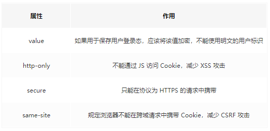

# 浏览器存储

## 一.Cookie

**Cookie 的本职工作并非存储，而是‘维持状态’，** 因为 HTTP 协议是无状态的，HTTP 协议自身不对请求和响应之间的通信状态进行保存。所以由 cookie 来判断当前链接的用户是哪个。

### 1.Cookie 原理及生成方式

原理：第一次访问网站的时候，浏览器发出请求，服务器响应请求后，会在响应头里面添加一个 Set-Cookie 选项，将 cookie 放入到响应请求中，在浏览器第二次发请求的时候，会通过 Cookie 请求头部将 Cookie 信息发送给服务器，服务端会辨别用户身份，另外，Cookie 的过期时间，域，路径，有效期，适用站点都可以根据需要来指定。  
生成方式：

* 1.http response header 中 set-cookie
* 2.js 中可以通过 document.cookie 读写 cookie，以键值对的形式展示

### 2.Cookie 的缺陷

* Cookie 不够大

Cookie 的大小限制在 4kb 左右，对于复杂的存储需求来说是不够用的，当超过 4kb 时会被裁剪  
注意：各浏览器的 cookie 每一个 name=value 的 value 值大概在 4k，所以 4k 并不是一个域名下所有 cookie 共享的，而是一个 name 的大小

* 过多的 Cookie 将会带来巨大的性能浪费

Cookie 是用来维护用户信息的，而域名（domin）下所有的请求都会携带 cookie，但对于静态文件的请求，携带 cookie 信息就没有用，此时可以通过 CDN 去加载静态文件

* 由于 HTTP 请求中的 Cookie 是明文传递的，所以安全成问题，除非用 HTTPS。

### 3.Cookie与安全

httpOnly不支持读写，浏览器不允许脚本操作document.cookie去更改cookie
所以为避免跨域脚本(xss)攻击，通过javascript的Document.cookie API无法访问带有HttpOnly标记的Cookie。  
标记为Secure的Cookie只应通过被HTTPS协议加密的请求发送给服务端。但即便设置了Secure标记，敏感信息也不应该通过Cookie传输，因为Cookie有其固有的不安全性，Secure标记也无法提供完全的安全保障  

## 二.LocalStorage

* 保存的数据长期存在，下一次访问该网站的时候，网页可以直接读取以前保存的数据
* 大小为5M左右
* 仅在客户端使用，不和服务器进行通信
* 接口封装较好

## 三.sessionStorage

sessionStorage保存的数据用于浏览器的一次会话，当会话结束(通常为窗口关闭),数据被清空  
sessionStorage特别的一点在于：**即便是相同域名下的两个页面，只要他们不在同一个浏览器窗口中打开，那么他们的sessionStorage内容并无法共享**  
localStorage在所有同源窗口中都是共享的  
cookie也是在所有同源窗口共享的  
除了保存期限长短不同，sessionStorage的属性和方法与localStorage完全一样

## 四.cookie localStorage sessionStorage区别

### 1.共同点

都是保存在浏览器端，且都遵循同源策略

### 2.不同点

* 作用域：localStorage只要在相同的协议，相同的主机名，相同的端口下，就能读取/修改到同一份localStorage数据。sessionStorage除此之外还必须在同一窗口下
* 生命周期：localStorage是本地持久化存储，唯一删除的办法是手动删除，sessionStorage是会话级别的，当前会话窗口关闭即释放

说到底，Web Storage 是对 Cookie 的拓展，它只能用于存储少量的简单数据。当遇到大规模的、结构复杂的数据时，Web Storage 也爱莫能助了。这时候我们就要IndexedDB！

## 五.IndexedDB

IndexedDB 是一种低级API，用于客户端存储大量结构化数据(包括文件和blobs)。该API使用索引来实现对该数据的高性能搜索。IndexedDB 是一个运行在浏览器上的非关系型数据库。既然是数据库了，那就不是 5M、10M 这样小打小闹级别了。理论上来说，IndexedDB 是没有存储上限的（一般来说不会小于 250M）。它不仅可以存储字符串，还可以存储二进制数据
