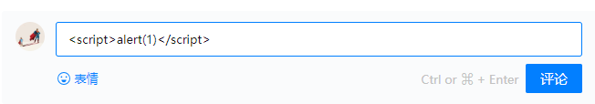
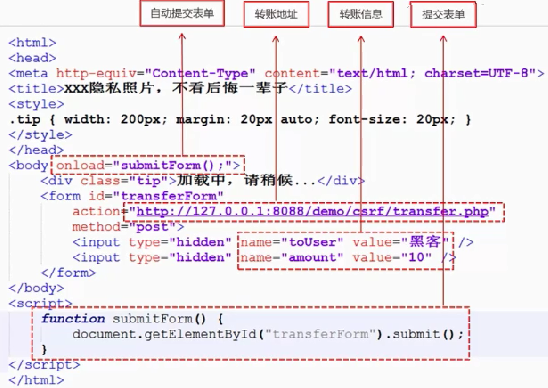

# XSS与CSRF

## XSS

xss(Cross-Site Scripting),跨站脚本攻击，因为缩写和CSS重叠，所以叫XSS，跨脚本攻击是指通过存在安全漏洞的Web网站注册用户的浏览器内运行非法的HTML标签或者Javascript进行的一种攻击。  
跨站脚本攻击可能造成以下影响：

* 利用虚假输入表单骗取用户个人信息
* 利用脚本窃取用户的cookie值，被害者再不知情的情况下，帮助攻击者发送恶意请求
* 显示伪造的图片后文章

**XSS的原理是恶意攻击者往web页面里插入恶意可执行网页脚本代码，当用户浏览该页时，嵌入其中web里面的脚本代码会被执行，从而可以达到攻击者盗取用户信息或其他侵犯用户安全隐私的目的**。

### 1.非持久型 XSS（反射型XSS）

一般是通过给别人发送**带有恶意脚本代码参数的URL**，当URL地址被打开时，特有的恶意代码参数被HTML解析，执行。  
比如页面中包含以下代码：

```html
<select>
    <script>
        document.write(''
            + '<option value=1>'
            +     location.href.substring(location.href.indexOf('default=') + 8)
            + '</option>'
        );
        document.write('<option value=2>English</option>');
    </script>
</select>
```

攻击者可以直接通过URL（类似：https://xxx.com/xxx?default=<script>alert(docuement.cookie)</script>）注入可执行的脚本代码。不过一些浏览器如chrome内置了一些xss过滤器，可以防止大部分反射型xss攻击

非持久型XSS漏洞攻击有以下几个特征：

* 即时性，不经过服务器存储，直接通过HTTP的GET POST请求就能完成一次攻击，拿到用户隐私数据。
* 攻击者需要诱骗点击，必须要通过用户点击连接才能发起
* 反馈率低，所以比较难发现和响应修复
* 盗取用户敏感保密信息

### 2.持久型XSS（存储型XSS）

持久型XSS漏洞，一般存在于form表单提交等交互功能，如文章留言，提交文本信息等，黑客利用xss漏洞，将内容经正常功能提交进入数据库持久保存，当前端页面获得后端从数据库中读出的注入代码时，恰好将其渲染执行。  

举个例子，对于评论功能来说，就得防范持久型xss攻击，因为我可以在评论中输入以下功能



主要注入页面方式和非持久型xss漏洞类似，只不过持久型的不是来源于URL，referer，forms等，而是源于**后端从数据库中读出来的数据**，持久型xss攻击不需要诱骗点击，黑客只需要在提交表单的地方完成注入即可，但这种攻击成本还是很高。  
需要以下几个条件：

* POST请求提交表单后端没有转义直接入库
* 后端从数据库中取出数据没有做转义直接输出给前端
* 前端拿到后端数据没做转义直接渲染

### 3.如何防御

#### 1)CSP

CSP本质上就是建立白名单，开发者明确告诉浏览器哪些外部资源可以加载和执行，我们只需要配置规则，如何拦截就是浏览器自己实现的。  
通常可以通过两种方法来开启CSP：

* 设置HTTP Header中的 Content-Security-Policy

```html
//只允许加载本站资源
Content-Security-Policy:default-src 'self'

//只允许加载HTTPS协议图片
Content-Security-Policy：img-src https://*

//允许加载任何来源框架
Content-Security-Policy: child-src 'none'
```

* 设置meta标签的方式

#### 2) 转义字符

用户的输入永远是不可信的，最普遍的做法就是转义输入输出的内容，对于引号，尖括号，斜杠进行转义

```javascript
function escape(str) {
  str = str.replace(/&/g, '&amp;')
  str = str.replace(/</g, '&lt;')
  str = str.replace(/>/g, '&gt;')
  str = str.replace(/"/g, '&quto;')
  str = str.replace(/'/g, '&#39;')
  str = str.replace(/`/g, '&#96;')
  str = str.replace(/\//g, '&#x2F;')
  return str
}
```

但是对于富文本来说，显然不能通过上面的办法来转义所有字符，一般使用白名单过滤的办法

```javascript
const xss = require('xss')
let html = xss('<h1 id="title">XSS Demo</h1><script>alert("xss");</script>')
// -> <h1>XSS Demo</h1>&lt;script&gt;alert("xss");&lt;/script&gt;
console.log(html)
```

以上示例使用了 js-xss 来实现，可以看到在输出中保留了 h1 标签且过滤了 script 标签。

#### 3)HttpOnly Cookie

这是防御xss攻击窃取用户cookie最有效的防御方法，web应用在设置cookie时，将其属性设置为HttpOnly，就可以避免该网站的coolie被客户端恶意javascript窃取，保护用户cookie信息。

## CSRF

CSRF(Cross Site Request Forgery),即跨站请求伪造，是一种常见的web攻击，它利用用户已登陆的身份，在用户毫不知情 的情况下，以用户的名义完成非法操作

### 一.CSRF攻击的原理


CSRF攻击需要三个条件：

* 用户已经登录了站点A，并在本地记录了cookie
* 在用户没有登出站点A的情况下（也就是cookie生效的情况下）,访问了恶意攻击者提供的引诱危险站点B（B站点要求访问站点A）
* 站点A没有做任何CSRF防御

例子：当我们登入转账页面后，突然眼前显示‘**点击进入**’，点击后，这页面加载便会执行submitForm这个方法来提交转账请求


### 二.如何防御

防范CSRF攻击可以遵循以下几种规则：

* GET 请求不对数据进行修改
* 不让第三方网站访问到用户Cookie
* 阻止第三方网站请求接口
* 请求时附带验证信息，比如验证码或者Token

#### 1）Token（比较完善的解决方法）

发送请求时在HTTP请求中以参数的形式加入一个随机产生的token，并在服务器建立一个拦截器栏验证这个token

#### 2）验证码

强制用户输入验证码，但是降低了用户的体验，网站不能给所有的操作都加上验证码，只能将验证码作为一种辅助手段，在关键业务点设置验证码

#### 3）SameSite

对Cookie设置SameSite属性，表述Cookie不能跨域请求发送，但是该属性不是所有浏览器都支持

#### 4）Refer Check

通过检查http头referer的值是不是这个页面，来判断CSRF攻击，但是某些情况下https跳转到http，浏览器处于安全考虑，不会发送referer
